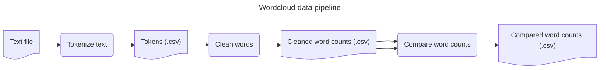

Create word clouds from text

# Text collection process



## Clean words

Clean word tokens by:

1. Lemmatizing words using nltk.stem.WordNetLemmatizer
2. Mapping words to lower case
3. removing digits
4. removing all non-alphabetic characters
5. ignoring predefined stop words

Once cleaned, the words are counted and returned as a dictionary.

## Word count comparison

Compare two word counts by:

1. Normalizing them to account for differences in text volumes.
2. Selecting words from each word count based on their:
   1. intersection
   2. union (like an outer join)
   3. complement
3. In the case of intersecting words, updating the count of the words based on the:
   1. Average
   2. Max
   3. Min

## Run scripts

Use the workflow script for automating the pipeline
```bash
python src/wordcloud_workflow.py test-data/configs/wordclouds/wordcloud_full_workflow_test_config.json
```

**Usage:**

```bash
usage: wordcloud_workflow.py [-h] [-d] [-l LOG] configuration

Launch a workflow (or data pipeline) based on a configuration

positional arguments:
  configuration      Specify the configuration file.
                     File must be structured as a JSON array of configurations, each specifying the type of activity, the inputs and outputs, and the parameters used for the activity.
                     Two types are currently supported:
                     - 'parse': for reading and parsing a text into a word count
                     - 'clean': for cleaning word counts
                     - 'compare': for comparing word counts
                     For example:
                     [
                        {
                           "activity": "parse",
                           "input_dir": "./input/wordcloud-test/",
                           "output_dir": "./wordcloud-test_stage_0/"
                        },
                        {
                           "activity": "clean",
                           "input_dir": "./wordcloud-test_stage_0/",
                           "output_dir": "./wordcloud-test_stage_1/",
                           "limit": 50,
                           "params": {
                           "stop_words_path": "./configs/wordclouds/stop_words_english.csv"
                           }
                        },
                        {
                           "activity": "clean",
                           "input_dir": "./wordcloud-test_stage_0/",
                           "output_dir": "./wordcloud-test_stage_1/",
                           "limit": 100,
                           "params": {
                           "stop_words_path": "./configs/wordclouds/stop_words_english.csv"
                           }
                        },
                        {
                           "activity": "compare",
                           "inputs": [
                                 "./wordcloud-test_stage_1/example-text_cleaned_50.csv:./wordcloud-test_stage_1/example-text_cleaned_100.csv"
                           ],
                           "output_dir": "./output/wordcloud-test/",
                           "params": {
                           "mode": "INTERSECTION"
                           }
                        }
                     ]

options:
  -h, --help         show this help message and exit
  -d, --debug        Use debug mode for logging
  -l LOG, --log LOG  Specify the logging file
```

# Experiments

## Compare PEPR VDBI project calls to PEPR Recyclage

This was done using deprecated code from [d70ef67](https://github.com/VCityTeam/PEPR-VDBI/tree/d70ef67b1900291b74fd0016c558b445f0c9c712/data-analysis)

### PEPR VDBI project calls

1. Manually copy all text (with the exception of major section headers) from the following three sections of each project call:
   - Resume (en)
   - Resume (fr)
   - Sections 2.1 and 2.2 regarding WP descriptions
2. Texts are aggregated in the [./test-data/](./test-data/) folder as `.txt` files

### PEPR Recyclage

1. Copy all text (with the exception of titles and section headers) from the following three sections of each project [website](https://www.pepr-recyclage.fr/):
   - Excerpt (en)
     - Project title (en)
     - Project description (en)
     - Keywords (en)
   - Tasks (en)
   - Consortium (en)
2. For projects still under construction phases such as 'Soon to come' are removed.
3. Texts are aggregated in the `pepr_recyclage_project_XXX.txt` files
