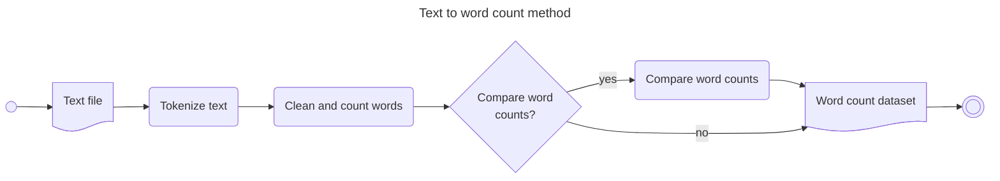
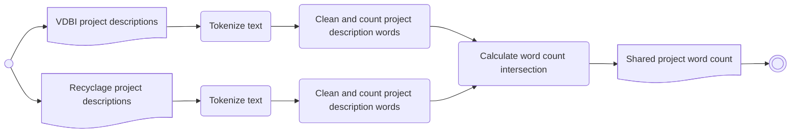
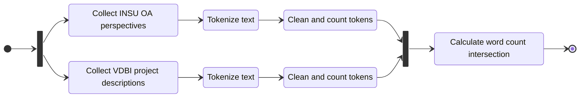
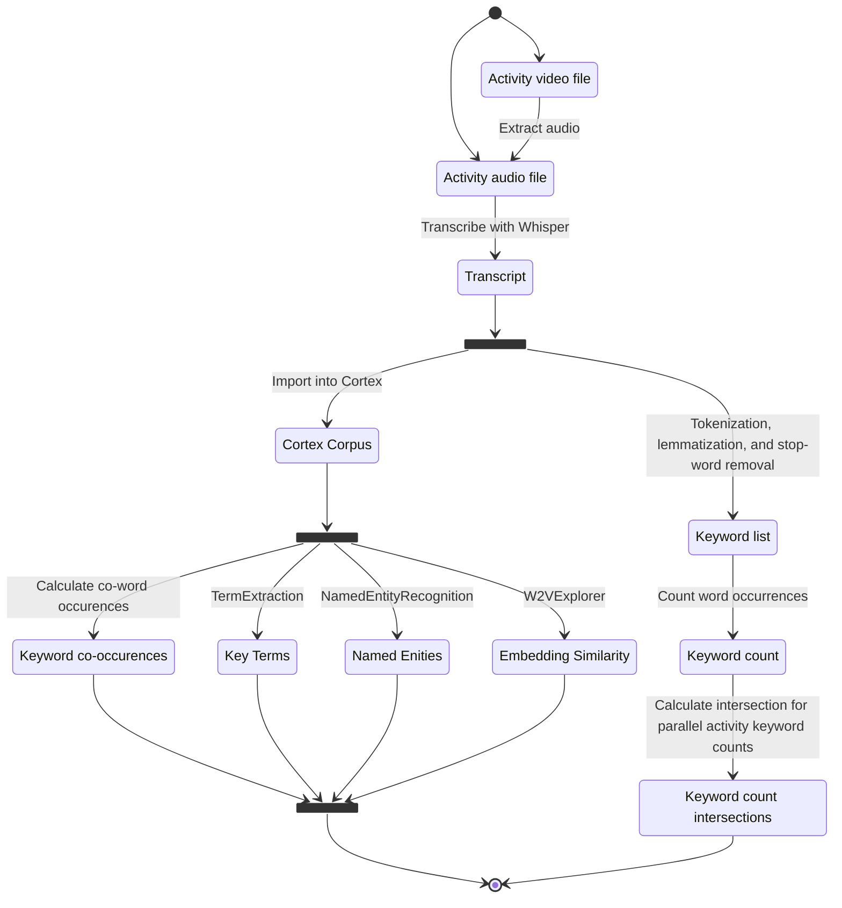

# Text to word count <!-- omit in toc -->

This page describes the process for counting and comparing the word used in
plain text files.

> [!TIP]
> These word counts can be passed to the
> [word cloud generator tool](/data-visualization/src/pages/tools/wordclouds.md)
> to create word clouds.

## Table of contents <!-- omit in toc -->

- [1. Method](#1-method)
  - [1.1. Tokenize words](#11-tokenize-words)
  - [1.2. Clean and count words](#12-clean-and-count-words)
  - [1.3. Word count comparison](#13-word-count-comparison)
- [2. To Run](#2-to-run)
- [3. Produced word counts](#3-produced-word-counts)
  - [3.1. PEPR VDBI Phase 1 project work package comparison](#31-pepr-vdbi-phase-1-project-work-package-comparison)
  - [3.2. Comparison between PEPR VDBI and PEPR Recyclage project descriptions](#32-comparison-between-pepr-vdbi-and-pepr-recyclage-project-descriptions)
    - [3.2.1. Data collection](#321-data-collection)
    - [3.2.2. Word count generation](#322-word-count-generation)
  - [3.3. Comparison between PEPR VDBI and INSU : OCÉAN-ATMOSPHÈRE](#33-comparison-between-pepr-vdbi-and-insu--océan-atmosphère)
    - [3.3.1. Data collection](#331-data-collection)
    - [3.3.2. Word count generation](#332-word-count-generation)
  - [3.4. JS VDBI 2025 analyses](#34-js-vdbi-2025-analyses)
    - [3.4.1. Data quality observations](#341-data-quality-observations)
    - [3.4.2. Data collection](#342-data-collection)
    - [3.4.3. Keyword extraction](#343-keyword-extraction)

## 1. Method



### 1.1. Tokenize words

Words are tokenized using [Natural Language Toolkit's](https://www.nltk.org/)
`nltk.word_tokenize` function with the default configuration.

### 1.2. Clean and count words

Word tokens are cleaned by:

1. [Lemmatizing](https://www.ibm.com/think/topics/stemming-lemmatization) with
   [Natural Language Toolkit's](https://www.nltk.org/)
   `nltk.stem.WordNetLemmatizer` and the default configuration
2. Mapping tokens to lower case
3. Ignoring predefined stop words
4. Removing tokens that are numeric digits
5. Removing non-alphabetic characters

Once cleaned, the word tokens are aggregated and counted.

> [!WARNING]
> The default lemmatizer does not support French

### 1.3. Word count comparison

Compare two word counts by:

1. Normalizing them to account for differences in text volumes.
2. Selecting words from each word count based on their:
   1. intersection
   2. union (like an outer join)
   3. complement
3. In the case of intersecting words, updating the count of the words based on the:
   1. Average
   2. Max
   3. Min

## 2. To Run

Before running, you must have [UV](https://docs.astral.sh/uv/) installed for
managing python dependencies.
Alternatively, you may install python directly [python](https://www.python.org/).

After installing the prerequisites, install the required npm and python libraries:

```bash
uv sync
source .venv/bin/activate
```

Use the workflow script for automating the pipeline

```bash
uv run src/wordcount_workflow.py test-data/configs/wordcount/full_workflow_test_config.json
```

**Usage:**

```bash
usage: wordcount_workflow.py [-h] [-d] [-l LOG] configuration

Launch a workflow (or data pipeline) based on a configuration

positional arguments:
  configuration      Specify the configuration file.
                     File must be structured as a JSON array of configurations,
                     each specifying the type of activity, the inputs and outputs,
                     and the parameters used for the activity.
                     Two types are currently supported:
                     - 'parse': for reading and parsing a text into a word count
                     - 'clean': for cleaning word counts
                     - 'compare': for comparing word counts
                     For example:
                     [
                        {
                           "activity": "parse",
                           "input_dir": "./input/wordcount-test/",
                           "output_dir": "./wordcount-test_stage_0/"
                        },
                        {
                           "activity": "clean",
                           "input_dir": "./wordcount-test_stage_0/",
                           "output_dir": "./wordcount-test_stage_1/",
                           "limit": 50,
                           "params": {
                           "stop_words_path": "./configs/wordcount/stop_words_english.csv"
                           }
                        },
                        {
                           "activity": "clean",
                           "input_dir": "./wordcount-test_stage_0/",
                           "output_dir": "./wordcount-test_stage_1/",
                           "limit": 100,
                           "params": {
                           "stop_words_path": "./configs/wordcount/stop_words_english.csv"
                           }
                        },
                        {
                           "activity": "compare",
                           "inputs": [
                                 "./wordcount-test_stage_1/example-text_cleaned_50.csv:./wordcount-test_stage_1/example-text_cleaned_100.csv"
                           ],
                           "output_dir": "./output/wordcount-test/",
                           "params": {
                           "mode": "INTERSECTION"
                           }
                        }
                     ]

options:
-h, --help show this help message and exit
-d, --debug Use debug mode for logging
-l LOG, --log LOG Specify the logging file
```

## 3. Produced word counts

This section documents how different word count datasets were produced.

> [!WARNING]
> Some of the input textes contain sensitive information and are not available
> on Github. Reach out to the repository maintainer if you believe you should
> have access to these files.

### 3.1. PEPR VDBI Phase 1 project work package comparison

This dataset was initially created to test the new `nltk` integration and create
word clouds for the [Journées Scientifiques PEPR VDBI 2025 (JS)](https://pepr-vdbi.fr/evenements/journees-scientifiques-annuelles-villes-durables-batiments-innovants-2024-1)

The input texts were sourced by manually copying all text (with the exception of
major section headers) from Sections 2.1 and 2.2 of each project call regarding
work package (WP) descriptions.

Once counted, the project description word counts were grouped based on their
respective "Regards croisés" sessions of the JS.
Each group's word counts were compared through the sum of their intersections.

This [config](./test-data/configs/wordcount/JS_roundtable_workflow_config.json)
was used to create the dataset.

The results are available in [test-data/output/js_roundtable](./test-data/output/js_roundtable/).

<a id="result_2" />

### 3.2. Comparison between PEPR VDBI and PEPR Recyclage project descriptions

What are the most commonly used words to describe the PEPR VDBI and Recyclage projects?

#### 3.2.1. Data collection

The initial texts from each PEPR were extracted as follows:

1. PEPR VDBI project calls description extraction
   1. Copy all text (with the exception of major section headers) from the
      following three sections of each project call:
      - Resume (en)
      - Resume (fr)
        - Note that the french version was created by translating the english
          original and verified manually.
      - Sections 2.1 and 2.2 regarding WP descriptions
1. PEPR Recyclage project description extraction
   1. Copy all text (with the exception of titles and section headers) from the
      following three sections of each project [website](https://www.pepr-recyclage.fr/):
      - Excerpt (en)
        - Project title (en)
        - Project description (en)
        - Keywords (en)
      - Tasks (en)
      - Consortium (en)
   2. Projects still under construction phases such as 'Soon to come' were removed.
   3. Final texts are available in [data-analysis/test-data/input/pepr_recyclage](data-analysis/test-data/input/pepr_recyclage)

#### 3.2.2. Word count generation

This [configuation file](test-data/configs/wordcount/compare_vdbi_recyclage_projects_config.json)
was used to create the dataset. It executes the following activities:



The results are available in the [test-data/output/compare_vdbi_recyclage_projects](test-data/output/compare_vdbi_recyclage_projects/financed_project_resumes_en_cleaned_INTERSECTION_SUM_pepr_recyclage_projets_en_cleaned.csv)
folder

### 3.3. Comparison between PEPR VDBI and INSU : OCÉAN-ATMOSPHÈRE

What are the most commonly used words to describe the PEPR VDBI and the
INSU:OCÉAN-ATMOSPHÈRE prospectives?

#### 3.3.1. Data collection

Data sources:

- PEPR VDBI project WP descriptions (see [section 3.2.1](#321-data-collection))
- The [INSU domain perspectives](https://www.insu.cnrs.fr/fr/identifier-les-enjeux-futurs-les-prospectives-scientifiques)
  for OCÉAN-ATMOSPHÈRE (OA):
  - [Synthèse des prospectives OA 2023-2028 : Comprendre, prévoir et accompagner la société à l’heure du changement climatique](https://www.insu.cnrs.fr/sites/institut_insu/files/page/2024-11/DigestProspectiveOA2023_INSU-CNRS.pdf)
  - Only sections 4-8 (pages 8-17) are used as these seem to have the richest
    vocabulary regarding the scientific themes, project needs, and proposed
    actions of the OA.
  - They are extracted and converted to text using Adobe Acrobat.
  - Final texts are available in [data-analysis/test-data/input/insu_ocean_atmosphere](data-analysis/test-data/input/insu_ocean_atmosphere)

#### 3.3.2. Word count generation

This [configuation file](test-data/configs/wordcount/compare_vdbi_insu_oa_config.json)
was used to create the dataset. It executes the following activities:



Results are available in [test-data/output/compare_vdbi_insu_oa_projects/](test-data/output/compare_vdbi_insu_oa_projects)

### 3.4. JS VDBI 2025 analyses

What are the keywords and their co-occurence used in the different presentations and workshops of the [Journées Scientifiques 2026 du PEPR VDBI](https://pepr-vdbi.fr/evenements/journees-scientifiques-annuelles-villes-durables-batiments-innovants-2025)?

The following activities are identified for analysis\* :

- Round tables between territorial collective partners and their laureate projects
  - Round table 1
  - Round table 1 questions
  - Round table 2
  - Round table 2 questions
  - Round table 3
  - Round table 3 questions
- NEO-SoLocale workshop
  - Group 1 presentation
  - Group 1 discussion
  - Group 2 presentation
  - ~~Group 2 discussion~~
  - Group 3 presentation
  - ~~Group 3 discussion~~

\* _Some activities have been removed due to poor audio quality_

#### 3.4.1. Data quality observations

- Round table audio is generally good quality
- NEO/SoLocale audio quality is inconsistent

#### 3.4.2. Data collection

Data source: Video and/or audio recording(s) of each activity

These files are not made publicly available for participant and animator privacy

#### 3.4.3. Keyword extraction



##### Notes

- Audio is cut and extracted with Microsoft Clipchamp
- Transcript is manually verified and corrected
- Whisper `large-v2` model is used for transcription
