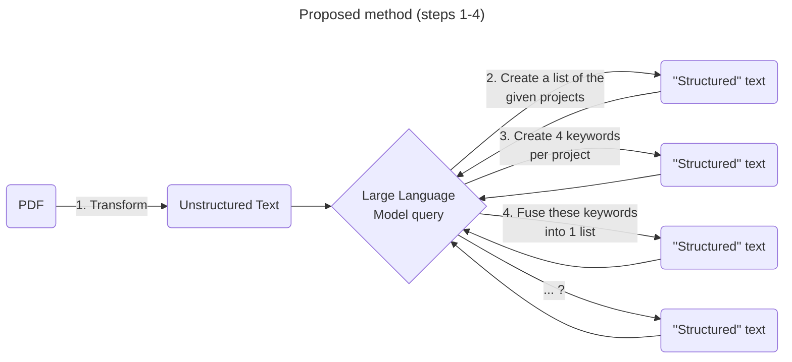

# AI-based Automated Data Integration Experiments

Tests for converting unstructured text to structured text

- [AI-based Automated Data Integration Experiments](#ai-based-automated-data-integration-experiments)
  - [Step 1 - PDF to unstructured text](#step-1---pdf-to-unstructured-text)
    - [pypdf tests](#pypdf-tests)
      - [Test 1: simple pdf to text conversion](#test-1-simple-pdf-to-text-conversion)
      - [Test 2: pdf with table to text conversion](#test-2-pdf-with-table-to-text-conversion)
  - [Step 2 - unstructured text to structured text via GPT](#step-2---unstructured-text-to-structured-text-via-gpt)
    - [Mistral](#mistral)
      - [Test 1.1: simple keyword extraction in french](#test-11-simple-keyword-extraction-in-french)
      - [Test 1.2: simple keyword extraction in english](#test-12-simple-keyword-extraction-in-english)


inspired from [GGE perplexity tests](./Tests_IA.md)

## Step 1 - PDF to unstructured text

**RQ1 (Research question):** What is the best open source PDF to text tool or library for transforming pdf files to text?

**Requirements:**

1. Open source license
2. Source available on github or library available on packaging repository (Pypi, npm, etc.)
3. Must run locally
4. Must support french
5. It would be nice if information from tables could be supported

**Initial candidates:**

| Tool/library                                     | Type                              | Comment                          |
| ------------------------------------------------ | --------------------------------- | -------------------------------- |
| [pypdf](https://github.com/py-pdf/pypdf)         | Python Library                    |                                  |
| [RAGFlow](https://github.com/infiniflow/ragflow) | CLI (Command line interface) tool |                                  |
| [pd3f](https://github.com/pd3f/pd3f)             | CLI tool                          | no french support? Is it mature? |

### pypdf tests

#### Test 1: simple pdf to text conversion
```bash
python pypdf_test.py test-data/résumé-thèse-fr.pdf test-data/pypdf_test.txt
```

Notes:
- seems to have a good output
- no formatting is retained (i.e., headers, bold, color, etc.)
- perhaps markdown would be better if possible to retain some semi-structured text?

#### Test 2: pdf with table to text conversion
```bash
python pypdf_test.py test-data/résumé-thèse-tableau-fr.pdf test-data/pypdf_table_test.txt
```

Notes:
- table has poor formatting
  - newlines in table cells are represented as newlines in output text
  - separation between consecutive cells is represented by just a space
- this causes structure of table to be lost
- again perhaps markdown is better?

## Step 2 - unstructured text to structured text via GPT
**RQ2:** What prompts provide the best results for answering the natural language questions posed in the [proposed method](#unstructured-text-to-structured-text-tests)

### Mistral
Proposed model: **Mistral**
- open source
- seems to have decent French language (and multi-language) support (also produced by a French company based in Paris, so I would hope so)
- seems to have a [good balance](https://medium.com/@periphanos.a/mistral-vs-gpt-4-a-comparative-analysis-in-size-cost-and-mmlu-performance-de320060388d) of resource usage vs performance compared to larger models like chatGPT

Dependency: **[Ollama](https://github.com/ollama/ollama)** (Open LLaMa) which supports local Mistral and Mixtral models

Start Ollama with the mistral model and no history to run tests
```baSh
ollama run mistral
>>> /set nohistory
```

#### Test 1.1: simple keyword extraction in french

Note that [deepl.com](https://www.deepl.com/) translates the keywords listed in the top of the documents as :
> 3D data, spatio-temporal data, urban data, data integration, data transformation, ontologies, knowledge graphs, conceptual models, model-based, data standards


For this prompt replace the occurrence of `[text]` with the contents of [pypdf_test.txt](./test-data/pypdf_test.txt)

> Quelles sont les mots clès dans le texte suivant ? : [text]

Output:
```
Keywords: urban data, heterogeneous data integration, 3D data, spatio-temporal data, semantic web, ontologies, knowledge graphs, conceptual models, Model-Driven Architecture (MDA), data
transformation, interoperability, computational representation, data validation.

Explanation: The text is about a research thesis focusing on the integration of heterogeneous, n-dimensional urban data for creating more comprehensive views of urban landscapes and their
evolution. The key challenges addressed in the thesis are ensuring compatibility with evolving urban data norms and minimizing data loss during transformations between different data formats. The
proposed approach uses semantic modeling based on models and preserves underlying conceptual models, which allows for adaptability and maintainability while enabling interoperability with other
open data sources. Additionally, the thesis discusses the transformation of urban data models into computational representations and their application in data validation processes to ensure high-quality transformed      
data. The ultimate goal is to enable easy reuse of integrated urban data by applications such as digital twins for providing more complete views of evolving urban landscapes.
```

Notes:
- response in english even though prompt and text are in french
- keywords seem to be accurately taken and translated from keyword section with several additions proposed
- explanation was not asked for but provided
  - the explanation does seem to be generally accurate
- would a larger Mistral model respond better? I.e.,
  - in french
  - without the explanation, just the keywords

#### Test 1.2: simple keyword extraction in english

For this prompt replace the occurrence of `[text]` with the contents of [pypdf_test.txt](./test-data/pypdf_test.txt)

> What are the keywords in the following text? : [text]

Output:
```
Keywords: urban data integration, heterogeneous multi-dimensional data, Urban Data, 3D data, spatio-temporal data, urban models, semantic modeling, model-driven architecture, data transformation,       
standardization, interoperability, computationally representable models, ontologies, knowledge graphs.

Additionally, some specific terms related to the context of the text are:

* urbanization and anthropization processes
* digital twin cities
* smart city applications
* heterogeneous data sources
* semantic and structural heterogeneity
* data transformation and conversion
* Model-Driven Architecture (MDA)
* norms and models evolution
* modeling conceptual schemes
* standards for urban data
* interoperability of urban data.
```

Notes:
- like in test 1.1 keywords are largely taken from keyword section in the text and translated with several additions
- I like the proposal of new keywords "related to the context of the text"
- given these two points, this response "seems" better than the output of test 1.1
  - with this size of Mistral, do english prompts work better than french ones?
  - how do other models like `llama2` or models with larger parameters like `mixtral:8x22b` perform?
