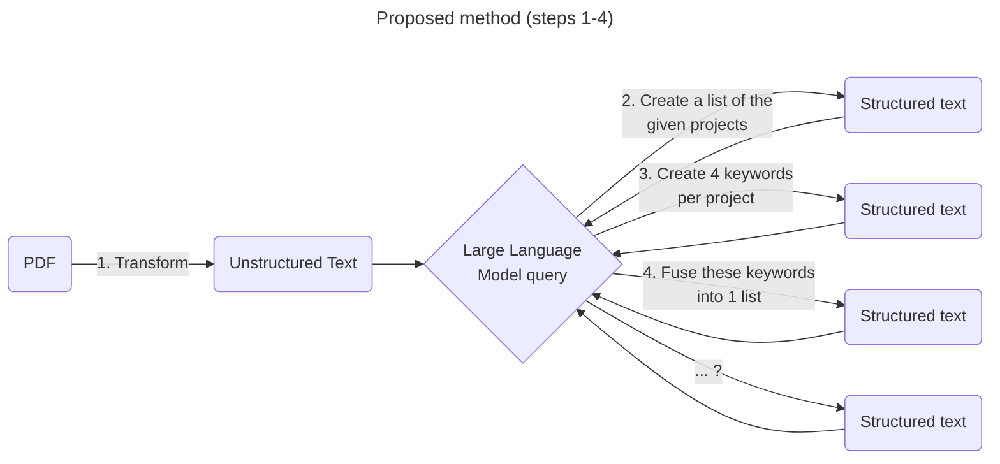

# AI-based Automated Data Integration Experiments

Tests for converting unstructured text to structured text

- [AI-based Automated Data Integration Experiments](#ai-based-automated-data-integration-experiments)
  - [Step 1 - PDF to unstructured text](#step-1---pdf-to-unstructured-text)
    - [Dependencies](#dependencies)
    - [pypdf tests](#pypdf-tests)
      - [Test 1.1: simple pdf to text conversion](#test-11-simple-pdf-to-text-conversion)
      - [Test 1.2: pdf with table to text conversion](#test-12-pdf-with-table-to-text-conversion)
      - [Test 1.3: Convert PEPR Résumés des lettres d’intention](#test-13-convert-pepr-résumés-des-lettres-dintention)
  - [Step 2 - unstructured text to structured text via GPT](#step-2---unstructured-text-to-structured-text-via-gpt)
    - [Mistral](#mistral)
      - [Test 2.1: simple keyword extraction in french](#test-21-simple-keyword-extraction-in-french)
      - [Test 2.2: simple keyword extraction in english](#test-22-simple-keyword-extraction-in-english)
      - [Test 2.3: Ollama server+python](#test-23-ollama-serverpython)
    - [Workflow](#workflow)
      - [Test 3.1: Initial Python data workflow](#test-31-initial-python-data-workflow)
      - [Test 3.2 Structured Python data workflow](#test-32-structured-python-data-workflow)
      - [Test 3.3 Initial prompt optimization test](#test-33-initial-prompt-optimization-test)
      - [Test 3.4 Page range test](#test-34-page-range-test)
      - [Test 3.5 Add csv config to workflow](#test-35-add-csv-config-to-workflow)
      - [Test 3.6 Modelfile test](#test-36-modelfile-test)
      - [Test 3.7 TEMPERATURE and top parameters test](#test-37-temperature-and-top-parameters-test)
    - [RAG tests](#rag-tests)
      - [Test 4.1 Langchain RAG local document test](#test-41-langchain-rag-local-document-test)
- [Notes for AI assisted data integration](#notes-for-ai-assisted-data-integration)
  - [Links](#links)
  - [Research interests](#research-interests)
  - [Text analysis](#text-analysis)
  - [Private instances](#private-instances)
  - [Further reading](#further-reading)
    - [JSA's AI and Deep learning courses](#jsas-ai-and-deep-learning-courses)
    - [Connectivist AI](#connectivist-ai)
    - [Symbolic AI](#symbolic-ai)
    - [Retrieval-Augmented Generation for Knowledge-Intensive NLP Tasks](#retrieval-augmented-generation-for-knowledge-intensive-nlp-tasks)


inspired from [GGE perplexity tests](./Tests_IA.md)

## Step 1 - PDF to unstructured text

**RQ1 (Research question):** What is the best open source PDF to text tool or library for transforming pdf files to text?

**Requirements:**

1. Open source license
2. Source available on github or library available on packaging repository (Pypi, npm, etc.)
3. Must run locally
4. Must support french
5. It would be nice if information from tables could be supported

**Tentative candidates:**

| Tool/library                                                                                          | Type                              | Comment                            |
| ----------------------------------------------------------------------------------------------------- | --------------------------------- | ---------------------------------- |
| [pypdf](https://github.com/py-pdf/pypdf)                                                              | Python Library                    |                                    |
| [Langchain+Ollama](https://github.com/ollama/ollama/tree/main/examples/langchain-python-rag-document) | Python Library                    |                                    |
| [RAGFlow](https://github.com/infiniflow/ragflow)                                                      | CLI (Command line interface) tool |                                    |
| [marker-pdf](https://pypi.org/project/marker-pdf/)                                                    | Python Library                    | a pipeline of deep-learning models |
| [pd3f](https://github.com/pd3f/pd3f)                                                                  | CLI tool                          | no french support? Is it mature?   |

> [!NOTE]
> On **Windows**, when exporting text files from other programs or writing to files from python, keep in mind that the **UTF-8** encoding is not always used.
> When visualizing the content of these files in vscode or in terminals, accent characers may be replaced by unknown symbols.

### Dependencies
- [Python](https://www.python.org/downloads/) v3.8+
It is recommended to use a virtual python environment. See [here](https://docs.python.org/3/library/venv.html#how-venvs-work) for more information on how to manage a python venv
```bash
python -m venv venv
venv/Scripts/activate
```

After installing python, (and optionally activating a venv) install required python libraries
```bash
pip install -r src/requirements.txt
```


### pypdf tests

Dependency:
- [pypdf](https://github.com/py-pdf/pypdf)


#### Test 1.1: simple pdf to text conversion
```bash
python src/pypdf_test.py test-data/résumé-thèse-fr.pdf test-data/pypdf_test.txt
```

> [!TIP]
> The test script can be customized. Use `python src/pypdf_test.py -h` to see the documentation.

Notes:
- seems to have a good output
- no formatting is retained (i.e., headers, bold, color, etc.)
- perhaps markdown would be better if possible to retain some semi-structured text?

#### Test 1.2: pdf with table to text conversion
```bash
python src/pypdf_test.py test-data/résumé-thèse-tableau-fr.pdf test-data/pypdf_table_test.txt
```

Notes:
- table has poor formatting
  - newlines in table cells are represented as newlines in output text
  - separation between consecutive cells is represented by just a space
- this causes structure of table to be lost
- again perhaps markdown is better?

#### Test 1.3: Convert PEPR Résumés des lettres d’intention
Download and transform the PDF of project motivation letters.

```bash
curl https://pepr-vdbi.fr/fileadmin/contributeurs/PEPR_Ville_durable/_231006b_Carnet_VDBI_resumes_des_intention_diffusion-autorisee_V3_biffe.pdf > test-data/_231006b_Carnet_VDBI_resumes_des_intention_diffusion-autorisee_V3_biffe.pdf
python src/pypdf_test.py test-data/_231006b_Carnet_VDBI_resumes_des_intention_diffusion-autorisee_V3_biffe.pdf test-data/_231006b_Carnet_VDBI_resumes_des_intention_diffusion-autorisee_V3_biffe.txt
```

Notes:
- formatting for headers, footers, and tables is lost (as expected)
- conversion is relatively fast for such a long pdf
- it will be interesting to see how these formatting issues  

## Step 2 - unstructured text to structured text via GPT
**RQ2:** What prompts provide the best results for answering the natural language questions posed in the [proposed method](#unstructured-text-to-structured-text-tests)

### Mistral
Proposed model: **Mistral**
- open source
- seems to have decent French language (and multi-language) support (also produced by a French company based in Paris, so I would hope so)
- seems to have a [good balance](https://medium.com/@periphanos.a/mistral-vs-gpt-4-a-comparative-analysis-in-size-cost-and-mmlu-performance-de320060388d) of resource usage vs performance compared to larger models like chatGPT

New dependency: **[Ollama](https://github.com/ollama/ollama)** (Open LLaMa) which supports local Mistral and Mixtral models

Start Ollama with the mistral model and no history to run tests
```bash
ollama run mistral
>>> /set nohistory
```

#### Test 2.1: simple keyword extraction in french

Note that [deepl.com](https://www.deepl.com/) translates the keywords listed in the top of the documents as :
> 3D data, spatio-temporal data, urban data, data integration, data transformation, ontologies, knowledge graphs, conceptual models, model-based, data standards


For this prompt replace the occurrence of `[text]` with the contents of [pypdf_test.txt](./test-data/pypdf_test.txt)

> Quelles sont les mots clès dans le texte suivant ? : [text]

Output:
```
Keywords: urban data, heterogeneous data integration, 3D data, spatio-temporal data, semantic web, ontologies, knowledge graphs, conceptual models, Model-Driven Architecture (MDA), data
transformation, interoperability, computational representation, data validation.

Explanation: The text is about a research thesis focusing on the integration of heterogeneous, n-dimensional urban data for creating more comprehensive views of urban landscapes and their
evolution. The key challenges addressed in the thesis are ensuring compatibility with evolving urban data norms and minimizing data loss during transformations between different data formats. The
proposed approach uses semantic modeling based on models and preserves underlying conceptual models, which allows for adaptability and maintainability while enabling interoperability with other
open data sources. Additionally, the thesis discusses the transformation of urban data models into computational representations and their application in data validation processes to ensure high-quality transformed      
data. The ultimate goal is to enable easy reuse of integrated urban data by applications such as digital twins for providing more complete views of evolving urban landscapes.
```

Notes:
- response in english even though prompt and text are in french
- keywords seem to be accurately taken and translated from keyword section with several additions proposed
- explanation was not asked for but provided
  - the explanation does seem to be generally accurate
- would a larger Mistral model respond better? I.e.,
  - in french
  - without the explanation, just the keywords

#### Test 2.2: simple keyword extraction in english

For this prompt replace the occurrence of `[text]` with the contents of [pypdf_test.txt](./test-data/pypdf_test.txt)

> What are the keywords in the following text? : [text]

Output:
```
Keywords: urban data integration, heterogeneous multi-dimensional data, Urban Data, 3D data, spatio-temporal data, urban models, semantic modeling, model-driven architecture, data transformation,       
standardization, interoperability, computationally representable models, ontologies, knowledge graphs.

Additionally, some specific terms related to the context of the text are:

* urbanization and anthropization processes
* digital twin cities
* smart city applications
* heterogeneous data sources
* semantic and structural heterogeneity
* data transformation and conversion
* Model-Driven Architecture (MDA)
* norms and models evolution
* modeling conceptual schemes
* standards for urban data
* interoperability of urban data.
```

Notes:
- like in test 1.1 keywords are largely taken from keyword section in the text and translated with several additions
- I like the proposal of new keywords "related to the context of the text"
- given these two points, this response "seems" better than the output of test 1.1
  - with this size of Mistral, do english prompts work better than french ones?
  - how do other models like `llama2` or models with larger parameters like `mixtral:8x22b` perform?

#### Test 2.3: Ollama server+python

This test will examine how we can call prompts and extract their output programatically with python.
This requires launching Ollama on a local server.

> [!NOTE]
> Why Ollama? See [these notes]([./feasability-notes-GPT-data-integration.md)

```bash
ollama serve & # launch ollama server in the background
python src/ollama_test.py \
  test-data/_231006b_Carnet_VDBI_resumes_des_intention_diffusion-autorisee_V3_biffe.txt \
  test-data/_231006b_Carnet_VDBI_resumes_des_intention_diffusion-autorisee_V3_biffe_out.txt \
  "Donner le liste des projets décrits" \
```

> [!TIP]
> - The test script can be customized. Use `python src/ollama_test.py -h` to see the documentation. 
> - Also, you can use just `ollama serve` (without the `&`) in another terminal session to be able to view ollama API calls in real time

### Workflow

#### Test 3.1: Initial Python data workflow

This test will examine how we can set up initial data workflows (or data pipelines) for extracting knowledge from multiple pdfs using python.

The proposed workflow does the following for each input file:
- step 1: Read a project proposal (PDF), transform its contents to text
- step 2: excecute a chain of GPT prompts on the text.
The following script can be used to run a series of ollama prompts based on a configuration file.
```bash
python src/workflow_test.py -f json test-data/workflow_0_config.json
```
> [!TIP]
> - The test script can be customized. Use `python src/workflow_test.py -h` to see the documentation.
> - Check the logs when running to see progress in real time (located in `workflow-test.log` by default) 

> [!WARNING]
> This configuration requires a PDF not provided in the repository

This test uses the configuration file [test-data/workflow_0_config.json](test-data/workflow_0_config.json) which features several prompts:
1. extract keywords
2. extract short abstract
3. extract partner
4. (not yet implemented) extract external partners 
5. extract laboratories
6. extract disciplines

The configuration will output to the `test-data/workflow-test/VILLEGARDEN` folder

#### Test 3.2 Structured Python data workflow

Same test as above but using the configuration file [test-data/workflow_1_config.json](test-data/workflow_1_config.json) which proposes structuring prompt outputs as JSON. 
```bash
python src/workflow_test.py -f json test-data/workflow_1_config.json
```

#### Test 3.3 Initial prompt optimization test

Same test as above but using the configuration file [test-data/workflow_2_config.json](test-data/workflow_2_config.json) which proposes a more developed prompt featuring:
- Setting a context for the GPT i.e., *"You are the scientific project manager of the project proposal below"*
- Clarifying a search perimeter i.e., *"Search only in the sections 1 'Context' and section 2 'Detailed project description'."*
- Asking for a formatted output i.e., *"Formulate your response as a bulleted list"*

```bash
python src/workflow_test.py -f json test-data/workflow_2_config.json
```

#### Test 3.4 Page range test

Same test as above but using the configuration file [test-data/workflow_3_config.json](test-data/workflow_3_config.json) which defines a page range to be searched in:
Page ranges should be a comma separated string e.g., `1, 2, 5-7` (spaces are allowed)

```bash
python src/workflow_test.py -f json test-data/workflow_3_config.json
```

#### Test 3.5 Add csv config to workflow

Use a csv file to configure workflow instead of a json file.

```bash
python src/workflow_test.py -f csv test-data/workflow_0_config.csv
```

#### Test 3.6 Modelfile test

Added modelfile functionality to ollama and workflow test scripts.

```bash
python src/workflow_test.py -f json test-data/workflow_4_config.json
```

#### Test 3.7 TEMPERATURE and top parameters test

Test ORCID and IdHAL extraction of the following modelfiles:
- [llama3-json1-creative-default](test-data/modelfiles/llama3-json1-creative-default)
- [llama3-json1-creative-diverse](test-data/modelfiles/llama3-json1-creative-diverse)
- [llama3-json1-creative-focused](test-data/modelfiles/llama3-json1-creative-focused)
- [llama3-json1-default-default](test-data/modelfiles/llama3-json1-default-default)
- [llama3-json1-default-diverse](test-data/modelfiles/llama3-json1-default-diverse)
- [llama3-json1-default-focused](test-data/modelfiles/llama3-json1-default-focused)
- [llama3-json1-unoriginal-default](test-data/modelfiles/llama3-json1-unoriginal-default)
- [llama3-json1-unoriginal-diverse](test-data/modelfiles/llama3-json1-unoriginal-diverse)
- [llama3-json1-unoriginal-focused](test-data/modelfiles/llama3-json1-unoriginal-focused)

These modelfiles use differente `temperature`, `top_k`, `top_p` to change see how these parameters effect the generation of JSON:
- 'creative' models use a `temperature` of *0.9*
- 'unoriginal' models use a `temperature` of *0.6*
- 'diverse' models use a `top_k` and `top_p` of *100* and *0.95* respectively 
- 'focused' models use a `top_k` and `top_p` of *10* and *0.5* respectively 

Additionally, conversation examples are used to provided to the model of how it should respond. The user prompt features a page of text from VILLEGARDEN project containing resercher names and their ORCIDs/IdHal. The assistant response features an example of what the expected corresponding JSON output should be.

```bash
python src/workflow_test.py -f json test-data/workflow_5_config.json
```

TODO: run test and add notes

### RAG tests

> [!NOTE]
> RAG (Retrieval-Augmented Generation) is an approach to allowing sources of new
> information to be provided to an LLM from outside of its training data. E.g. perplexity
> See [here](#retrieval-augmented-generation-for-knowledge-intensive-nlp-tasks) for more
> information

#### Test 4.1 Langchain RAG local document test

Code adapted from the ollama [langchain-python-rag-document](https://github.com/ollama/ollama/tree/main/examples/langchain-python-rag-document) example.
Test Langchain for RAG ollama queries with workspace configuration.

First install dependencies. **Note that this only seems to work on macos and linux as of initial testing**
```bash
pip install -r src/langchain-requirements.txt
```
Additionally Chroma (a dependency) requires sqlite3 >= 3.35.0. Follow [these instructions](https://docs.trychroma.com/troubleshooting#sqlite) to fulfull this dependency 

```bash
python src/workflow_test.py -f json test-data/workflow_6_config.json
```


# Notes for AI assisted data integration

**Context:** In the context of the PEPR-tests project, we would like to use AI to integrate non-structured data (from PDF documents) to visualize and analyse their underlying knowledge.

- [AI-based Automated Data Integration Experiments](#ai-based-automated-data-integration-experiments)
  - [Step 1 - PDF to unstructured text](#step-1---pdf-to-unstructured-text)
    - [Dependencies](#dependencies)
    - [pypdf tests](#pypdf-tests)
      - [Test 1.1: simple pdf to text conversion](#test-11-simple-pdf-to-text-conversion)
      - [Test 1.2: pdf with table to text conversion](#test-12-pdf-with-table-to-text-conversion)
      - [Test 1.3: Convert PEPR Résumés des lettres d’intention](#test-13-convert-pepr-résumés-des-lettres-dintention)
  - [Step 2 - unstructured text to structured text via GPT](#step-2---unstructured-text-to-structured-text-via-gpt)
    - [Mistral](#mistral)
      - [Test 2.1: simple keyword extraction in french](#test-21-simple-keyword-extraction-in-french)
      - [Test 2.2: simple keyword extraction in english](#test-22-simple-keyword-extraction-in-english)
      - [Test 2.3: Ollama server+python](#test-23-ollama-serverpython)
    - [Workflow](#workflow)
      - [Test 3.1: Initial Python data workflow](#test-31-initial-python-data-workflow)
      - [Test 3.2 Structured Python data workflow](#test-32-structured-python-data-workflow)
      - [Test 3.3 Initial prompt optimization test](#test-33-initial-prompt-optimization-test)
      - [Test 3.4 Page range test](#test-34-page-range-test)
      - [Test 3.5 Add csv config to workflow](#test-35-add-csv-config-to-workflow)
      - [Test 3.6 Modelfile test](#test-36-modelfile-test)
      - [Test 3.7 TEMPERATURE and top parameters test](#test-37-temperature-and-top-parameters-test)
    - [RAG tests](#rag-tests)
      - [Test 4.1 Langchain RAG local document test](#test-41-langchain-rag-local-document-test)
- [Notes for AI assisted data integration](#notes-for-ai-assisted-data-integration)
  - [Links](#links)
  - [Research interests](#research-interests)
  - [Text analysis](#text-analysis)
  - [Private instances](#private-instances)
  - [Further reading](#further-reading)
    - [JSA's AI and Deep learning courses](#jsas-ai-and-deep-learning-courses)
    - [Connectivist AI](#connectivist-ai)
    - [Symbolic AI](#symbolic-ai)
    - [Retrieval-Augmented Generation for Knowledge-Intensive NLP Tasks](#retrieval-augmented-generation-for-knowledge-intensive-nlp-tasks)

## Links
- [Project Repository](https://github.com/VCityTeam/PEPR-VDBI)
- [Meeting JSA DVA](../../Topic_Meetings/2024/2024_04_11_DVA_JSA.md) 

## Research interests
How to leverage AI in:
1. Extracting information from non-structured textual data sources (Natural Language Processing (NLP))
2. Automated Entity Linking
3. Data analysis

## Text analysis


## Private instances
| Model                                               | Company                                             | Pricing                                                                                                                                                                                                          |
| --------------------------------------------------- | --------------------------------------------------- | ---------------------------------------------------------------------------------------------------------------------------------------------------------------------------------------------------------------- |
| ChatGPT                                             | OpenAI (Microsoft)                                  | [pricing](https://openai.com/chatgpt/pricing) starts at 25$ / month                                                                                                                                              |
| [OLLaMa](https://github.com/ollama/ollama-python)   | <li>Open source project<li>Based on LLaMa from Meta | A **free** version of LLaMa                                                                                                                                                                                      |
| Gemini                                              | Google                                              | [pay as you go](https://ai.google.dev/pricing)<li>5 RPM (requests per minute)<li>10 million TPM (tokens per minute)<li>2,000 RPD (requests per day)<li>[API TOS](https://ai.google.dev/terms) (terms of service) |
| Claude                                              | Anthropic                                           | No official private servers<li>[Consumer TOS](https://www.anthropic.com/legal/consumer-terms)<li>[Commercial TOS](https://www.anthropic.com/legal/commercial-terms)                                              |
| Perplexity (based on ChatGPT/supports other models) | Perplexity                                          | No official private servers ([FAQ](https://docs.perplexity.ai/page/frequently-asked-questions), [TOS](https://www.perplexity.ai/hub/legal/perplexity-ai-api-privacy))                                            |
| Grok                                                | xAI                                                 | Still in early access                                                                                                                                                                                            |

## Further reading

### [JSA's AI and Deep learning courses](https://johnsamuel.info/fr/enseignement/cours/2023/IA-DeepLearning/)


### [Connectivist AI](https://en.wikipedia.org/wiki/Connectionism)
> "Connectionism... is the name of an approach to the study of human mental processes and cognition that utilizes mathematical models known as connectionist networks or **artificial neural networks**."
Includes approaches such as [Artificial neural networks](https://en.wikipedia.org/wiki/Neural_network_(machine_learning)) and [Deep learning](https://en.wikipedia.org/wiki/Deep_learning)

### [Symbolic AI](https://en.wikipedia.org/wiki/Symbolic_artificial_intelligence)
A more "classical" approach to AI. Includes logic and search algorithms, ontologies, reasoning systems, etc.

### [Retrieval-Augmented Generation for Knowledge-Intensive NLP Tasks](https://arxiv.org/abs/2005.11401)
> Large pre-trained language models have been shown to store factual knowledge in their parameters, and achieve state-of-the-art results when fine-tuned on downstream NLP tasks.
> However, their ability to access and precisely manipulate knowledge is still limited, and hence on knowledge-intensive tasks, their performance lags behind task-specific architectures.
> Additionally, providing provenance for their decisions and updating their world knowledge remain open research problems.
> Pre-trained models with a differentiable access mechanism to explicit non-parametric memory can overcome this issue, but have so far been only investigated for extractive downstream tasks.
> We explore a general-purpose fine-tuning recipe for retrieval-augmented generation (RAG) -- models which combine pre-trained parametric and non-parametric memory for language generation.
> We introduce RAG models where the parametric memory is a pre-trained seq2seq model and the non-parametric memory is a dense vector index of Wikipedia, accessed with a pre-trained neural retriever.
> We compare two RAG formulations, one which conditions on the same retrieved passages across the whole generated sequence, the other can use different passages per token.
> We fine-tune and evaluate our models on a wide range of knowledge-intensive NLP tasks and set the state-of-the-art on three open domain QA tasks, outperforming parametric seq2seq models and task-specific retrieve-and-extract architectures.
> For language generation tasks, we find that RAG models generate more specific, diverse and factual language than a state-of-the-art parametric-only seq2seq baseline.
