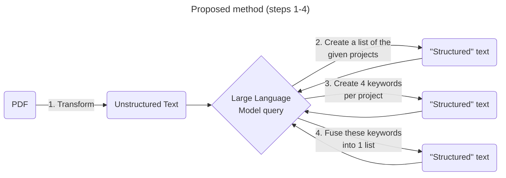

# AI-based Automated Data Integration Experiments

## Unstructured text to structured text tests


inspired from [GGE tests](./Tests_IA.md)

### Step 1 - PDF to unstructured text

**RQ1 (Research question):** What is the best open source PDF to text tool or library for transforming pdf files to text?

**Requirements:**

1. Open source license
2. Source available on github or library available on packaging repository (Pypi, npm, etc.)
3. Must run locally
4. Must support french
5. It would be nice if information from tables could be supported

**Initial candidates:**

| Tool/library                                     | Type                              | Comment                          |
| ------------------------------------------------ | --------------------------------- | -------------------------------- |
| [pypdf](https://github.com/py-pdf/pypdf)         | Python Library                    |                                  |
| [RAGFlow](https://github.com/infiniflow/ragflow) | CLI (Command line interface) tool |                                  |
| [pd3f](https://github.com/pd3f/pd3f)             | CLI tool                          | no french support? Is it mature? |

**pypdf tests**
Test 1: simple pdf to text conversion
```bash
python pypdf_test.py test-data/résumé-thèse\ \(fr\).pdf test-data/pypdf_test.txt
```

### Step 2 - unstructured text to structured text via GPT
**RQ2:** What prompts provide the best results for answering the natural language questions posed in the [proposed method](#unstructured-text-to-structured-text-tests)

Proposed model: **Mistral**
- open source
- seems to have decent French language (and multi language) support (also produced by a French company based in Paris so I would hope so)
- seems to have a [good balance](https://medium.com/@periphanos.a/mistral-vs-gpt-4-a-comparative-analysis-in-size-cost-and-mmlu-performance-de320060388d) of resource usage vs performance compared to larger models like chatGPT

Dependency: **[Ollama](https://github.com/ollama/ollama)** (Open LLaMa) which supports Mistral and Mixtral models

**Mistral tests**
Test 1: simple keyword extraction
```bash
ollama run mistral
>>> What are the keywors
```