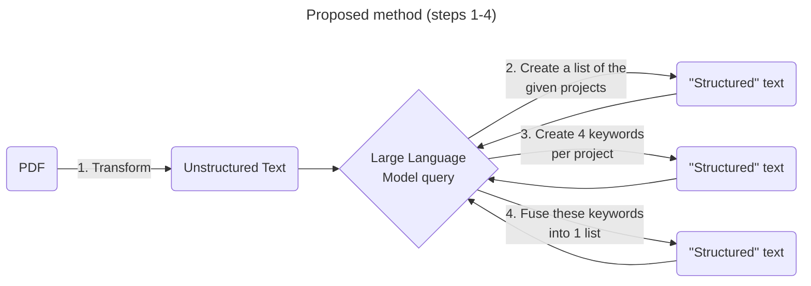

# AI-based Automated Data Integration Experiments

## Unstructured text to structured text tests

### Test 1 - PDF to unstructured text

**Research question:** What is the best open source PDF to text tool or library for transforming pdf files to text?

**Requirements:**

1. Open source license
2. Source available on github or library available on packaging repository (Pypi, npm, etc.)
3. Must run locally

**Initial candidates:**

| Tool/library                                                    | Type                              |
| --------------------------------------------------------------- | --------------------------------- |
| [RAGFlow](https://github.com/infiniflow/ragflow)                | CLI (Command line interface) tool |
| [pd3f](https://github.com/pd3f/pd3f)                            | CLI tool                          |
| [pypdf](https://github.com/py-pdf/pypdf)                        | Python Library                    |
