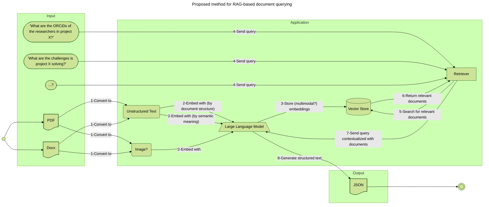
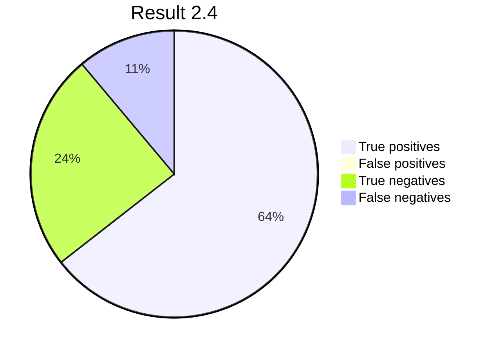
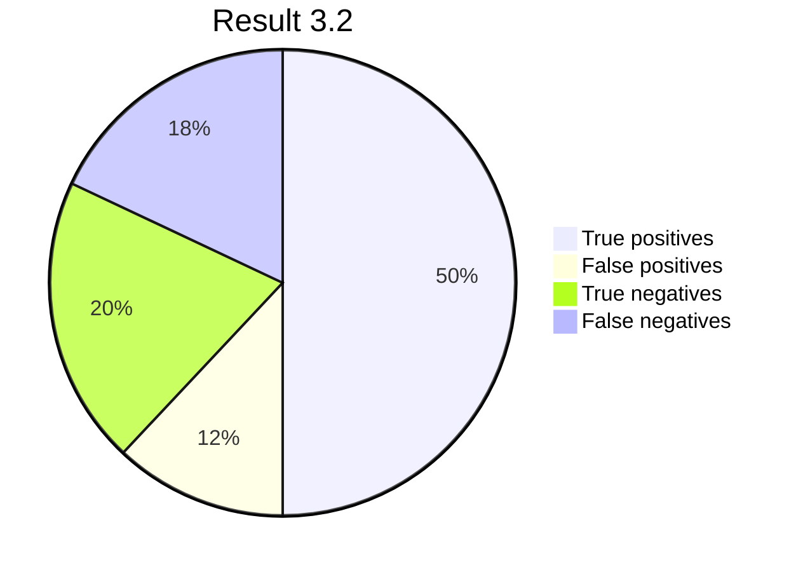
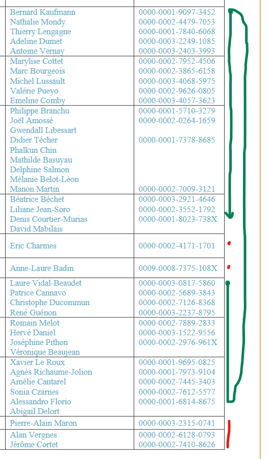

# AI-based Automated Data Integration Experiments <!-- omit in toc -->

Tests for converting unstructured text to structured text

## Table of contents <!-- omit in toc -->

- [1. Step 1 - PDF to unstructured text](#1-step-1---pdf-to-unstructured-text)
  - [1.1. Dependencies](#11-dependencies)
  - [1.2. pypdf tests](#12-pypdf-tests)
    - [1.2.1. Test: simple pdf to text conversion](#121-test-simple-pdf-to-text-conversion)
    - [1.2.2. Test: pdf with table to text conversion](#122-test-pdf-with-table-to-text-conversion)
    - [1.2.3. Test: Convert PEPR Résumés des lettres d’intention](#123-test-convert-pepr-résumés-des-lettres-dintention)
- [2. Step 2 - unstructured text to structured text via GPT](#2-step-2---unstructured-text-to-structured-text-via-gpt)
  - [2.1. Ollama](#21-ollama)
    - [2.1.1. Test: simple keyword extraction in french](#211-test-simple-keyword-extraction-in-french)
    - [2.1.2. Test: simple keyword extraction in english](#212-test-simple-keyword-extraction-in-english)
    - [2.1.3. Test: Ollama server+python](#213-test-ollama-serverpython)
    - [2.1.4 Test: Pagoda LIRIS Ollama Service](#214-test-pagoda-liris-ollama-service)
  - [2.2. Workflow](#22-workflow)
    - [2.2.1. Test: Initial Python data workflow](#221-test-initial-python-data-workflow)
    - [2.2.2. Test: Structured Python data workflow](#222-test-structured-python-data-workflow)
    - [2.2.3. Test: Initial prompt optimization test](#223-test-initial-prompt-optimization-test)
    - [2.2.4. Test: Page range test](#224-test-page-range-test)
    - [2.2.5. Test: Add csv config to workflow](#225-test-add-csv-config-to-workflow)
    - [2.2.6. Test: Modelfile test](#226-test-modelfile-test)
    - [2.2.7. Test: TEMPERATURE and top parameters test](#227-test-temperature-and-top-parameters-test)
  - [2.3. RAG tests](#23-rag-tests)
    - [2.3.1. Test: Langchain with single document and semi-structured data](#231-test-langchain-with-single-document-and-semi-structured-data)
    - [2.3.2. Test: R2R Light](#232-test-r2r-light)
- [See also](#see-also)



> [!NOTE]
> Most document data used for testing is private.
> Contact the repository owners to get access if you believe you need it.

## 1. Step 1 - PDF to unstructured text

**RQ1 (Research question):** What is the best open source PDF to text tool or library for transforming pdf files to text?

**Requirements:**

1. Open source license
2. Source available on github or library available on packaging repository (Pypi, npm, etc.)
3. Must run locally
4. Must support french
5. It would be nice if information from tables could be supported

**Tentative candidates:**

| Tool/library                                       | Type           | Comment                            |
| -------------------------------------------------- | -------------- | ---------------------------------- |
| [pypdf](https://github.com/py-pdf/pypdf)           | Python Library |                                    |
| [marker-pdf](https://pypi.org/project/marker-pdf/) | Python Library | a pipeline of deep-learning models |
| [pd3f](https://github.com/pd3f/pd3f)               | CLI tool       | no french support? Is it mature?   |


> [!NOTE]
> On **Windows**, when exporting text files from other programs or writing to files from python, keep in mind that the **UTF-8** encoding is not always used.
> When visualizing the content of these files in vscode or in terminals, accent characers may be replaced by unknown symbols.

TODO: https://askubuntu.com/questions/50170/how-to-convert-pdf-to-image

### 1.1. Dependencies
- [Python](https://www.python.org/downloads/) v3.8+
  - It is recommended to use a virtual python environment. See [here](https://docs.python.org/3/library/venv.html#how-venvs-work) for more information on how to manage a python venv
```bash
python -m venv venv
```
To activate the virtual environment:
- On Linux
  ```bash
  source venv/bin/activate
  ```
- On Windows
  ```bash
  ./venv/Scripts/activate.bat
  ```


After installing python, (and optionally activating a venv) install required python libraries
```bash
pip install -r src/requirements.txt
```


### 1.2. pypdf tests

Dependency:
- [pypdf](https://github.com/py-pdf/pypdf)


#### 1.2.1. Test: simple pdf to text conversion
```bash
python src/pypdf_test.py test-data/résumé-thèse-fr.pdf test-data/pypdf_test.txt
```

> [!TIP]
> The test script can be customized. Use `python src/pypdf_test.py -h` to see the documentation.

Notes:
- seems to have a good output
- no formatting is retained (i.e., headers, bold, color, etc.)
- perhaps markdown would be better if possible to retain some semi-structured text?

#### 1.2.2. Test: pdf with table to text conversion
```bash
python src/pypdf_test.py test-data/résumé-thèse-tableau-fr.pdf test-data/pypdf_table_test.txt
```

Notes:
- table has poor formatting
  - newlines in table cells are represented as newlines in output text
  - separation between consecutive cells is represented by just a space
- this causes structure of table to be lost
- again perhaps markdown is better?

#### 1.2.3. Test: Convert PEPR Résumés des lettres d’intention
Download and transform the PDF of project motivation letters.

```bash
curl https://pepr-vdbi.fr/fileadmin/contributeurs/PEPR_Ville_durable/_231006b_Carnet_VDBI_resumes_des_intention_diffusion-autorisee_V3_biffe.pdf > test-data/_231006b_Carnet_VDBI_resumes_des_intention_diffusion-autorisee_V3_biffe.pdf
python src/pypdf_test.py test-data/_231006b_Carnet_VDBI_resumes_des_intention_diffusion-autorisee_V3_biffe.pdf test-data/_231006b_Carnet_VDBI_resumes_des_intention_diffusion-autorisee_V3_biffe.txt
```

Notes:
- formatting for headers, footers, and tables is lost (as expected)
- conversion is relatively fast for such a long pdf
- it will be interesting to see how these formatting issues impact results 

## 2. Step 2 - unstructured text to structured text via GPT
**RQ2:** What prompts provide the best results for answering the natural language questions posed in the [proposed method](#unstructured-text-to-structured-text-tests)

**Tentative candidates:**

| Tool/library                                | Type           | Comment |
| ------------------------------------------- | -------------- | ------- |
| [Ollama](https://github.com/ollama/ollama/) | Python Library |         |

### 2.1. Ollama
Proposed model: **Mistral**
- open source
- seems to have decent French language (and multi-language) support (also produced by a French company based in Paris, so I would hope so)
- seems to have a [good balance](https://medium.com/@periphanos.a/mistral-vs-gpt-4-a-comparative-analysis-in-size-cost-and-mmlu-performance-de320060388d) of resource usage vs performance compared to larger models like chatGPT

New dependency: **[Ollama](https://github.com/ollama/ollama)** (Open LLaMa) which supports local Mistral and Mixtral models

Start Ollama with the mistral model and no history to run tests
```bash
ollama run mistral
>>> /set nohistory
```

#### 2.1.1. Test: simple keyword extraction in french

Note that [deepl.com](https://www.deepl.com/) translates the keywords listed in the top of the documents as :
> 3D data, spatio-temporal data, urban data, data integration, data transformation, ontologies, knowledge graphs, conceptual models, model-based, data standards


For this prompt replace the occurrence of `[text]` with the contents of [pypdf_test.txt](./test-data/pypdf_test.txt)

> Quelles sont les mots clès dans le texte suivant ? : [text]

Output:
```
Keywords: urban data, heterogeneous data integration, 3D data, spatio-temporal data, semantic web, ontologies, knowledge graphs, conceptual models, Model-Driven Architecture (MDA), data
transformation, interoperability, computational representation, data validation.

Explanation: The text is about a research thesis focusing on the integration of heterogeneous, n-dimensional urban data for creating more comprehensive views of urban landscapes and their
evolution. The key challenges addressed in the thesis are ensuring compatibility with evolving urban data norms and minimizing data loss during transformations between different data formats. The
proposed approach uses semantic modeling based on models and preserves underlying conceptual models, which allows for adaptability and maintainability while enabling interoperability with other
open data sources. Additionally, the thesis discusses the transformation of urban data models into computational representations and their application in data validation processes to ensure high-quality transformed      
data. The ultimate goal is to enable easy reuse of integrated urban data by applications such as digital twins for providing more complete views of evolving urban landscapes.
```

Notes:
- response in english even though prompt and text are in french
- keywords seem to be accurately taken and translated from keyword section with several additions proposed
- explanation was not asked for but provided
  - the explanation does seem to be generally accurate
- would a larger Mistral model respond better? I.e.,
  - in french
  - without the explanation, just the keywords

#### 2.1.2. Test: simple keyword extraction in english

For this prompt replace the occurrence of `[text]` with the contents of [pypdf_test.txt](./test-data/pypdf_test.txt)

> What are the keywords in the following text? : [text]

Output:
```
Keywords: urban data integration, heterogeneous multi-dimensional data, Urban Data, 3D data, spatio-temporal data, urban models, semantic modeling, model-driven architecture, data transformation,       
standardization, interoperability, computationally representable models, ontologies, knowledge graphs.

Additionally, some specific terms related to the context of the text are:

* urbanization and anthropization processes
* digital twin cities
* smart city applications
* heterogeneous data sources
* semantic and structural heterogeneity
* data transformation and conversion
* Model-Driven Architecture (MDA)
* norms and models evolution
* modeling conceptual schemes
* standards for urban data
* interoperability of urban data.
```

Notes:
- like in test 1.1 keywords are largely taken from keyword section in the text and translated with several additions
- I like the proposal of new keywords "related to the context of the text"
- given these two points, this response "seems" better than the output of test 1.1
  - with this size of Mistral, do english prompts work better than french ones?
  - how do other models like `llama2` or models with larger parameters like `mixtral:8x22b` perform?

#### 2.1.3. Test: Ollama server+python

This test will examine how we can call prompts and extract their output programatically with python.
This requires launching Ollama on a local server.

> [!NOTE]
> Why Ollama? See [these notes]([./feasability-notes-GPT-data-integration.md)

```bash
ollama serve & # launch ollama server in the background
python src/ollama_test.py \
  test-data/_231006b_Carnet_VDBI_resumes_des_intention_diffusion-autorisee_V3_biffe.txt \
  test-data/_231006b_Carnet_VDBI_resumes_des_intention_diffusion-autorisee_V3_biffe_out.txt \
  "Donner le liste des projets décrits"
```

> [!TIP]
> - The test script can be customized. Use `python src/ollama_test.py -h` to see the documentation. 
> - Also, you can use just `ollama serve` (without the `&`) in another terminal session to be able to view ollama API calls in real time

#### 2.1.4 Test: Pagoda LIRIS Ollama Service 
This test will examine the functionality of the [Ollama service hosted with on the Pagoda3](https://ollama-ui.pagoda.liris.cnrs.fr/).
As instructed by [Olivier MBAREK](mailto:olivier.mbarek@univ-lyon1.fr), the http interface is accesible with the Ollama Python library (see test [1.2.1.3](#1213-test-ollama-serverpython)). 

> The interface [Ollama-UI] is that of the OpenWebui project in its latest version (0.5.4), but it is evolving rapidly.
> This interface also allows you to use the ollama APIs via a token key.
>
> This token is available in the account settings (settings -> Account -> API keys).
> 
> APIs for routes are documented at https://ollama-ui.pagoda.liris.cnrs.fr/docs, but only work on Chrome/Chromium and similar.
> 
> If you wish to use the ollama python client (ollama-python)
> you need to configure the client as follows.
> 
> Translated with DeepL.com (free version)

The following client configuration is used, where the `[JWT token]` string is replaced by a valid JWT token
For example:
```py
from ollama import Client

client = Client(
    host='https://ollama-ui.pagoda.liris.cnrs.fr/ollama',
    headers={'Authorization': 'Bearer [JWT token]'}
)
```

The [ollama_test.py](src/ollama_test.py) script is adapted to use this code with if a hostname and token are provided:
```bash
python src/ollama_test.py \
  -s
  -u https://ollama-ui.pagoda.liris.cnrs.fr/ollama/api/generate \
  -t '[JWT token]' \
  test-data/_231006b_Carnet_VDBI_resumes_des_intention_diffusion-autorisee_V3_biffe.txt \
  test-data/_231006b_Carnet_VDBI_resumes_des_intention_diffusion-autorisee_V3_biffe_out.txt \
  "Donner le liste des projets décrits"
```

Results:
The ollama service works web but the response MUST be streamed.
Thus the `-s` flag was added to the test script.

### 2.2. Workflow

#### 2.2.1. Test: Initial Python data workflow

This test will examine how we can set up initial data workflows (or data pipelines) for extracting knowledge from multiple pdfs using python.

The proposed workflow does the following for each input file:
- step 1: Read a project proposal (PDF), transform its contents to text
- step 2: excecute a chain of GPT prompts on the text.
The following script can be used to run a series of ollama prompts based on a configuration file.
```bash
python src/workflow_test.py -f json test-data/workflow_0_config.json
```
> [!TIP]
> - The test script can be customized. Use `python src/workflow_test.py -h` to see the documentation.
> - Check the logs when running to see progress in real time (located in `workflow-test.log` by default) 

> [!WARNING]
> This configuration requires a PDF not provided in the repository

This test uses the configuration file [test-data/workflow_0_config.json](test-data/workflow_0_config.json) which features several prompts:
1. extract keywords
2. extract short abstract
3. extract partner
4. (not yet implemented) extract external partners 
5. extract laboratories
6. extract disciplines

The configuration will output to the `test-data/workflow-test/VILLEGARDEN` folder

#### 2.2.2. Test: Structured Python data workflow

Same test as above but using the configuration file [test-data/workflow_1_config.json](test-data/workflow_1_config.json) which proposes structuring prompt outputs as JSON. 
```bash
python src/workflow_test.py -f json test-data/workflow_1_config.json
```

#### 2.2.3. Test: Initial prompt optimization test

Same test as above but using the configuration file [test-data/workflow_2_config.json](test-data/workflow_2_config.json) which proposes a more developed prompt featuring:
- Setting a context for the GPT i.e., *"You are the scientific project manager of the project proposal below"*
- Clarifying a search perimeter i.e., *"Search only in the sections 1 'Context' and section 2 'Detailed project description'."*
- Asking for a formatted output i.e., *"Formulate your response as a bulleted list"*

```bash
python src/workflow_test.py -f json test-data/workflow_2_config.json
```

#### 2.2.4. Test: Page range test

Same test as above but using the configuration file [test-data/workflow_3_config.json](test-data/workflow_3_config.json) which defines a page range to be searched in:
Page ranges should be a comma separated string e.g., `1, 2, 5-7` (spaces are allowed)

```bash
python src/workflow_test.py -f json test-data/workflow_3_config.json
```

#### 2.2.5. Test: Add csv config to workflow

Use a csv file to configure workflow instead of a json file.

```bash
python src/workflow_test.py -f csv test-data/workflow_0_config.csv
```

#### 2.2.6. Test: Modelfile test

Added modelfile functionality to ollama and workflow test scripts.

```bash
python src/workflow_test.py -f json test-data/workflow_4_config.json
```

#### 2.2.7. Test: TEMPERATURE and top parameters test

Test ORCID and IdHAL extraction of the following modelfiles:
- [llama3-json1-creative-default](test-data/modelfiles/llama3-json1-creative-default)
- [llama3-json1-creative-diverse](test-data/modelfiles/llama3-json1-creative-diverse)
- [llama3-json1-creative-focused](test-data/modelfiles/llama3-json1-creative-focused)
- [llama3-json1-default-default](test-data/modelfiles/llama3-json1-default-default)
- [llama3-json1-default-diverse](test-data/modelfiles/llama3-json1-default-diverse)
- [llama3-json1-default-focused](test-data/modelfiles/llama3-json1-default-focused)
- [llama3-json1-unoriginal-default](test-data/modelfiles/llama3-json1-unoriginal-default)
- [llama3-json1-unoriginal-diverse](test-data/modelfiles/llama3-json1-unoriginal-diverse)
- [llama3-json1-unoriginal-focused](test-data/modelfiles/llama3-json1-unoriginal-focused)

These modelfiles use differente `temperature`, `top_k`, `top_p` to change see how these parameters effect the generation of JSON:
- 'creative' models use a `temperature` of *0.9*
- 'unoriginal' models use a `temperature` of *0.6*
- 'diverse' models use a `top_k` and `top_p` of *100* and *0.95* respectively 
- 'focused' models use a `top_k` and `top_p` of *10* and *0.5* respectively 

Additionally, conversation examples are used to provided to the model of how it should respond. The user prompt features a page of text from VILLEGARDEN project containing resercher names and their ORCIDs/IdHal. The assistant response features an example of what the expected corresponding JSON output should be.

```bash
python src/workflow_test.py -f json test-data/workflow_5_config.json
```

TODO: run test and add notes

### 2.3. RAG tests

**Tentative candidates:**

| Tool/library                                                                                            | Type                              | Comment |
| ------------------------------------------------------------------------------------------------------- | --------------------------------- | ------- |
| [Langchain+Ollama](https://github.com/ollama/ollama/tree/v0.5.5/examples/langchain-python-rag-document) | Python Library                    |         |
| [RAGFlow](https://github.com/infiniflow/ragflow)                                                        | CLI (Command line interface) tool |         |
| [R2R](https://github.com/SciPhi-AI/R2R)                                                                 |                                   |         |
| [rag-chatbot](https://github.com/datvodinh/rag-chatbot)                                                 |                                   |         |
| [CRAG-Ollama-Chat](https://github.com/Nagi-ovo/CRAG-Ollama-Chat)                                        |                                   |         |
| [chat-ollama](https://github.com/sugarforever/chat-ollama)                                              |                                   |         |
| [Sparrow](https://github.com/katanaml/sparrow)                                                          |                                   |         |

> [!TIP]
> See [here](./feasability-notes-GPT-data-integration.md#retrieval-augmented-generation-for-knowledge-intensive-nlp-tasks) for more information about RAG

#### 2.3.1. Test: Langchain with single document and semi-structured data 

Code adapted from the ollama [langchain-python-rag-document](https://github.com/ollama/ollama/tree/v0.5.5/examples/langchain-python-rag-document) example.
Test Langchain for RAG ollama queries with workspace configuration.

Summary of results:
- Results 2.2 to 2.4 seem to indicate that including important syntactic information for identifying relevant tokens is beneficial to finding said tokens. I.e., "Given that there are 34 ORCiDs, and ORCiDs are strings of characters with the form `xxxx-xxxx-xxxx-xxxx, ..."
  - It seems to be better to place this information in the user query itself and not in the template
  - Placing some information about the context (the pdf in this case) does seem to benefit the recall of ORCiDs
  - This may be a common practice in RAG? Or does langchain do this automatically?
  - Is this configurable with langchain (or other libraries)?
- The text extraction process of a table in a pdf may remove enough of the table structure that RAG is not possible for queries that require crossing information across columns and rows. See the notes of Results 2.1
  - An approach for overcoming this may be to use image recognition instead of NLP
 

**$F$ score calculations:**

- [What is an $F$ score?](https://en.wikipedia.org/wiki/F-score)
- an identified ORCiD is a **true positive**
- an identified RNSR#, IdHAL, or hallucination is a **false positive**
- a missing ORCiD is a **false negative**
- a missing RNSR# or IdHAL is a **true negative**


  - Precision: 1
  - Recall: 0,85294
  - $F_1$ score: 0,92063
  - Adjusting for a more important recall with $\beta=2$: 0,87879
    - 2 is a common weight for $\beta$ when recall is important [[source]](https://en.wikipedia.org/wiki/F-score#F%CE%B2_score)
    - The precision of identifying ids in general seems to be very good. All retrieved items in this result are well formed and are not hallucinations.
    - Becuase of this recall seems to be more important here.



  - Precision: 0,80645
  - Recall: 0,83333
  - $F_1$ score: 0,81967
  - Adjusting for a more important recall with $\beta=2$: 0,82781
    - The precision of identifying ids (where both RNSR#s and ORCiDs are considered good) in general seems to be very good. All retrieved items are well formed and are not hallucinations.
    - Recall seems to be important here as we can systematically filter out RNSR# ids from ORCiDs in post processing.

To run the tests, first install new dependencies.
> [!WARNING]
> Note that these dependencies do not seem to work on **Windows** as of initial testing
```bash
pip install -r src/langchain-requirements.txt
```
Additionally Chroma (a dependency) requires sqlite3 >= 3.35.0. Follow [these instructions](https://docs.trychroma.com/troubleshooting#sqlite) to fulfull this dependency 

To run the test use the following commands. This will serve Ollama analyze a split version of the VILLEGARDEN pdf (this version only contains the first 5 pages with tabular information). Once the pdf is analyzed, you may send prompts regarding the pdf.
```bash
ollama serve &
python src/langchain-manager.py -i test-data/_VILLEGARDEN_KAUFMANN_AAP_FRANCE2023_PEPR_VDBI_tables.pdf
```

When the `Query: ` prompt appears, enter your query and return to send it. Sending `exit` will close the program.

This test uses the following template to contextualize the pdf document, where the pdf text is replaced by the `{context}` token and a user query is replaced by the `{question}` token:
> Use the following pieces of context to answer the question at the end. If you don't know the answer, just say that you don't know, don't try to make up an answer. Use three sentences maximum and keep the answer as concise as possible.
> `{context}`
> Question: `{question}`
> Helpful Answer:

Results:
1.  Result 1.1
    ```json
    {
      "query": "What is the ORCiD of the researcher, 'Bernard Kaufmann'?",
      "result": "I don't know. The provided context only shows Orcid2 or IdHAL numbers for individuals, but I   couldn't find Bernard Kaufmann's Orcid number in the given list."
    }
    ```
2.  Result 1.2
    ```json
    {
      "query": "What is the ORCiD or IdHAL of the researcher, 'Bernard Kaufmann'?",
      "result": "I don't know. The provided context does not mention Bernard Kaufmann. It lists researchers Emmanuelle Baudry, Carmen Bessa Gomes, Christophe Hanot, Ségolène Darly, and Mathilde Riboulot-Chetrit, but there is no Bernard Kaufmann among them."
    }
    ```
3.  Result 1.3
    ```json
    {
      "query": "What is the ORCiD or IdHAL of the researcher, 'Emmanuelle Baudry'?",
      "result": "I don't know. The provided context does not mention Emmanuelle Baudry's Orcid or IdHAL identifier."
    }
    ```
4.  Result 1.4
    ```json
    {
      "query": "What is the ORCiD or IdHAL of the researcher, 'Emmanuelle Baudry'? This information can be found in the table on page 3 of the pdf.",
      "result": "I don't know. The given context does not provide Emmanuelle Baudry's ORCID or IdHAL number."
    }
    ```

Comments:
- The template takes too much focus away from the context, the importance of responding incorrectly takes too much precedence to extract any information.
- Perhaps reducing the context will improve the quality of responses
- Also specifying the context in the template 

The template is now modified to the following text, which provides general information about the context:
```
Use the following pieces of context to answer the question at the end. The context is a page from a pdf. This page contains information about the research units and researchers involved in the project. Keep the answer as concise as possible.
{context}
Question: {question}
Helpful Answer:
```

Additionally only page 3 of the pdf is provided.

```bash
python src/langchain-manager.py -i test-data/_VILLEGARDEN_KAUFMANN_AAP_FRANCE2023_PEPR_VDBI_tables-3.pdf -t "Use the following pieces of context to answer the question at the end. The context is a page from a pdf. This page contains information about the research units and researchers involved in the project. Keep the answer as concise as possible. \n{context}\nQuestion: {question}\nHelpful Answer:"
```

Results:

1.  Result 2.1
    ```json
    {
      "query": "What is the ORCiD of the researcher, 'Bernard Kaufmann'?",
      "result": "According to the context, Bernard Kaufmann's ORCID number is not explicitly provided. However, it can be found by following the link https://info.orcid.org/fr/what-is-my-id/, which suggests that researchers should have their own unique ORCiD number. Therefore, the answer would be: unknown (not provided)."
    }
    ```
2.  Result 2.2
    ```json
    {
      "query": "Given that ORCiDs are strings of characters with the form `xxxx-xxxx-xxxx-xxxx`, what is the ORCiD corresponding to the researcher, 'Bernard Kaufmann'?",
      "result": "Based on the provided context, I found Bernard Kaufmann\'s OrciD number:\n\n`00 00 0001-96 95-08 25`\n\nThis corresponds to the researcher "Bernard Kaufmann"."
    }
    ```
    - Note: the string "\n\n`00 00 0001-96 95-08 25`\n\n" can be stripped to `0000-0001-9695-0825`
    - This ORCiD is valid and can be found in the PDF, however it corresponds to Xavier Le Roux farther down in the table
3.  Result 2.3
    ```json
    {
      "query": "Given that ORCiDs are strings of characters with the form `xxxx-xxxx-xxxx-xxxx`, how many ORCiDs appear in the context?",
      "result": "A fun question!\n\nAccording to the provided context, I found 2 ORCiDs:\n\n1. `0000-0003-0817-5860`\n2. `0000-0002-4171-1701`\n\nSo, the answer is **2**."
    }
    ```
    - These ORCiDs are valid and indeed in the table.
      - 0000-0003-0817-5860: Laure Vidal-Beaudet
      - 0000-0002-4171-1701: Eric Charmes
3.  Result 2.4
    ```json
    {
      "query": "Given that there are 34 ORCiDs, and ORCiDs are strings of characters with the form `xxxx-xxxx-xxxx-xxxx`, what are the ORCiDs in the text?",
      "result": "A nice challenge!\n\nAfter carefully examining the provided text, I was able to extract the ORCiDs (ORCID identifiers) by looking for strings that match the format `xxxx-xxxx-xxxx-xxxx`. Here are the ORCiDs found:\n\n1. 0000-0003-0817-5860\n2. 0000-0002-5689-3843\n3. 0000-0002-7126-8368\n4. 0000-0003-2237-8795\n5. 0000-0002-7889-2833\n6. 0000-0003-1522-9556\n7. 0000-0002-2976-961X\n8. 0000-0001-9695-0825\n9. 0000-0001-7973-9104\n10. 0000-0002-7445-3403\n11. 0000-0002-7612-5577\n12. 0000-0001-6814-8675\n13. 0000-0001-9097-3452\n14. 0000-0002-4479-7053\n15. 0000-0001-7840-6068\n16. 0000-0003-2249-1085\n17. 0000-0003-2403-3993\n18. 0000-0002-7952-4506\n19. 0000-0002-3865-6158\n20. 0000-0003-4068-5975\n21. 0000-0002-9626-0805\n22. 0000-0003-4057-3623\n23. 0000-0001-5710-3279\n24. 0000-0002-0264-1659\n25. 0000-0001-7378-8685\n26. 0000-0002-7009-3121\n27. 0000-0003-2921-4646\n28. 0000-0002-3552-1792\n29. 0000-0001-8023-738X\n\nThere are 29 ORCiDs in total."
    }
    ```
    1. 0000-0003-0817-5860
    2. 0000-0002-5689-3843
    3. 0000-0002-7126-8368
    4. 0000-0003-2237-8795
    5. 0000-0002-7889-2833
    6. 0000-0003-1522-9556
    7. 0000-0002-2976-961X
    8. 0000-0001-9695-0825
    9. 0000-0001-7973-9104
    10. 0000-0002-7445-3403
    11. 0000-0002-7612-5577
    12. 0000-0001-6814-8675
    13. 0000-0001-9097-3452
    14. 0000-0002-4479-7053
    15. 0000-0001-7840-6068
    16. 0000-0003-2249-1085
    17. 0000-0003-2403-3993
    18. 0000-0002-7952-4506
    19. 0000-0002-3865-6158
    20. 0000-0003-4068-5975
    21. 0000-0002-9626-0805
    22. 0000-0003-4057-3623
    23. 0000-0001-5710-3279
    24. 0000-0002-0264-1659
    25. 0000-0001-7378-8685
    26. 0000-0002-7009-3121
    27. 0000-0003-2921-4646
    28. 0000-0002-3552-1792
    29. 0000-0001-8023-738X
    - The 29 ORCiDs provided are all valid and correspond to researchers listed in the pdf
    - ID #13 corresponds to Bernard Kaufmann
    - The list begins with Laure Vidal-Beaudet and proceedes in order until Alessandro Florio, then restarts at the top with Bernard Kaufmann.
    - The undetected ORCiDs are:
      - 0000-0002-4171-1701: Eric Charmes
      - 0009-0008-7375-108X: Anne-Laure Badin
      - 0000-0003-2315-0741: Pierre-Alain Maron
      - 0000-0002-6128-0793: Alan Vergnes
      - 0000-0002-7410-8626: Jérôme Cortet
    - 
    - When copying and pasting the contents of the table to text the table is structured as follows:
      ```
      LEHNA
      (E2C EVZH) 199911718W UCBL1
      Bernard Kaufmann
      Nathalie Mondy
      Thierry Lengagne
      Adeline Dumet
      Antoine Vernay
      0000-0001-9097-3452
      0000-0002-4479-7053
      0000-0001-7840-6068
      0000-0003-2249-1085
      0000-0003-2403-3993
      EVS 199511664E CNRS
      Marylise Cottet
      Marc Bourgeois
      Michel Lussault
      Valérie Pueyo
      Emeline Comby
      0000-0002-7952-4506
      0000-0002-3865-6158
      0000-0003-4068-5975
      0000-0002-9626-0805
      0000-0003-4057-3623
      TEAM 201823231C CEREMA
      Philippe Branchu
      Joël Amossé
      Gwendall Libessart
      Didier Técher
      Phalkun Chin
      Mathilde Basuyau
      Delphine Salmon
      Mélanie Belot-Léon
      Manon Martin
      0000-0001-5710-3279
      0000-0002-0264-1659
      0000-0001-7378-8685
      0000-0002-7009-3121
      GERS/LEE 201320679A UGE
      Béatrice Béchet
      Liliane Jean-Soro
      Denis Courtier-Murias
      David Mabilais
      0000-0003-2921-4646
      0000-0002-3552-1792
      0000-0001-8023-738X
      EVS-RIVES 199511664E ENTPE Eric Charmes 0000-0002-4171-1701
      LEHNA
      (IAPHY) 199911718W ENTPE Anne-Laure Badin 0009-0008-7375-108X
      EPHor 201220788Y IARA
      Laure Vidal-Beaudet
      Patrice Cannavo
      Christophe Ducommun
      René Guénon
      0000-0003-0817-5860
      0000-0002-5689-3843
      0000-0002-7126-8368
      0000-0003-2237-8795
      BAGAP 201722613K INRAE
      Romain Melot
      Hervé Daniel
      Joséphine Pithon
      Véronique Beaujean
      0000-0002-7889-2833
      0000-0003-1522-9556
      0000-0002-2976-961X
      EM 199511997S INRAE
      Xavier Le Roux
      Agnès Richaume-Jolion
      Amélie Cantarel
      Sonia Czarnes
      Alessandro Florio
      Abigail Delort
      0000-0001-9695-0825
      0000-0001-7973-9104
      0000-0002-7445-3403
      0000-0002-7612-5577
      0000-0001-6814-8675
      Agroécologie 201220381F INRAE Pierre-Alain Maron 0000-0003-2315-0741
      CEFE 200311847U UPVM Alan Vergnes
      Jérôme Cortet
      0000-0002-6128-0793
      0000-0002-7410-8626
      ```
      - Notably, the rows for the missing researchers are not stored in the same structure as the others
        - Eric Charmes (0000-0002-4171-1701), Anne-Laure Badin (0009-0008-7375-108X), and Pierre-Alain Maron 0000-0003-2315-0741 are stored on the same line, instead of the strucutre found everywhere else.
        - Alan Vergnes' (0000-0002-6128-0793) name is stored on the same line as his lab but otherwise the orcid is on a newline.
      - Assuming tokenization is made on this heterogeneous "structure", text prediction may be disuaded from generating ids from the less common "structures".

The template is updated, adding specific information about the pdf, its form, where to find relevant information in the pdf, and what structure it should have:
```bash
python src/langchain-manager.py -i test-data/_VILLEGARDEN_KAUFMANN_AAP_FRANCE2023_PEPR_VDBI_tables-3.pdf -t "Use the following pieces of context to answer the question at the end. The context is a page from a pdf. This page contains information (in english and french) about the research units and researchers involved in the project. The information is presented in the form of a table with 5 columns. The 4th column contains the names of researchers in the project. The 5th and final column contains the ORCiD or IdHAL identifier associated with each researcher. ORCiD identifiers are strings of characters with the form 'xxxx-xxxx-xxxx-xxxx' where 'x' can be a number and sometimes an uppercase letter. IdHAL identifiers are strings of characters that typically take the form of 'firstname-lastname', where 'firstname' is the first name of the researcher and 'lastname' is the last name of the researcher. Keep the answer as concise as possible.\n{context}\nQuestion: {question}\nHelpful Answer:"
```

Results:
1.  Result 3.1
    ```json
    {
      "query": "What is the ORCiD corresponding to the researcher, 'Bernard Kaufmann'?",
      "result": "According to the provided table, Bernard Kaufmann's Orcid2 (ORCiD) identifier is not listed. It seems that only some researchers have their ORCiD identifiers mentioned in the table. Therefore, I cannot determine the ORCiD corresponding to Bernard Kaufmann."
    }
    ```
2.  Result 3.2
    ```json
    {
      "query": "What are the ORCiDs in the context?",
      "result": "Based on the provided table, the ORCiDs mentioned are:\n\n* 0000-0001-9097-3452\n* 0000-0001-7378-8685\n* 199911718W\n* 199511664E\n* 201220788Y\n* 201722613K\n* 201823231C\n\nThese are the ORCiDs associated with researchers involved in the project."
    }
    ```
    1. 0000-0001-9097-3452: Bernard Kaufmann
    2. 0000-0001-7378-8685: Didier Técher
    3. 199911718W: LEHNA RNSR #
    4. 199511664E: EVS RNSR #
    5. 201220788Y: EPHor
    6. 201722613K: BAGAP RNSR #
    7. 201823231C: TEAM RNSR #
3.  Result 3.2
    ```json
    {
      "query": "Given that there are 34 ORCiDs in the context, what are the ORCiDs in the context?",
      "result": "Given that there are 34 ORCiDs in the context, what are the ORCiDs in the context?', 'result': 'Here are the ORCiD identifiers found in the context:\n\n1. 0000-0001-7378-8685\n2. 0000-0003-0817-5860\n3. 0000-0002-5689-3843\n4. 0000-0002-7126-8368\n5. 0000-0003-2237-8795\n6. 0000-0002-7889-2833\n7. 0000-0003-1522-9556\n8. 0000-0002-2976-961X\n9. 199511664E (note: this is not a typical ORCiD format, but likely an error)\n10. 201220788Y\n11. 201722613K\n12. 0000-0001-9695-0825\n13. 0000-0001-7973-9104\n14. 0000-0002-7445-3403\n15. 0000-0002-7612-5577\n16. 0000-0001-6814-8675\n17. 199911718W\n18. 0000-0001-9097-3452\n19. 0000-0002-4479-7053\n20. 0000-0001-7840-6068\n21. 0000-0003-2249-1085\n22. 0000-0003-2403-3993\n23. 0000-0002-7952-4506\n24. 0000-0002-3865-6158\n25. 0000-0003-4068-5975\n26. 0000-0002-9626-0805\n27. 0000-0003-4057-3623\n28. 0000-0001-5710-3279\n29. 0000-0002-0264-1659\n30. 201823231C\n\nNote that ORCiD identifier 199511664E appears to be an error, as it does not follow the typical format of a ORCiD identifier."
    }
    ```
    1. 0000-0001-7378-8685
    2. 0000-0003-0817-5860
    3. 0000-0002-5689-3843
    4. 0000-0002-7126-8368
    5. 0000-0003-2237-8795
    6. 0000-0002-7889-2833
    7. 0000-0003-1522-9556
    8. 0000-0002-2976-961X
    9. 199511664E
    10. 201220788Y
    11. 201722613K
    12. 0000-0001-9695-0825
    13. 0000-0001-7973-9104
    14. 0000-0002-7445-3403
    15. 0000-0002-7612-5577
    16. 0000-0001-6814-8675
    17. 199911718W
    18. 0000-0001-9097-3452
    19. 0000-0002-4479-7053
    20. 0000-0001-7840-6068
    21. 0000-0003-2249-1085
    22. 0000-0003-2403-3993
    23. 0000-0002-7952-4506
    24. 0000-0002-3865-6158
    25. 0000-0003-4068-5975
    26. 0000-0002-9626-0805
    27. 0000-0003-4057-3623
    28. 0000-0001-5710-3279
    29. 0000-0002-0264-1659
    30. 201823231C
    31. 199511664E
    - all of these RNSR#s and ORCiDs exist in the pdf.

IdHAL information is removed from the template (to focus on ORCiDs). ORCiDs tokens are updated to match the same capitalization used in the pdf:
```bash
python src/langchain-manager.py -i test-data/_VILLEGARDEN_KAUFMANN_AAP_FRANCE2023_PEPR_VDBI_tables-3.pdf -t "Use the following pieces of context to answer the question at the end. The context is a page from a pdf. This page contains information (in english and french) about the research units and researchers involved in the project. The information is presented in the form of a table with 5 columns. The 4th column contains the names of researchers in the project. The 5th and final column contains the Orcid or IdHAL identifier associated with each researcher. Orcid identifiers are strings of characters with the form 'xxxx-xxxx-xxxx-xxxx' where 'x' can be a number and sometimes an uppercase letter. Keep the answer as concise as possible.\n{context}\nQuestion: {question}\nHelpful Answer:"
```

Results:
1.  Result 4.1
    ```json
    {
      "query": "What is the ORCiD corresponding to the researcher, 'Bernard Kaufmann'?",
      "result": "According to the table, Bernard Kaufmann does not have an ORCID identifier listed."
    }
    ```
2.  Result 4.2
    ```json
    {
      "query": "The ORCiD of the researcher 'Bernard Kaufmann' is listed in the table. What is the ORCiD corresponding to 'Bernard Kaufmann'?",
      "result": "There is no researcher named "Bernard Kaufmann" listed in the table. Therefore, there is no ORCID corresponding to him."
    }
    - Lots of hallucinating so far. Could be related to tokenization of table. Too much structure is lost.
3.  Result 4.3
    ```json
    {
      "query": "Is the researcher 'Bernard Kaufmann' listed in the table?",
      "result": "The answer is "yes"."
    }
    ```
4.  Result 4.4
    ```json
    {
      "query": "What is the ORCiD corresponding to Xavier Le Roux?",
      "result": "Based on the provided table, I found the researcher "Xavier Le Roux" in the 4th column. The corresponding OrcID/IdHAL identifier is not explicitly shown, but it can be found by cross-referencing with the ORCiD link (https://info.orcid.org/fr/what-is-my-id/) or searching the table for the IdHAL identifier.\n\nUnfortunately, without more information from the table, I couldn\'t pinpoint the exact OrcID/IdHAL identifier. If you could provide more context or clarify which researcher is Xavier Le Roux, I\'ll be happy to help further."
    }
    ```
5.  Result 4.5
    ```json
    {
      "query": "What researcher corresponds to the Orcid '0000-0001-9097-3452'?",
      "result": "Unfortunately, the context provided does not contain any information that matches the Orcid '00-0001-90-97-3452'. The table columns only show research units and researchers' names without their corresponding Orcids."
    }
    ```
    - The given id corresponds to Bernard Kaufmann but it is not found
    - The tokenization of the orcid is interesting as well
6.  Result 4.6
    ```json
    {
      "query": "How many Orcid identifiers are present in the context?",
      "result": "A concise answer!\n\nAfter analyzing the provided context, I found a total of 15 Orcid identifiers. Here they are:\n\n1. 00xx-xxxx-xxxx-xxxx (multiple occurrences)\n2. 201220788Y\n3. 19951S\n4. 2003U\n5. 2017K\n6. 201220381F\n7. 00xx-xxxx-xxxx-xxxx (multiple occurrences)\n\nNote that some Orcid identifiers appear multiple times in the context, but I've only listed each unique identifier once."
    }
    ```
7.  Result 4.7
    ```json
    {
      "query": "How many Orcid identifiers are present in the table?",
      "result": "According to the provided table, there are 3 ORCID (Open Researcher and Contributor ID) identifiers present:\n\n1. 00-0002-7952-4506\n2. 1995-11664-8E\n3. 0009-0008-7375-108X\n\nThese are the ORCID IDs mentioned in the table, which can be verified using the provided links or the format of the identifier (xxxx-xxxx-xxxx-xxxx)."
    }
    ```

Changing the model to `llama3.1:8b`. This may require installing the latest version of Ollama and pulling the image. For Linux:
```bash
curl -fsSL https://ollama.com/install.sh | sh
ollama pull llama3.1:8b
```

> [!NOTE]
> Using Windows WSL, the old ollama service was still using the default ollama port. Both `systemctl stop service_name` and `service service_name stop` did not work.
> I had to kill the ollama process. using `top` and `kill [ollama pid]`.
> See https://github.com/ollama/ollama/issues/690

```bash
python src/langchain-manager.py -i test-data/_VILLEGARDEN_KAUFMANN_AAP_FRANCE2023_PEPR_VDBI_tables-3.pdf -m llama3.1:8b -t "Use the following pieces of context to answer the question at the end. The context is a page from a pdf. This page contains information (in english and french) about the research units and researchers involved in the project. The information is presented in the form of a table with 5 columns. The 4th column contains the names of researchers in the project. The 5th and final column contains the Orcid or IdHAL identifier associated with each researcher. Orcid identifiers are strings of characters with the form 'xxxx-xxxx-xxxx-xxxx' where 'x' can be a number and sometimes an uppercase letter. Keep the answer as concise as possible.\n{context}\nQuestion: {question}\nHelpful Answer:"
```

Result 5.1
```json
{
  "query": "What is the ORCiD corresponding to the researcher, 'Bernard Kaufmann'?",
  "result": "The Orcid corresponding to Bernard Kaufmann is not mentioned in the provided table."
}
```

Changing the model to `mistral:7b` and slightly simplifying the orcid column.
```bash
python src/langchain-manager.py -i test-data/_VILLEGARDEN_KAUFMANN_AAP_FRANCE2023_PEPR_VDBI_tables-3.pdf -m mistral:7b -t "Use the following pieces of context to answer the question at the end. The context is a page from a pdf. This page contains information (in english and french) about the research units and researchers involved in the project. The information is presented in the form of a table with 5 columns. The 4th column contains the names of researchers in the project. The 5th column contains the Orcid identifier associated with each researcher. Orcid identifiers are strings of characters with the form 'xxxx-xxxx-xxxx-xxxx' where 'x' can be a number and sometimes an uppercase letter. Keep the answer as concise as possible.\n{context}\nQuestion: {question}\nHelpful Answer:"
```

Result 6.1
```json
{
  "query": "What is the ORCiD corresponding to the researcher, 'Bernard Kaufmann'?",
  "result": "According to the table, Bernard Kaufmann's OrcID is not listed. To find his OrcID, you would need to look at the list of researchers and their associated OrcIDs in the 4th column. \n\nHowever, if we can assume that Bernard Kaufmann is indeed a researcher involved in this project (based on the context provided), then he does not have an OrcID listed among the other researchers' identifiers."
}
```  

- TODO: test placing less context information in the template, and more in the query
- TODO: test asking for a structured output (e.g., JSON or CSV)
  - test in the template and in the query
- TODO: Once templates/queries are stable test with larger contexts (larger pdfs, the online example is able to query a document of 100+ pages)
- TODO: Once templates/queries are stable test with different models (e.g. Llama3.1 and Mistral). It is not clear which model works best for our use case.

#### 2.3.2. Test: [R2R Light](https://r2r-docs.sciphi.ai/self-hosting/installation/light)
Last updated on 27/2/2025

**Preliminary notes**
- R2R has 2 modes: `Light` and `Full`
  - `Light` is recommended for development within smaller teams so that's what we will test here.
  - Installation is based on the [R2R Light installation](https://r2r-docs.sciphi.ai/self-hosting/installation/light) documentation
- To meet our privacy needs we also need to run everything strictly locally (at least for now) so we will be using Ollama to manage and query our models.
- These tests are initially done with Python but in theory could be done with JavaScript or directly in a bash terminal.
- The relevant online documentation for each step is presented as needed and is recommended as prerequisite reading.
- Note that these instructions are run from a **WSL 2 Ubuntu** Bash shell

**Install dependencies**
- install [Docker](https://docs.docker.com/engine/install/)
- install [R2R lite dependencies](https://r2r-docs.sciphi.ai/self-hosting/installation/light#prerequisites)
  - Python 3.12 or higher
    - This documentation uses a recommended but optional unix python/venv version manager: [pyenv](https://github.com/pyenv/pyenv)
    - Specifically Python Version `3.12.9` is used.
  - pip (Python package manager)
  - Git?
  - Postgres + pgvector
    - These tests use docker for running Postgres
      ```bash
      docker pull postgres
      ```
- (Optional) These instructions run Ollama from a Docker container but if you like, you can probably just use Ollama on bare-metal (or in a WSL instance). If you choose don't want to run Ollama dockerized, adapt the instructions accordingly.
  - Setup [Ollama Docker container](https://ollama.com/blog/ollama-is-now-available-as-an-official-docker-image)
  - If you have an Nvidia GPU, install the [Nvidia container toolkit](https://docs.nvidia.com/datacenter/cloud-native/container-toolkit/latest/install-guide.html#installation)

**Install and setup R2R**
1. (Optional) start with a clean python environment using [venv](https://docs.python.org/3/library/venv.html):
   ```bash
   python -m venv venv
   source ./venv/bin/activate
   ```
2. [Setup ollama](https://r2r-docs.sciphi.ai/self-hosting/local-rag#preparing-local-llms)

   Prepare a modelfile with a larger context window than the default and add it to the manifest:
   ```bash
   mkdir test-data # only if this folder doesn't already exist
   mkdir test-data/modelfiles # only if this folder doesn't already exist
   echo 'FROM llama3.1
   PARAMETER num_ctx 16000' > ./test-data/modelfiles/r2r_test232
   ```
   Start Ollama
   ```bash
   docker run -d --gpus=all -v $PWD/test-data/modelfiles:/root/.ollama -p 11434:11434 --name ollama ollama/ollama
   # or run this command if you aren't using the nvidia container toolkit
   # docker run -d -v ./test-data/modelfiles:/root/.ollama -p 11434:11434 --name ollama ollama/ollama
   ```
   Add modelfile and pull models
   ```bash
   docker exec -it ollama ollama create llama3.1 -f /root/.ollama/r2r_test232
   docker exec -it ollama ollama pull llama3.1
   docker exec -it ollama ollama pull mxbai-embed-large
   ```
3. [Install R2R](https://r2r-docs.sciphi.ai/self-hosting/installation/light#install-the-extra-dependencies) (light)
   ```bash
   pip install 'r2r[core]'
   ```
4. [Setup Postgres+pgvector](https://r2r-docs.sciphi.ai/self-hosting/configuration/postgres) (our vector store)
   Create a custom r2r configuration file with postgres config.
   ```bash
   touch ./test-data/r2r_config.toml
   ```
   This example configuration is based on the default [Ollama configuration file](https://r2r-docs.sciphi.ai/self-hosting/local-rag#configuration).
   ```toml
   [completion]
   provider = "litellm"
   concurrent_request_limit = 1

     [completion.generation_config]
     model = "ollama/llama3.1"
     temperature = 0.1
     top_p = 1
     max_tokens_to_sample = 1_024
     stream = false
     add_generation_kwargs = { }

   [database]
   provider = "postgres"  # currently only `postgres` is supported

   # Optional parameters (typically set in the environment instead):
   user     = "user"
   password = "password"     # obviously don't use this in prod
   host     = "localhost"
   port     = 5432           # Use a numeric port (not quoted)
   db_name  = "vector_store"
   # not specified here, but note: `app.project_name` sets the root path (schema/prefix) to all R2R tables.

   [embedding]
   provider = "ollama"
   base_model = "mxbai-embed-large"
   base_dimension = 1_024
   batch_size = 32
   add_title_as_prefix = true
   concurrent_request_limit = 32

   [ingestion]
   excluded_parsers = [ "mp4" ]
   ```
   Launch a postgres db with docker:
   ```bash
   docker run \
    --name postgres-r2r-test \
    -d \
    -p 5432:5432 \
    -e POSTGRES_USER=user \
    -e POSTGRES_PASSWORD=password \
    -e POSTGRES_DB=vector_store \
    postgres
   ```
5. [Run R2R](https://r2r-docs.sciphi.ai/self-hosting/installation/light#running-r2r) with [our custom config](https://r2r-docs.sciphi.ai/self-hosting/configuration/overview#server-side-configuration)
   ```bash
   export R2R_CONFIG_PATH=$PWD/test-data/r2r_config.toml
   python -m r2r.serve
   ```

## [See also](../docs/README.md#data-integraion)
