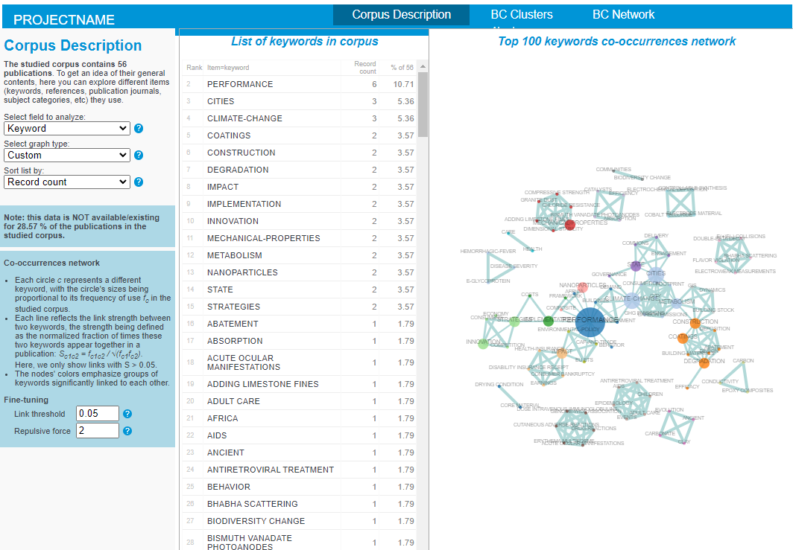

# BiblioTools / BiblioMaps notes <!-- omit in toc -->

[BiblioTools](https://www.sebastian-grauwin.com/bibliomaps/index.html) is a freely available set of scripts developed to create maps of science based on bibliographic data.

## Table of contents
- [Table of contents](#table-of-contents)
- [General notes](#general-notes)
- [Requirements](#requirements)
- [Technical limitations](#technical-limitations)
- [Installation notes](#installation-notes)
- [Visualization notes](#visualization-notes)
  - [Corpus description](#corpus-description)
  - [BC (Bibliographic Coupling) Clusters](#bc-bibliographic-coupling-clusters)
  - [BC Network](#bc-network)


> [!NOTE]
> - **BiblioTools** refers to a pythonic command line scripts for creating maps of bibliographic data
> - **BiblioMaps** is a web interface for BiblioTools


## General notes
- no license? But the following is mentioned
  > - Download the software and use it on your data.
  > - Download the software and edit / improve / expand the code as you see fit, if you are a motivated developper.
- BiblioMaps does not yet have a citation but BiblioTools does: https://link.springer.com/article/10.1007/s11192-011-0482-y
- No longer under development? No major updates since March 2018 according to main website

## Requirements
- Requires [WebOfScience](https://www.webofscience.com/wos/) (WoS) and/or [Scopus](https://www.scopus.com/home.uri) access which are available through **UCBL (SESAME) credentials**
  - See [this tutorial](https://www.sebastian-grauwin.com/bibliomaps/tutorials.html#EXT) for general instructions on data exportation
  - This tutorial may be slightly out of date. E.g., in the WoS instruction reference to "Output records" which is now labled "Export". 
- No binary installer or executable, requires Python and command line to run
  - Installation instructions are available [here](https://www.sebastian-grauwin.com/bibliomaps/download.html)
- Minimal management of script input/output and local/public server hosting is also required for BiblioMaps data visualization

## Technical limitations
- [WebOfScience](https://www.webofscience.com/wos/) and [Scopus](https://www.scopus.com/home.uri) data is exported/imported manually

## Installation notes
- Results are stored under the [./data/bibliotools](./data/bibliotools) folder following the instructions mentioned in the [requirements section](#requirements)
  - BiblioTools3.2 is installed in [./BibioTools3.2](./BiblioTools3.2/) for the purposes of this documentation.
  - An initial [WoS export](./data/bibliotools/rawdata/WoS_export.txt) (56 results) is used for this using this WoS query: `ALL=(City) AND ALL=(Durable) AND ALL=(Building) AND (ALL=(Innovative) OR ALL=(Innovation))`
- BiblioTools rejects "inadequate" records (e.g., missing publication year) by default
- BiblioMaps server files are stored in [./data/bibliotools/server/](./data/bibliotools/server/) following the tutorial linked in the BiblioMaps documentation.

Using a terminal with the same working directory as this document the following commands are run:
```bash
python BiblioTools3.2/all_in_one.py -i data/bibliotools/rawdata -o data/bibliotools/
cp -r BiblioTools3.2/BIBLIOMAPS_myprojectname/* data/bibliotools/server
cp -r data/bibliotools/freqs data/bibliotools/server/data
cp -r data/bibliotools/jsonfiles/* data/bibliotools/server/data
```

To run a localhost server with python:
```bash
python -m http.server -d data/bibliotools/server/
```

Navigate to [localhost:8000](http://localhost:8000) to see the visualization


> [!IMPORTANT]
> To have access to Bibliographic Coupling at the publication level, uncomment line 14 of the [data/bibliotools/server/headermenu.html](./data/bibliotools/server/headermenu.html) file.
> This page will be accessible from [localhost:8000/BCpublis.html](http://localhost:8000/BCpublis.html) 

## Visualization notes

Three main pages are provided:
1. [Corpus description](#Corpus-description)
2. [BC (Bibliographic Coupling) Clusters](#bc-bibliographic-coupling-clusters)
3. [BC Network](#BC-Network)

### Corpus description

Displays general data visualizations of the corpus data.

All visualizations display some specialized data visualization on the right, and a table with the raw data in the middle of the interface.
This table can always be sorted by `Record count` or alphabetically by `Item` (record name)



**Proposed Visualizations by corpus data field**

|              Field |    Bar chart and Plot    | Pie chart | Word cloud |      Map       | Graph        |
| -----------------: | :----------------------: | :-------: | :--------: | :------------: | ------------ |
|             Author |       :bar_chart:        |           |  :cloud:   |
|  Country/territory |       :bar_chart:        |           |            | :earth_africa: |
|      Document type | :bar_chart: (only plot)  |   :pie:   |            |
|        Institution |       :bar_chart:        |           |  :cloud:   |
|            Keyword |       :bar_chart:        |           |            |                | :spider_web: |
|           Language | :bar_chart:  (only plot) |   :pie:   |            |
| Publication source | :bar_chart:  (only plot) |           |  :cloud:   |
|   Publication year |       :bar_chart:        |           |            |
|          Reference |       :bar_chart:        |           |            |                | :spider_web: |
|   Reference source |       :bar_chart:        |           |            |                | :spider_web: |
|   Subject category |       :bar_chart:        |           |            |                | :spider_web: |

### BC (Bibliographic Coupling) Clusters

> [!CAUTION]
> After initial setup this is currently not working, displaying the following errors:
> - `Uncaught ReferenceError: Awesomplete is not defined at bibliomap_BCclusters.js:28:19`
> - ```
>    Uncaught TypeError: Cannot set properties of undefined (setting 'list')
>      at update (bibliomap_BCclusters.js:185:19)
>      at bibliomap_BCclusters.js:164:5
>      at d3.min.js:1:11180
>      at Object.<anonymous> (d3.min.js:1:10988)
>      at Object.t (d3.min.js:1:1368)
>      at XMLHttpRequest.u (d3.min.js:1:9850)
>    ```

### BC Network

> [!CAUTION]
> After initial setup this is currently not working, displaying the following errors:
> - `GET http://localhost:8000/data/network_all_defaultVAR.json 404 (File not found) d3.min.js:1 `
> - ```
>   Uncaught TypeError: Cannot read properties of null (reading 'Wrange')
>     at BCpublis.html:191:20
>     at Object.<anonymous> (d3.min.js:1:11180)
>     at Object.t (d3.min.js:1:1368)
>     at XMLHttpRequest.u (d3.min.js:1:9873)
>   ```