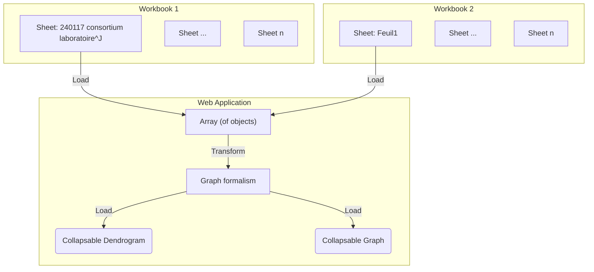

# Visualize Workbook data using Graphs and Trees

Visualize the first sheet from the phase 1 Excel document as a graph.

## Integration process

Take the data imported from the [initial-import-test](./initial-import-test) and transform the table into a graph formalism.
To do this, we need to set up a component to transform the data.

**Input:**
- Workbook 1: "240117 consortium laboratoire, établissement CNRS-SHS_Stat"
- Workbook 2: "240108_consortium, contenus des propositions CNRS-SHS_GGE_JYT_ANRT"

# Visualization result

Once integrated the following information is desired for visualization:
- lab names
- ERC disciplines
- show missing information
- show graphs over charts
  - theme -> projet (in other workbook ANRT)
  - col I : produit (ou resultats) de la recherche (primaire), J : secondaire, H : Quelles actions pour quelles solutions, A : acronyme
- Root node: PEPR VDBI

## Collapsable Dendrogram of themes and projects
 