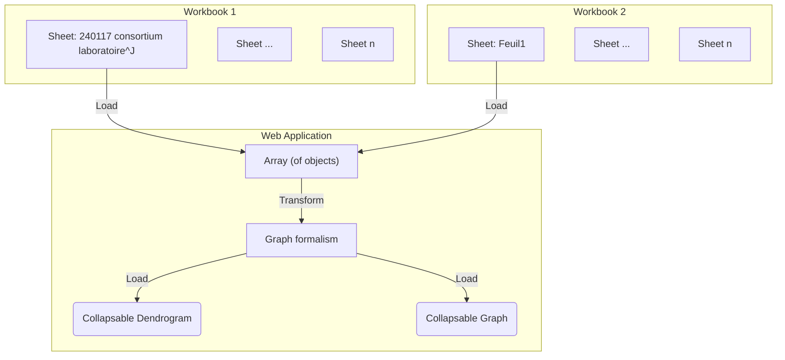

# Visualize Workbook data using Graphs and Trees

Visualize the first sheet from the phase 1 Excel document as a graph.

```js
import { getProductSheet, resolveKnownEntities } from "./components/import-products.js";
import { mapProductsToGraph } from "./components/force-graph.js";
import { mapProductsToTree, radialDendrogram } from "./components/radial-dendrogram.js";
import { collapsableRadialDendrogram } from "./components/collapsable-radial-dendrogram.js";
```

```js
const workbook1 = FileAttachment("./data/240117 consortium laboratoire, établissement CNRS-SHS_Stat.xlsx").xlsx();
const workbook2 = FileAttachment("./data/240108_consortium, contenus des propositions CNRS-SHS_GGE_JYT_ANRT.xlsx").xlsx();
```

```js
let productData = d3.filter(resolveKnownEntities(getProductSheet(workbook2)), (_d, i) => {
    return i < 10;
});
```

**Input data:**
```js
display(productData);
```

```js
const productGraph = mapProductsToGraph(productData);
```

**Sheet mapped to graph:**
```js
display(productGraph);
```

```js
const productTree = mapProductsToTree(productData);
```

**Sheet mapped to tree:**
```js
display(productTree);
```

## Collapsable Radial Dendrogram

```js
const collapsableRadialProducts = view(collapsableRadialDendrogram(productTree, {
    label: d => d.name,
    width: 1600,
    height: 1600,
    margin: 50,
    r: 3,
    fontsize: 15,
    depth: 150,
    duration: 500
}));
```

```js
collapsableRadialProducts;
```

```js
console.debug(collapsableRadialProducts);
```

## Visualization information

Once integrated the following information is desired for visualization:
- [ ] lab names
- [ ] ERC disciplines
- [ ] show missing information
- [x] show graphs over charts
  - [ ] theme -> projet (in other workbook ANRT)
  - [ ] col I : produit (ou resultats) de la recherche (primaire), J : secondaire, H : Quelles actions pour quelles solutions, A : acronyme
- [x] Root node: PEPR VDBI

## Data integration process

Take the data imported from the [initial-import-test](./initial-import-test) and transform the table into a graph formalism.
To do this, we need to set up a component to transform the data.

**Input:**
- Workbook 1: "240117 consortium laboratoire, établissement CNRS-SHS_Stat"
- Workbook 2: "240108_consortium, contenus des propositions CNRS-SHS_GGE_JYT_ANRT"


