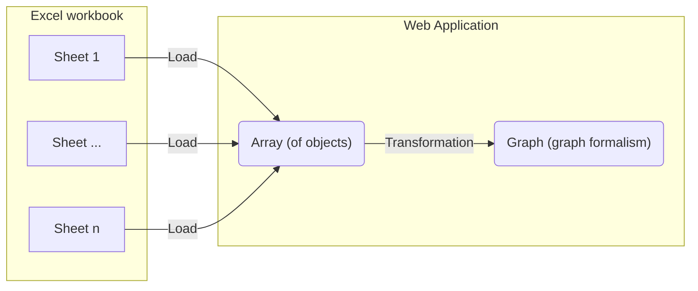

# Import 240117 consortium laboratoire^J

Visualize the first sheet from the phase 1 Excel document as a graph.

## Integration process

Take the data imported from the [initial-import-test](./initial-import-test) and transform the table into a graph formalism.
To do this, we need to set up a component to transform the data.

# Visualization result
