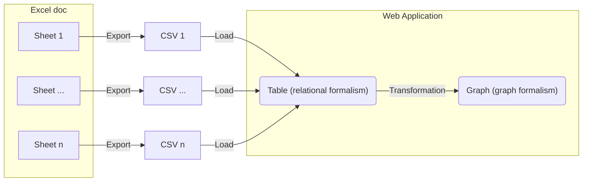

# Import 240117 consortium laboratoire^J

Visualize the first sheet from the phase 1 Excel document as a graph.

## Integration process

D3 and the Observable framework can't import `.xls` or `.xlsx` files so we must export to `.csv` first.
This was done in the [initial-import-test](./initial-import-test).
Next we must transform the table into a graph formalism.
To do this, we need to set up a [csv dataloader](./data/phase1_sheet1.csv.js).



## Visualization result

```js
import {timeline} from "./components/timeline.js";
```

```js
const events = FileAttachment("./data/events.json").json();
```

```js
timeline(events, {height: 300})
```
