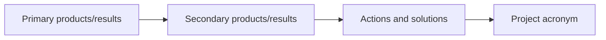

# Visualize Workbook data using Graphs and Trees

Visualize the first sheet from the phase 1 Excel document using trees and dendrogram diagrams.

```js echo
import { getProductSheet, resolveKnownEntities, mapEntitesToProjectTree, mapEntitesToProductToProjectTree } from "./components/import-products.js";
import { mapProductsToGraph } from "./components/force-graph.js";
import { radialDendrogram } from "./components/radial-dendrogram.js";
import { collapsableRadialDendrogram } from "./components/collapsable-radial-dendrogram.js";

const workbook1 = FileAttachment("./data/240117 consortium laboratoire, établissement CNRS-SHS_Stat.xlsx").xlsx();
const workbook2 = FileAttachment("./data/240108_consortium, contenus des propositions CNRS-SHS_GGE_JYT_ANRT.xlsx").xlsx();
```

**Input data:**

Using the transformation proposed in the imported components we can extract the tabular workbook data and resolve known entities.
This transformation produces the following hierarchy: `root -> Project Acronym -> Project attribute (keywords, titles, etc.) -> ...`
```js echo
const productData = resolveKnownEntities(getProductSheet(workbook2));
display(productData);
```

## Collapsable Radial Dendrogram

**Sheet mapped to tree:**

We can map the dataset to a tree hierarchy...

```js echo
const productTree = mapEntitesToProjectTree(productData);
display(productTree);
```

We can display our tree dataset using a dendrogram. This dendrogram implements the following features:
* Radial structure
* Collapsable nodes
  * TODO: Fix label animation updates
* TODO: Zoom
* TODO: Pan

```js echo
const collapsableRadialProducts = collapsableRadialDendrogram(productTree, {
    label: d => d.name,
    width: 1400,
    height: 1400,
    margin: 80,
    r: 3,
    fontsize: 15,
    depth: 150,
    duration: 500
});
display(collapsableRadialProducts);
```

### Dendrogram: Products/results → Actions and solutions → Project acronym

A different mapping showing the relationships between the identified products and results and each project:



```js echo
const productProjectTree = mapEntitesToProductToProjectTree(productData);
//display(productProjectTree);
```

<!-- ```js echo
const collapsableRadialProducts = collapsableRadialDendrogram(productProjectTree, {
    label: d => d.name,
    width: 1400,
    height: 1400,
    margin: 80,
    r: 3,
    fontsize: 15,
    depth: 150,
    duration: 500
});
display(collapsableRadialProducts);
``` -->

## Force Directed Graph

**Sheet mapped to graph:**

... We can also map the data to a graph hierarchy

```js echo
const productGraph = mapProductsToGraph(productData);
display(productGraph);
```

:warning: Under construction ! :warning:

## Visualization information

Once integrated the following information is desired for visualization:
- lab names
- ERC disciplines
- show missing information
- show graphs over charts
  - theme → projet (in other workbook ANRT)
  - col I : produit (ou resultats) de la recherche (primaire) → J : secondaire → H : Quelles actions pour quelles solutions → A : acronyme
- Root node: PEPR VDBI

## Data integration process

Take the data imported from the [initial-import-test](./initial-import-test) and transform the table into a graph formalism.
To do this, we need to set up a component to transform the data.

**Input:**
- Workbook 1: "240117 consortium laboratoire, établissement CNRS-SHS_Stat"
- Workbook 2: "240108_consortium, contenus des propositions CNRS-SHS_GGE_JYT_ANRT"


