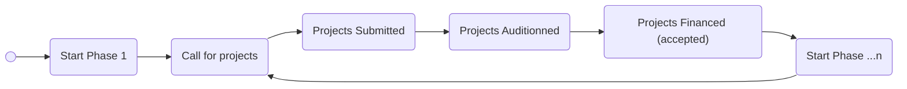

<style>

.hero {
  display: flex;
  flex-direction: column;
  align-items: center;
  font-family: var(--sans-serif);
  margin: 4rem 0 8rem;
  text-wrap: balance;
  text-align: center;
}

.hero h1 {
  margin: 2rem 0;
  max-width: none;
  font-size: 14vw;
  font-weight: 900;
  line-height: 1;
  background: linear-gradient(30deg, var(--theme-foreground-focus), currentColor);
  -webkit-background-clip: text;
  -webkit-text-fill-color: transparent;
  background-clip: text;
}

.hero h2 {
  margin: 0;
  max-width: 34em;
  font-size: 20px;
  font-style: initial;
  font-weight: 500;
  line-height: 1.5;
  color: var(--theme-foreground-muted);
}

@media (min-width: 640px) {
  .hero h1 {
    font-size: 90px;
  }
}

</style>

<div class="hero">
  <h1>PEPR Data Visualization Tests</h1>
  <h2>Welcome to the data visualization tests for PEPR Ville Durable & Bâtiment Innovant project! Use the menu on the left to explore each Dashboard. Edit&nbsp;<code style="font-size: 90%;">docs/index.md</code> to change this page.</h2>
  <a href="https://github.com/VCityTeam/PEPR-VDBI" target="_blank">Github<span style="display: inline-block; margin-left: 0.25rem;">↗︎</span></a>
</div>

# PEPR Project

Here is an overview of the project

## Context


**Information collected:**
- Project name
  - Jury grade
- Researchers per project
  - Name
  - Status
- Universities per project (owner/partner)
  - Location
- Laboratories per project (owner/partner)
  - Domaines (ERC/HCERES)

## Data visualization tools

### [Observable Framework](https://observablehq.com/framework/), [Plot](https://observablehq.com/plot/), [D3](https://d3js.org/)

Some cool functions to know (from D3 docs)

#### Map

```js
const array = [0, 2, 3, 4];
display("array");
display(array);
```

```js echo
const mapped_array = d3.map(array, (d) => d > 2);
display(mapped_array);
```

#### Reduce

```js echo
const reduced_array = d3.reduce(array, (p, v) => p + v, 0)
display(reduced_array);
```

#### Group

```js
const object_array = [
  {name: 'John', status: 'Teacher'},
  {name: 'Johanna', status: 'Teacher'},
  {name: 'Diego', status: 'Doctor'},
  {name: 'Clement', status: 'Doctor'},
  {name: 'Corentin', status: 'Doctoral Student'},
  {name: 'Jey', status: 'Doctoral Student'},
]
display("object_array")
display(object_array)
```

```js echo
const grouped_array = d3.group(object_array, (d) => d.status);
display(grouped_array);
```

#### Rollup (group + reduce)

```js echo
const rolledup_array = d3.rollup(object_array, (D) => D.length, (d) => d.status);
display(rolledup_array);
```