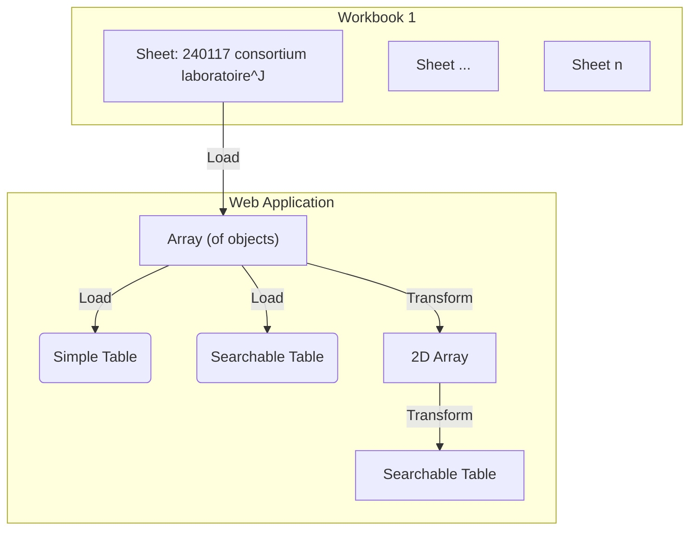

# Import and visualize sheet "240117 consortium laboratoire^J"

Import and visualize the first sheet from the phase 1 Excel document.

## Integration process

D3 and the Observable framework can import [`.xlsx` files](https://observablehq.com/framework/lib/xlsx).
Then the data should be transformed into an array using a [component](./components/240117-proposals-labs-establishments.js).
Columns with obviously identical entities are combined.
E.g. `Etablissement`, `Etablissement 2`, ... `Etablissement n` are merged into the same column.

**Input:** Workbook 1 - "240117 consortium laboratoire, établissement CNRS-SHS_Stat"



# Visualization results

Once integrated the following data visualizations are tested using components.

First a component for transforming the Workbook data is imported, followed by the reading and storing of the Workbook itself.

```js echo
import { resolvePhase1Entities } from "./components/240117-proposals-labs-establishments.js";
const workbook = FileAttachment("./data/240117 consortium laboratoire, établissement CNRS-SHS_Stat.xlsx").xlsx();
```

```js
display(workbook);
```

A function is used to extract the relevant cells from the 1st sheet of the workbook.

```js echo
function getProjectSheet(workbook) {
  return workbook.sheet(workbook.sheetNames[0], {
    range: "A1:DR78",
    headers: true,
  });
}
const projects_phase_1 = getProjectSheet(workbook);
```

```js
display(projects_phase_1);
```

## Simple table

A function is proposed to display a simple table.
```js echo
function simpleTable(sheet, { height } = { height: 300 }) {
  return Inputs.table(sheet, {
    width: 800,
    height: height,
  });
}
```

The function is called with the raw extracted data

```js echo
display(simpleTable(projects_phase_1, { height: 400 }));
```

## Search table

A searchable table can also be created.

```js echo
const search = view(
  Inputs.search(projects_phase_1, { placeholder: "Search projects..." })
);
```

```js echo
display(Inputs.table(search));
```

Note how the data in the changes in real-time, based on our search query. 

```js
search
```

## Table with 2D arrays and search

Using the proposed transformation from the component, we can map the extracted data to a more compact table.

This is a basic example of manual entity linking.

```js echo
const mappedData = resolvePhase1Entities(projects_phase_1);
const searchMapped = view(
  Inputs.search(mappedData, { placeholder: "Search mapped projects..." })
);
```

```js echo
display(Inputs.table(searchMapped));
```

```js
searchMapped
```
