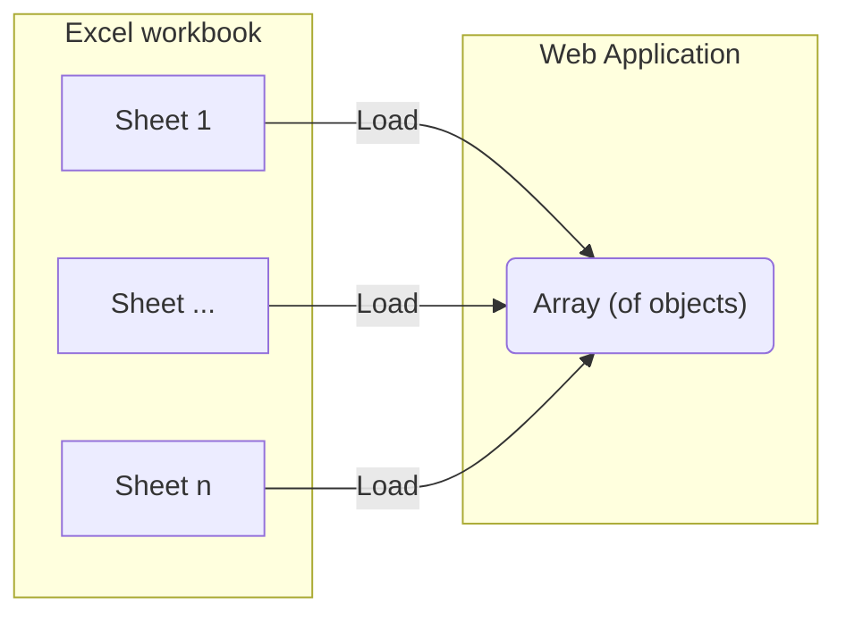

# Import and visualize sheet "240117 consortium laboratoire^J"

Import and visualize the first sheet from the phase 1 Excel document.

## Integration process

D3 and the Observable framework can import [`.xlsx` files](https://observablehq.com/framework/lib/xlsx).
Then the data should be transformed into an array using a [component](./components/map-phase-1.js).
Columns with obviously identical entities are combined.
E.g. `Etablissement`, `Etablissement 2`, ... `Etablissement n` are merged into the same column.



# Visualization results

Once integrated the following data visualizations are tested using components.

```js
import { mapPhase1 } from "./components/map-phase-1.js";
```

```js
const workbook = FileAttachment("./data/phase_1_workbook.xlsx").xlsx();
```

```js
display(workbook);
```

```js
function getProjectSheet(workbook) {
  return workbook.sheet(workbook.sheetNames[0], {
    range: "A1:DR78",
    headers: true,
  });
}

const projects_phase_1 = getProjectSheet(workbook);
```

```js
display(projects_phase_1);
```

## Simple table

```js
function simpleTable(sheet, { height } = { height: 300 }) {
  return Inputs.table(sheet, {
    width: 800,
    height: height,
  });
}
```

```js
display(simpleTable(projects_phase_1, { height: 400 }));
```

## Search table

```js
const search = view(
  Inputs.search(projects_phase_1, { placeholder: "Search projects..." })
);
```

```js
display(Inputs.table(search));
```

```js
search
```

## Table with 2D arrays and search

```js
const mappedData = mapPhase1(projects_phase_1);
```

```js
const searchMapped = view(
  Inputs.search(mappedData, { placeholder: "Search mapped projects..." })
);
```

```js
display(Inputs.table(searchMapped));
```

```js
searchMapped
```
