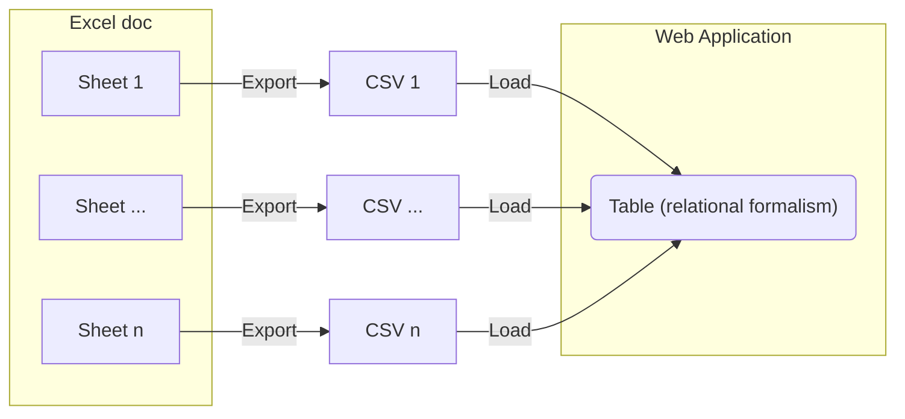

# Import and visualize sheet "240117 consortium laboratoire^J"

Visualize the first sheet from the phase 1 Excel document as a table.

## Integration process

D3 and the Observable framework can't import `.xls` or `.xlsx` files, so we must export to `.csv` first.
Then the data should be transformed into a table (in a relational formalism) using a [component](./components/initial-component-test.js).



## Visualization result

```js
import {timeline} from "./components/timeline.js";
```

```js
const events = FileAttachment("./data/phase1_sheet1.csv").csv({typed: true});
```

```js
timeline(events, {height: 300})
```
