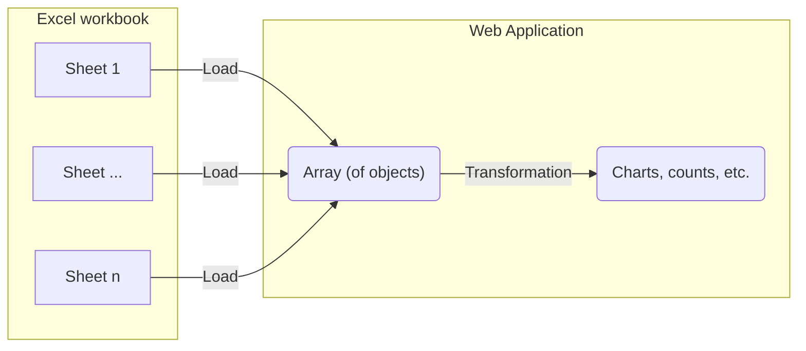

# Import 240117 consortium laboratoire^J

Visualize the first sheet from the phase 1 Excel document as a graph.

## Integration process

Take the data imported from the [initial-import-test](./initial-import-test) and transform the table into a plot.
To do this, we need to set up a component to transform the data.



# Visualization result

TODO:
- simple plots and analysis
- reproduce excel plots, graphs
- don't correct, just align
Once integrated the following data visualizations are tested using components.

```js
import { resolvePhase1Entities, getPhase1Sheet } from "./components/240117-proposals-labs-establishments.js";
import {
  getProductSheet,
  resolveProjectEntities,
} from "./components/240108-proposals-keyworks.js";
import { countPhase1 } from "./components/reduce-phase-1.js";
```

```js
const workbook1 = FileAttachment("./data/240108_consortium, contenus des propositions CNRS-SHS_GGE_JYT_ANRT.xlsx").xlsx();
const workbook2 = FileAttachment("./data/240117 consortium laboratoire, établissement CNRS-SHS_Stat.xlsx").xlsx();
```

```js
const projects_product = resolveProjectEntities(getProductSheet(workbook1));
const projects_phase_1 = resolvePhase1Entities(getPhase1Sheet(workbook2));
```

## Simple plot

```js echo
const reducedSheet = countPhase1(projects_phase_1);
display(reducedSheet)
```

```js echo
function simplePlot(columns, {height} = {}) {
  return Plot.plot({
    width: 1200,
    height,
    marginTop: 30,
    x: {nice: true, label: null, tickFormat: ""},
    y: {axis: null},
    marks: [
      Plot.ruleX(columns, {x: "etablissements", y: "y", markerEnd: "dot", strokeWidth: 2.5}),
      Plot.ruleY([0]),
      Plot.text(columns, {x: "etablissements", y: "y", text: "name", lineAnchor: "bottom", dy: -10, lineWidth: 10, fontSize: 12})
    ]
  });
}

display(simplePlot(reducedSheet));
```
