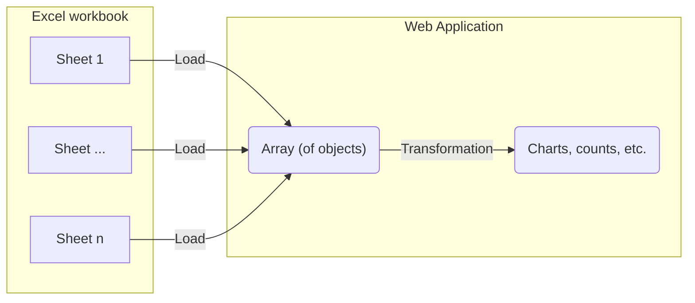

# Import 240117 consortium laboratoire^J

Visualize the first sheet from the phase 1 Excel document as a graph.

## Integration process

Take the data imported from the [initial-import-test](./initial-import-test) and transform the table into a plot.
To do this, we need to set up a component to transform the data.



# Visualization result

Once integrated the following data visualizations are tested using components.

```js
import { mapPhase1 } from "./components/map-phase-1.js";
import { countPhase1 } from "./components/reduce-phase-1.js";
```

```js
const workbook = FileAttachment("./data/phase_1_workbook.xlsx").xlsx();
```

```js
function getProjectSheet(workbook) {
  return workbook.sheet(workbook.sheetNames[0], {
    range: "A1:DR78",
    headers: true,
  });
}

const projects_phase_1 = getProjectSheet(workbook);
```

## Simple plot

```js
function simplePlot(columns, {height} = {}) {
  return Plot.plot({
    width: 800,
    height,
    marginTop: 30,
    x: {nice: true, label: null, tickFormat: ""},
    y: {axis: null},
    marks: [
      Plot.ruleX(columns, {x: "etablissements", y: "y", markerEnd: "dot", strokeWidth: 2.5}),
      Plot.ruleY([0]),
      Plot.text(columns, {x: "etablissements", y: "y", text: "name", lineAnchor: "bottom", dy: -10, lineWidth: 10, fontSize: 12})
    ]
  });
}

const reducedSheet = countPhase1(projects_phase_1);
```

```js
display(reducedSheet)
```

```js
display(simplePlot(reducedSheet));
```
