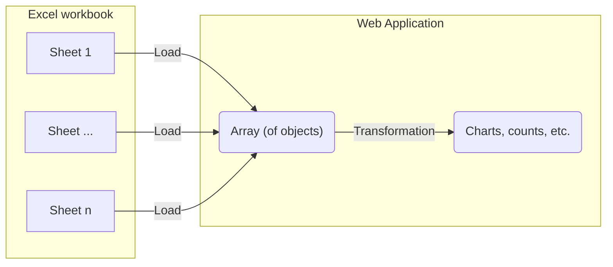

# Import 240117 consortium laboratoire^J

Visualize the first sheet from the phase 1 Excel document as a graph.

## Integration process

Take the data imported from the [initial-import-test](./initial-import-test) and transform the table into a plot.
To do this, we need to set up a component to transform the data.



# Visualization result

TODO:
- simple plots and analysis
- reproduce excel plots, graphs
- don't correct, just align
Once integrated the following data visualizations are tested using components.

```js
import {
  resolvePhase1Entities,
  getPhase1Sheet,
  countPhase1
} from "./components/240117-proposals-labs-establishments.js";
import {
  getProductSheet,
  resolveProjectEntities,
  // countKeywords
  test
} from "./components/240108-proposals-keywords.js";
```

```js
const workbook1 = FileAttachment("./data/240108_consortium, contenus des propositions CNRS-SHS_GGE_JYT_ANRT.xlsx").xlsx();
const workbook2 = FileAttachment("./data/240117 consortium laboratoire, établissement CNRS-SHS_Stat.xlsx").xlsx();
```

```js
const projects_product = resolveProjectEntities(getProductSheet(workbook1));
const projects_phase_1 = resolvePhase1Entities(getPhase1Sheet(workbook2));
```

```js echo
display(projects_product);
```

```js echo
display(projects_phase_1);
```

## Simple plot - count keywords

```js echo
function countKeywords(projects) {
  const keyWords = d3.merge(d3.map(projects, (project) => project.motClef));
  const keyWordCount = new Map(); 
  keyWords.forEach((word) => {
    if (keyWordCount.has(word)) {
      keyWordCount.set(word, keyWordCount.get(word) + 1);
    } else {
      keyWordCount.set(word, 1);
    }
  });
  return d3.map(keyWordCount.entries(), ([key, value], i) => {
    return {
      keyword: key,
      count: value
    };
  });
  // return d3.rollup(sheet, ,(project) => project.motClef.);
}

const reducedKeywords = d3.sort(countKeywords(projects_product), (d) => d.keyword);
display(reducedKeywords);
```

```js echo
// Since Xbar is horizontal instead of vertical, the x and y axes are inversed
function simpleBarXPlot(columns, {
    height,
    marginLeft = 60, // space for labels
    fill,
    color = {},
    x = "x",
    xOptions,
    y = "y",
    yOptions,
    ySort = "ascending",
    title = "y",
  }) {
  return Plot.plot({
    height: height,
    marginLeft: marginLeft,
    color: color,
    sort: { y: y, order: ySort },
    x: xOptions,
    y: yOptions,
    marks: [
      Plot.barX(columns, {
        x: x,
        y: y,
        title: title,
        fill: fill,
      }),
    ],
  });
  
}

display(
  simpleBarXPlot(reducedKeywords, {
    height: reducedKeywords.length * 20, // assure adequate horizontal space for each line
    marginLeft: 150,
    fill: d3.map(reducedKeywords, (d) => d.count + 2),
    color: {
      scheme: "YlGn",
    },
    x: "count",
    y: "keyword",
    yOptions: {
      tickFormat: (d) => (d.length > 25 ? d.slice(0, 23).concat("...") : d),
      fontSize: 20,
    },
    title: "keyword",
  })
);
```

```js echo
const reducedSheet = countPhase1(projects_phase_1);
display(reducedSheet)
```