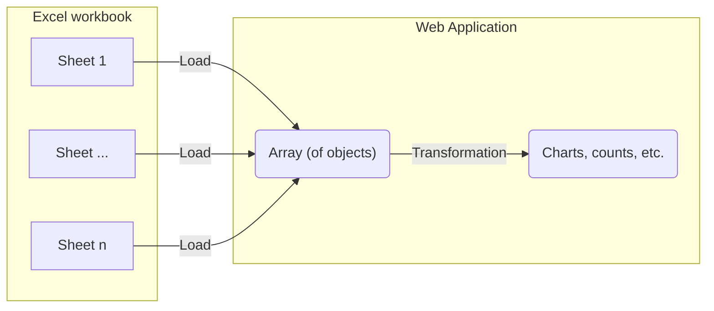

# Import 240117 consortium laboratoire^J

Visualize the first sheet from the phase 1 Excel document as a graph.

## Integration process

Take the data imported from the [initial-import-test](./initial-import-test) and transform the table into a plot.
To do this, we need to set up a component to transform the data.



# Visualization result

TODO:

- ~~simple plots and analysis~~
- reproduce excel plots, graphs
- don't correct, just align

Once integrated the following data visualizations are tested using components.

```js
import {
  resolvePhase1Entities,
  getPhase1Sheet,
  getVillesSheet,
} from "./components/240117-proposals-labs-establishments.js";
import {
  getProductSheet,
  resolveProjectEntities,
  // countKeywords
  test,
} from "./components/240108-proposals-keywords.js";
import { mapEntitiesToGraph } from "./components/force-graph.js";
import { mapCounts } from "./components/utilities.js";
```

```js
const workbook1 = FileAttachment(
  "./data/240108_consortium, contenus des propositions CNRS-SHS_GGE_JYT_ANRT.xlsx"
).xlsx();
const workbook2 = FileAttachment(
  "./data/240117 consortium laboratoire, établissement CNRS-SHS_Stat.xlsx"
).xlsx();
```

```js
const projects_product = resolveProjectEntities(getProductSheet(workbook1));
const projects_phase_1 = resolvePhase1Entities(getPhase1Sheet(workbook2));
```

Projects from product workbook:

```js echo
display(projects_product);
```

Projects from laboratory workbook:

```js echo
display(projects_phase_1);
```

## Simple XBar plot - count keywords

Map-group-reduce-sort the keywords of each project to an array and count the occurences of each word

```js echo
function countEntities(data, mapFunction) {
  // flatten (map to array then merge) entities
  const entityList = d3.merge(d3.map(data, (d) => mapFunction(d)));
  // group by entity then reduce to a count with d3.rollup()
  const entityCounts = d3.rollup(
    entityList,
    (D) => D.length,
    (d) => d
  );
  // map entityCounts to a [{x: entity, y: count}] data structure
  const formattedEntityCounts = d3.map(
    entityCounts.entries(),
    ([key, value], i) => {
      return {
        entity: key,
        count: value,
      };
    }
  );
  // sort by entity and return
  return d3.sort(formattedEntityCounts, (d) => d.entity);
}

const sortedKeywordCounts = countEntities(
  projects_product,
  (project) => project.motClefs
);
display(sortedKeywordCounts);
```

Plot the occurrences to a simple bar chart with the following features:

- horizontal bars
- coloring by count number
- longer keyword (y) axis labels are truncated
- hover over bar to see full keyword

```js echo
display(
  Plot.plot({
    height: sortedKeywordCounts.length * 20, // assure adequate horizontal space for each line
    marginLeft: 150,
    color: {
      scheme: "Spectral",
    },
    x: {
      grid: true,
      axis: "both",
      anchor: "top",
    },
    y: {
      tickFormat: (d) => (d.length > 25 ? d.slice(0, 23).concat("...") : d), // cut off long tick labels
      fontSize: 20,
    },
    marks: [
      Plot.barX(sortedKeywordCounts, {
        x: "count",
        y: "entity",
        title: "entity",
        fill: d3.map(sortedKeywordCounts, (d) => d.count + 2), // shift up the color values to be more visible
      }),
    ],
  })
);
```

## Sorted Grouped XBar plot - count project universities and partners

<!--
Map table to graph first
```js echo
const phase_1_graph = mapEntitiesToGraph(projects_phase_1);
display(phase_1_graph);
``` -->

A count of establishment owners (or a count of projects per establishment owner)

```js echo
const sortedEstablishmentOwnerCounts = countEntities(
  projects_phase_1,
  (project) => project.etablissements.slice(0, 1)
);
display(sortedEstablishmentOwnerCounts);
```

A count of establishment partners (or a count of projects per establishment partner)

```js echo
const sortedEstablishmentPartnerCounts = countEntities(
  projects_phase_1,
  (project) => project.etablissements.slice(1)
);
display(sortedEstablishmentPartnerCounts);
```

<!-- A count of partners per establishment (using the graph).
Note that this "query" could work (should be) better with node types (either as attributes of a node or in the graph).

```js echo
// establishment count by project
const establishmentCounts = d3.rollup(d3.filter(phase_1_graph.links, (link) => link.label == "etablissements"), (D) => D.length, (link) => link.target);
display(establishmentCounts);
``` -->

Combine counts to one array and calculate count totals

```js echo
const establishmentCounts = mapCounts(
  [sortedEstablishmentOwnerCounts, sortedEstablishmentPartnerCounts],
  ["owner", "partner"]
);
display(establishmentCounts);

const totalEstablishmentCounts = d3.sort(
  d3
    .rollup(
      establishmentCounts,
      (D) => {
        let count = 0;
        D.forEach((d) => {
          count = count + d.count;
        });
        return {
          entity: D[0].entity,
          type: "total",
          count: count,
        };
      },
      (d) => d.entity
    )
    .values(),
  (d) => d.entity
);
display(totalEstablishmentCounts);

const sortedEstablishmentCounts = d3.sort(
  establishmentCounts.concat(totalEstablishmentCounts),
  (d) => d.count,
  (d) => d.entity
);
display(sortedEstablishmentCounts);
```

... and plot data

```js
display(
  Plot.plot({
    height: sortedEstablishmentCounts.length * 20, // assure adequate horizontal space for each line
    width: 1000,
    marginLeft: 60,
    marginRight: 150,
    color: {
      scheme: "Plasma",
    },
    x: {
      grid: true,
      axis: "both",
      anchor: "top",
    },
    fy: {
      tickFormat: (d) => (d.length > 25 ? d.slice(0, 23).concat("...") : d), // cut off long tick labels
    },
    marks: [
      Plot.barX(sortedEstablishmentCounts, {
        x: "count",
        y: "type",
        fy: "entity",
        title: "entity",
        fill: "count",
        sort: { fy: "-x" },
      }),
    ],
  })
);
```

## Sorted YBar plot - count project cities

Get lab cities (from workbook for now)

```js echo
const citiesSheet = getVillesSheet(workbook2).map((d) => {
  return {
    etablissement: [d["Etablissements"]],
    lieu: [d["Lieu"]],
  };
});
display(citiesSheet);
```

A count of project cities

```js echo
const cityCount = countEntities(
  citiesSheet,
  (establishment) => establishment.lieu
);
display(cityCount);
```

Plot data

```js
display(
  Plot.plot({
    width: 1000,
    marginBottom: 60,
    color: {
      scheme: "Turbo",
    },
    x: {
      tickRotate: 30
    },
    marks: [
      Plot.barY(cityCount, {
        x: "entity",
        y: "count",
        fill: "count",
        sort: { x: "-y" },
      }),
    ],
  })
);
```
