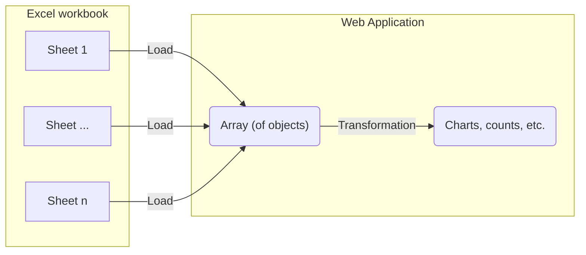

# Import 240117 consortium laboratoire^J

Visualize the first sheet from the phase 1 Excel document as a graph.

## Integration process

Take the data imported from the [initial-import-test](./initial-import-test) and transform the table into a plot.
To do this, we need to set up a component to transform the data.



# Visualization result

TODO:
- ~~simple plots and analysis~~
- reproduce excel plots, graphs
- don't correct, just align

Once integrated the following data visualizations are tested using components.

```js
import {
  resolvePhase1Entities,
  getPhase1Sheet
} from "./components/240117-proposals-labs-establishments.js";
import {
  getProductSheet,
  resolveProjectEntities,
  // countKeywords
  test
} from "./components/240108-proposals-keywords.js";
import { mapEntitiesToGraph } from "./components/force-graph.js";
```

```js
const workbook1 = FileAttachment("./data/240108_consortium, contenus des propositions CNRS-SHS_GGE_JYT_ANRT.xlsx").xlsx();
const workbook2 = FileAttachment("./data/240117 consortium laboratoire, établissement CNRS-SHS_Stat.xlsx").xlsx();
```

```js
const projects_product = resolveProjectEntities(getProductSheet(workbook1));
const projects_phase_1 = resolvePhase1Entities(getPhase1Sheet(workbook2));
```

```js
const phase_1_graph = mapEntitiesToGraph(projects_phase_1);
```

Projects from product workbook:

```js echo
display(projects_product);
```

Projects from laboratory workbook:

```js echo
display(projects_phase_1);
```

## Simple plot - count keywords

Map-group-reduce-sort the keywords of each project to an array and count the occurences of each word

```js echo
function countEntities(data, mapFunction) {
  // flatten (map to array then merge) entities
  const entityList = d3.merge(
    d3.map(data, (d) => mapFunction(d))
  );
  // group by entity then reduce to a count with d3.rollup() 
  const entityCounts = d3.rollup(
    entityList,
    (D) => D.length,
    (d) => d
  );
  // map entityCounts to a [{x: entity, y: count}] data structure 
  const formattedEntityCounts = d3.map(
    entityCounts.entries(),
    ([key, value], i) => {
      return {
        entity: key,
        count: value,
      };
    }
  );
  // sort by entity and return
  return d3.sort(formattedEntityCounts, (d) => d.entity);
}

const sortedKeywordCounts = countEntities(projects_product, (project) => project.motClefs)
display(sortedKeywordCounts);
```

Plot the occurrences to a simple bar chart with the following features:
- horizontal bars
- coloring by count number
- longer keyword (y) axis labels are truncated
- hover over bar to see full keyword

```js echo
display(
  Plot.plot({
    height: sortedKeywordCounts.length * 20, // assure adequate horizontal space for each line
    marginLeft: 150,
    color: {
      scheme: "YlGn",
    },
    x: {
      grid: true,
      axis: "both",
      anchor: "top",
    },
    y: {
      tickFormat: (d) => (d.length > 25 ? d.slice(0, 23).concat("...") : d), // cut off long tick labels
      fontSize: 20,
    },
    marks: [
      Plot.barX(sortedKeywordCounts, {
        x: "count",
        y: "entity",
        title: "entity",
        fill: d3.map(sortedKeywordCounts, (d) => d.count + 2), // shift up the color values to be more visible
      }),
    ],
  })
);
```

## Simple plot - count project universities and partners 

Map table to graph first
```js echo
const phase_1_graph = mapEntitiesToGraph(projects_phase_1);
```

A count of establishments (or a count of projects per establishment)

```js echo
const sortedEstablishmentCounts = countEntities(projects_phase_1, (project) => project.etablissements);
display(sortedEstablishmentCounts);
```

A count of partners (or a count of projects per partner)

```js echo
const sortedPartnerCounts = countEntities(projects_phase_1, (project) => project.partenaires);
display(sortedPartnerCounts);
```

A count of partners per establishment (from graph)

```js echo
const establishments = d3.group(d3.filter(phase_1_graph.links, (link) => link.label == "etablissements"), (link) => );
display(establishments); // TODO FINISH ME
// display(d3.group(d3.map(projects_phase_1, (project) => project.etablissements), ));
// const sortedPartnerCounts = countEntities(projects_phase_1, (project) => {
//   const project 
// });
// display(sortedPartnerCounts);
```

```js echo
display(
  Plot.plot({
    height: sortedEstablishmentCounts.length * 40, // assure adequate horizontal space for each line
    marginLeft: 150,
    color: {
      scheme: "YlGn",
    },
    x: {
      grid: true,
      axis: "both",
      anchor: "top",
    },
    y: {
      tickFormat: (d) => (d.length > 25 ? d.slice(0, 23).concat("...") : d), // cut off long tick labels
      fontSize: 20,
    },
    marks: [
      Plot.barX(sortedEstablishmentCounts, {
        x: "count",
        y: "entity",
        title: "entity",
        fill: "count",
      }),
      Plot.barX(sortedPartnerCounts, {
        x: "count",
        y: "entity",
        title: "entity",
        fill: "count",
      }),
    ],
  })
);
```
