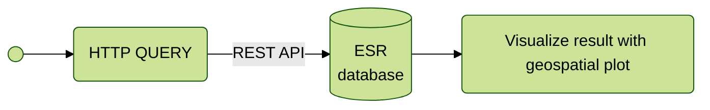

# Import and visualize Geospatial ESR Open Data

Import and visualize data from the [ESR Open Data](data.enseignementsup-recherche.gouv.fr) using their [API](https://data.enseignementsup-recherche.gouv.fr/api/explore/v2.1/console)
Also test the Observable Frameworks data loader library.

## Integration process



Interesting datasets:
- `fr-esr-structures-recherche-publiques-actives` (tests will be effectuated on this dataset)
- `fr-esr-ecoles_doctorales_annuaire`
- `fr-esr-atlas_regional-effectifs-d-etudiants-inscrits-detail_etablissements`
- `fr-esr-referentiel-geographique`

# Visualization results

```js echo
const structures_recherche_json = FileAttachment("./data/fr-esr-structures-recherche-publiques-actives.json").json();
const structures_recherche_csv = FileAttachment("./data/fr-esr-structures-recherche-publiques-actives.csv").csv();
// const structures_recherche_ttl = structures_recherche.ttl();
```

```js
display("structures_recherche json and csv");
display(structures_recherche_json);
display(structures_recherche_csv);
// display(structures_recherche_ttl);
```

```js
display(d3.group(structures_recherche_json, d => d.commune))
display(d3.group(structures_recherche_json, d => d.code_postal))
```

```js echo

// for (let index = 0; index < esr_response.length; index++) {
//   const geo_response = await fetchJson(`https://nominatim.openstreetmap.org/search?q=${esr_response[index].adresse}%2C%20${esr_response[index].commune}%2C%20${esr_response[index].code_postal}&format=${format}`).then((value) => JSON.stringify(value));
//   esr_response[index].lat = geo_response.lat;
//   esr_response[index].lon = geo_response.lon;
// }


// modified from https://observablehq.com/framework/loaders
// Plot.plot({
//   projection: {
//     type: "orthographic",
//     rotate: [200, -30]
//   },
//   marks: [
//     Plot.graticule(),
//     Plot.sphere(),
//     Plot.geo(land, {stroke: "var(--theme-foreground-faint)"}),
//     Plot.dot(structures_recherche_csv, {x: "longitude", y: "latitude", r: "magnitude", stroke: "#f43f5e"})
//   ]
// });
```