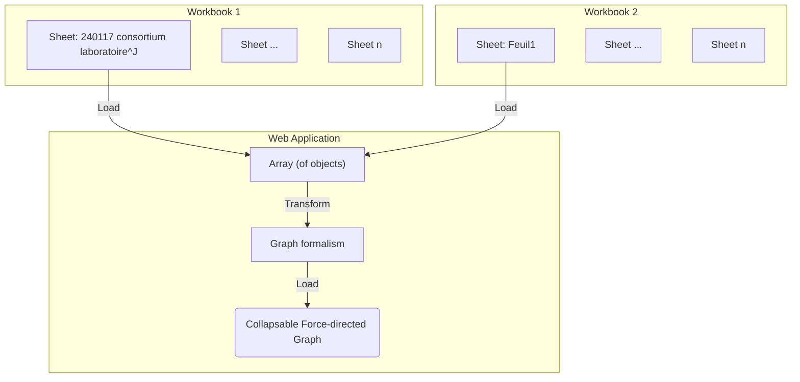

# Visualize Workbook data using Graphs

Visualize the first sheet from the phase 1 Excel document using graphs.

## Visualization information

Once integrated the following information is desired for visualization:

- lab names
- ERC disciplines
- show missing information
- show graphs over charts
  - theme → projet (in other workbook ANRT)
  - col I : produit (ou resultats) de la recherche (primaire) → J : secondaire → H : Quelles actions pour quelles solutions → A : acronyme
- Root node: PEPR VDBI

## Data integration process

Take the data imported from the [initial-import-test](./initial-import-test) and transform the table into a graph formalism.
To do this, we need to set up a component to transform the data.

**Input:**

- Workbook 1: "240117 consortium laboratoire, établissement CNRS-SHS_Stat"
- Workbook 2: "240108_consortium, contenus des propositions CNRS-SHS_GGE_JYT_ANRT"




```js echo
import {
  getProductSheet,
  resolveProjectEntities,
} from "./components/240108-proposals-keywords.js";
import { mapEntitiesToGraph, filterLinks, forceGraph } from "./components/force-graph.js";

const workbook1 = FileAttachment(
  "./data/240117 consortium laboratoire, établissement CNRS-SHS_Stat.xlsx"
).xlsx();
const workbook2 = FileAttachment(
  "./data/240108_consortium, contenus des propositions CNRS-SHS_GGE_JYT_ANRT.xlsx"
).xlsx();
```

**Input data:**

Using the transformation proposed in the imported components we can extract the tabular workbook data and resolve known entities.
This transformation produces the following hierarchy: `root -> Project Acronym -> Project attribute (keywords, titles, etc.) -> ...`

```js echo
const productData = resolveProjectEntities(getProductSheet(workbook2));
display(productData);
```

## Force Directed Graph - all project data

**Sheet mapped to graph:**

... We can also map the data to a graph hierarchy

```js echo
const productGraph = mapEntitiesToGraph(productData);
display(productGraph);
```

```js echo
const productForceGraph = forceGraph(productGraph, {
  width: 1400,
  height: 1400,
  r: 3,
  fontsize: 12,
});
display(productForceGraph);
```

## Force Directed Graph - projects and keywords

**Filtered graph nodes and links:**

```js echo
const filteredProductGraph = filterLinks(productGraph, (d) => d.label == "motClefs");
display(filteredProductGraph);
```

```js echo
const filteredProductForceGraph = forceGraph(filteredProductGraph, {
  width: 1400,
  height: 1400,
  r: 3,
  fontsize: 12,
});
display(filteredProductForceGraph);
```

TODO:
- select node:
  - center node
  - use force for readability
  - or display additional info
    - in another vis e.g. plot, etc...
    - e.g. num of occurences 
- example "query/viz" by product 1, 2
- keep in mind generic functions that allow to group by some keyword with a "query" 
  - search func
- keep in mind query SPARQL/RDF
- 50/50 work AI text mining
  - how to have private instances?
  - that work on private data?
  - Gemini, GPT-4, Perplexity?
  - How to connect to API?
