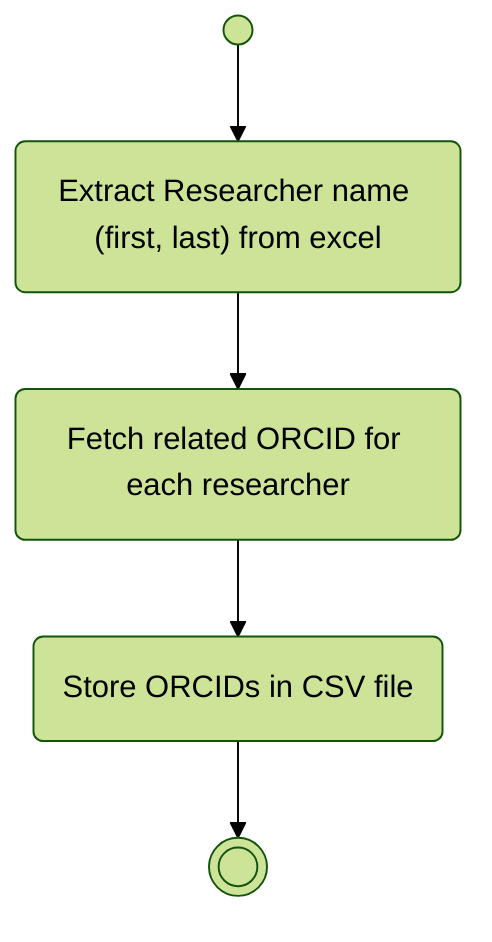

# Import and visualize Geospatial ESR Open Data

Import and visualize ORCIDs using their [API](https://info.orcid.org/documentation/api-tutorials/api-tutorial-searching-the-orcid-registry/)

## Integration process



# Visualization results

```js
import { searchOrcid } from "./components/orcid.js" 

// const access_token_reponse = FileAttachment(
//   "./data/fetch-orcid-access-token.json"
// ).json();
```

```js
// display(access_token_reponse);
const response = await searchOrcid(
  "vinasco",
  // access_token_reponse.access_token,
  "4e03ecf7-98af-4ac1-9cd4-876fdc86dc91",
);
```

```js
display(response);
```
