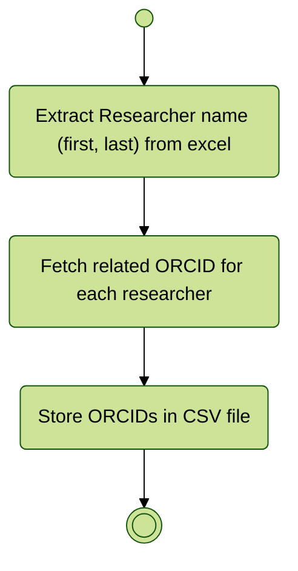

# Import and visualize Geospatial ESR Open Data

Import and visualize ORCIDs using their [API](https://info.orcid.org/documentation/api-tutorials/api-tutorial-searching-the-orcid-registry/)

## Integration process



# Visualization results

```js
async function searchOrcid(
  query,
  token,
  fields = [
    "orcid",
    "email",
    "given-names",
    "family-name",
    "given-and-family-names",
    "credit-name",
    "other-name",
    "current-institution-affiliation-name",
    "past-institution-affiliation-name"
  ]
) {
  // const url = `https://pub.orcid.org/v3.0/csv-search/?q=${query}&fl=${fields.join(",")}`;
  const url = `https://pub.orcid.org/v3.0/search/?q=${query}`;
  const options = {
    method: "GET",
    mode: 'no-cors',
    headers: {
      // "Content-Type": "text/csv",
      // "Content-Type": "application/json",
      "Content-Type": "*/*",
      "Authorization": `Bearer ${token}`,
      // "Authorization type and Access token": `Bearer ${token}`,
      // "Authorization type": `Bearer`,
      // "Access token": `${token}`,
    },
  };

  const response = await fetch(url, options);
  // if (!response.ok) throw new Error(`fetch failed: ${response.status} with response: ${response.ok}`);
  console.debug(response);
  return await response.json();
}

const access_token_reponse = FileAttachment(
  "./data/fetch-orcid-access-token.json"
).json();
```

```js
display(access_token_reponse);
const response = await searchOrcid(
  "vinasco-alvarez",
  access_token_reponse.access_token
);
```

```js
display(response);
```
