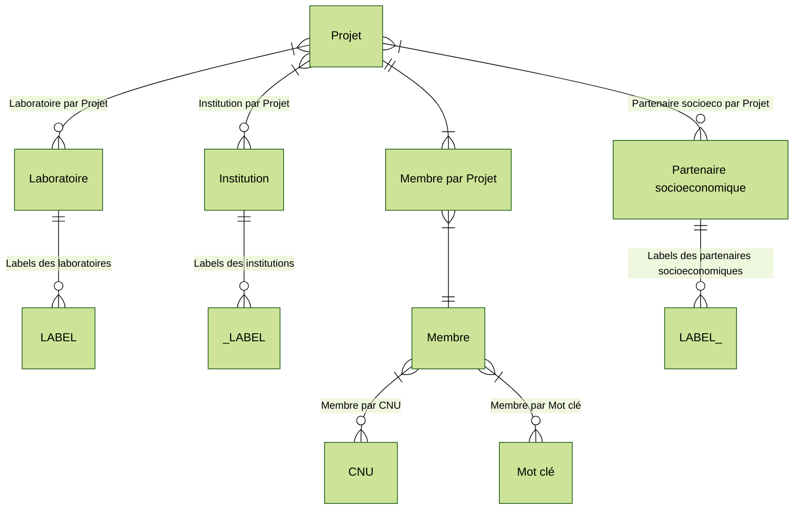

# Data directory

This directory contains input data or scripts for integrating data sources
([data loaders](https://observablehq.com/framework/data-loaders)) to be visualized
using observable. Refer to the respective [observable dashboard or markdown documentation](../)
for specific data loader documentation.

## Running dataloaders manually

To install Python dataloader dependencies, [install uv](https://docs.astral.sh/uv/getting-started/installation/)

Once installed, sync installed libraires:

```bash
uv sync
```

Some dataloaders require your terminal be in the `../` directory

> [!NOTE] Private data
> Some data files are not provided and must be added manually to the folder `./private/`.
> Please contact the PEPR VDBI monitoring manager (responsable de la veille) if you believe data is missing:
> Diego Vinasco-Alvarez - <diego.vinasco-alvarez@liris.cnrs.fr>

> [!WARNING] ORCiD API access
> Data loaders that require and ORCiD API key (denoted by :asterisk:) require you have a
> file named `.env` in this directory with the following contents:
>
> ```bash
> # ORCiD API secrets
> CLIENT_ID="MY_APP_ID"
> CLIENT_SECRET="MY_APP_SECRET"
> ```

## Grist data schema


