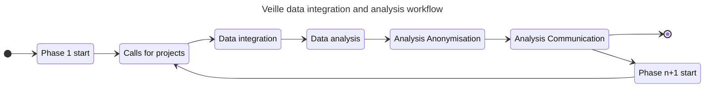
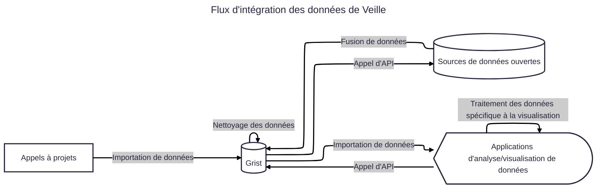

  <h1>PEPR VDBI Dashboards</h1>
  <h2>
    Welcome to the data visualization tests for PEPR Ville Durable & Bâtiment Innovant
    project! Use the menu on the left to explore each Dashboard. Edit&nbsp;
    <code style="font-size: 90%;">docs/index.md</code> to change this page.
  </h2>
  <a href="https://github.com/VCityTeam/PEPR-VDBI" target="_blank">
    Github↗︎
  </a>

## Context

Here is an overview of what data is visualized and the mechanisms for used for data visualization.

