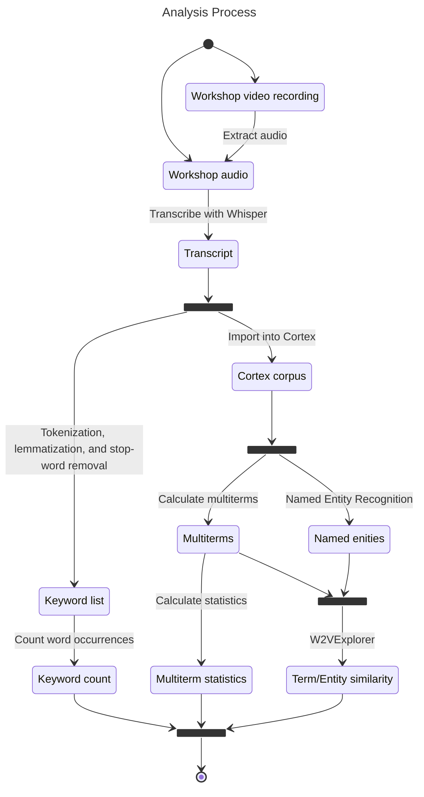

# VDBI JS 2025

## NEO/SoLocale Workshop Lexicometric Analysis

## Method



## Results

```js
import { downloadSVGButton } from "/components/utilities.js"
```

```js
// for debugging
// display("entities")
// display(Inputs.table(entities))
// display("extracted_terms")
// display(Inputs.table(extracted_terms))
```

```js
// Load cortex export
const files = await FileAttachment(
  "/data/private/VDBI_JS_2025_atelier_NEO_extracted_terms.zip",
).zip()

const extracted_terms = files.file("extracted-terms.tsv").tsv({ typed: true })
const entities = files.file("entities.tsv").tsv({ typed: true })
```

### Extracted Entities

<div id="entities" class="card">
  <h2>Extracted Entities</h2>
  ${resize((width) =>
    generateEntitiesPlot(entities, width)
  )}<!-- $ -->
  ${downloadSVGButton("#entities svg")}

</div>

```js
const generateEntitiesPlot = (data, width) =>
  Plot.auto(data, {
    x: (d) => Number(d.frequency),
    y: "entity",
    fx: "group",
    color: "type",
    mark: "bar",
  }).plot({
    width: width,
    y: { label: "Entity", grid: true },
    x: { label: "Frequency" },
    fx: { label: "Group" },
    marginLeft: 150,
    color: { legend: true },
  })
```

### Extracted Nouns

<div class="grid grid-cols-2">
  <div id="c-value-noun-plot" class="card">
    <h2>C-values</h2>
    ${resize((width) => generateExtractedTermsPlot(
      extracted_terms,
      width,
      "C-value",
      "noun",
      190,
    ))}<!-- $ -->
    ${downloadSVGButton("#c-value-noun-plot svg")}

  </div>
  <div id="gfidf-noun-plot" class="card">
    <h2>Gfidfs</h2>
    ${resize((width) => generateExtractedTermsPlot(
      extracted_terms,
      width,
      "Gfidf",
      "noun",
      190,
    ))}<!-- $ -->
    ${downloadSVGButton("#gfidf-noun-plot svg")}

  </div>
  <div id="occurrences-noun-plot" class="card">
    <h2>Occurrences</h2>
    ${resize((width) => generateExtractedTermsPlot(
      extracted_terms,
      width,
      "Occurrences",
      "noun",
      190,
    ))}<!-- $ -->
    ${downloadSVGButton("#occurrences-noun-plot svg")}

  </div>
  <div id="cooccurrences-noun-plot" class="card">
    <h2>Co-occurrences</h2>
    ${resize((width) => generateExtractedTermsPlot(
      extracted_terms,
      width,
      "Cooccurrences",
      "noun",
      190,
    ))}<!-- $ -->
    ${downloadSVGButton("#cooccurrences-noun-plot svg")}

  </div>
</div>

### Extracted Verbs

<div class="grid grid-cols-2">
  <div id="c-value-verb-plot" class="card">
    <h2>C-values</h2>
    ${resize((width) => generateExtractedTermsPlot(
      extracted_terms,
      width,
      "C-value",
      "verb",
      100,
    ))}<!-- $ -->
    ${downloadSVGButton("#c-value-verb-plot svg")}

  </div>
  <div id="gfidf-verb-plot" class="card">
    <h2>Gfidfs</h2>
    ${resize((width) => generateExtractedTermsPlot(
      extracted_terms,
      width,
      "Gfidf",
      "verb",
      100,
    ))}<!-- $ -->
    ${downloadSVGButton("#gfidf-verb-plot svg")}

  </div>
  <div id="occurrences-verb-plot" class="card">
    <h2>Occurrences</h2>
    ${resize((width) => generateExtractedTermsPlot(
      extracted_terms,
      width,
      "Occurrences",
      "verb",
      100,
    ))}<!-- $ -->
    ${downloadSVGButton("#occurrences-verb-plot svg")}

  </div>
  <div id="cooccurrences-verb-plot" class="card">
    <h2>Co-occurrences</h2>
    ${resize((width) => generateExtractedTermsPlot(
      extracted_terms,
      width,
      "Cooccurrences",
      "verb",
      100,
    ))}<!-- $ -->
    ${downloadSVGButton("#cooccurrences-verb-plot svg")}

  </div>
</div>

### Extracted Adjectives

<div class="grid grid-cols-4">
  <div id="c-value-adj-plot" class="card">
    <h2>C-values</h2>
    ${resize((width) => generateExtractedTermsPlot(
      extracted_terms,
      width,
      "C-value",
      "adj",
      60,
    ))}<!-- $ -->
    ${downloadSVGButton("#c-value-adj-plot svg")}

  </div>
  <div id="gfidf-adj-plot" class="card">
    <h2>Gfidfs</h2>
    ${resize((width) => generateExtractedTermsPlot(
      extracted_terms,
      width,
      "Gfidf",
      "adj",
      60,
    ))}<!-- $ -->
    ${downloadSVGButton("#gfidf-adj-plot svg")}

  </div>
  <div id="occurrences-adj-plot" class="card">
    <h2>Occurrences</h2>
    ${resize((width) => generateExtractedTermsPlot(
      extracted_terms,
      width,
      "Occurrences",
      "adj",
      60,
    ))}<!-- $ -->
    ${downloadSVGButton("#occurrences-adj-plot svg")}

  </div>
  <div id="cooccurrences-adj-plot" class="card">
    <h2>Co-occurrences</h2>
    ${resize((width) => generateExtractedTermsPlot(
      extracted_terms,
      width,
      "Cooccurrences",
      "adj",
      60,
    ))}<!-- $ -->
    ${downloadSVGButton("#cooccurrences-adj-plot svg")}

  </div>
</div>

```js
const generateExtractedTermsPlot = (data, width, y_column, term, marginLeft) =>
  Plot.auto(
    data.filter((d) => d.pos === term),
    {
      x: (d) => Number(d[y_column]),
      y: "Main form",
      fx: "group",
      color: "#3558A2",
      mark: "bar",
    },
  ).plot({
    x: {
      label: y_column,
      ticks:
        d3.max(data.filter((d) => d.pos === term).map((d) => d[y_column])) === 1
          ? 1
          : undefined,
    },
    fx: { label: "Group" },
    width: width,
    grid: true,
    marginLeft: marginLeft,
    marginRight: 50,
  })
```
