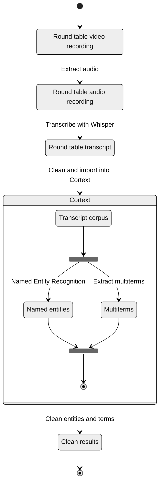

```js
import {
  downloadSVGButton,
  downloadTableButton,
  cropText,
} from "/components/utilities.js";
import { Graph, WordBubbles } from "/components/graph.js";
import {
  freq_words,
  group_freq_words,
  graph_config_round_table,
  entity_type_map,
  generateRoundTableEntitiesPlot,
  column_title_map,
  column_label_map,
  generateExtractedTermsPlot,
  extractedTermsHtmlTemplate,
  extractedTermsByGroupHtmlTemplate,
} from "./js-2025-analysis.js";
```

# VDBI JS 2025 Round Table Lexicometric Analysis <!-- omit in toc -->

## Diego Vinasco-Alvarez (PEPR VDBI; <diego.vinasco-alvarez@cnrs.fr>) <!-- omit in toc -->

## 1. Context

This report provides a lexicometric analysis of the round table discussions held
during the [2025 PEPR VDBI Journées Scientifiques](https://pepr-vdbi.fr/evenements/journees-scientifiques-annuelles-villes-durables-batiments-innovants-2025)
between November 3rd and 5th, 2025.

This report will be used to supplement a future publication regarding the round
table discussions. This publication will provide a more in-depth analysis of the
discussions and their context.

The report is structured as follows:

- [Section 2](#2-method) details the proposed methodology and steps for reproducibility
- [Section 3](#3-results) presents the results of the lexicometric
  analysis

<div class="tip">

A critique of the proposed methodology is provided in [this report](./js-2025-workshop-analysis-en).

</div>

## 2. Method

The diagram below illustrates the analysis process.

First, round table discussions were recorded live. Their audio was cut and extracted
with [Microsoft Clipchamp](https://clipchamp.com/en/).

Transcription was done using [Whisper](https://github.com/openai/whisper)'s
`large-v2` model. This transcript was manually verified and corrected by replacing
the most common misspelled proper nouns related to the PEPR VDBI, it's projects,
and the territorial collectives that participated in the round table (e.g. "Pleine
Commune" to "Plaine Commune" or "Antegreen" to "InteGREEN").

Next, the transcript was processed using the [Cortext](https://www.cortext.net/)
social science and humanities research infrastructure.
Cortext uses Natural Language Processing (NLP) and machine learning to extract keywords
and entities from a corpus. This analysis uses two main Cortext tasks:

1. **Named Entity Recognition (NER)** [[5.1]](#51-cortext-documentation-named-entity-recognition)
   to "identify and index persons, places, organizations, etc."
   The following metrics are provided for each extracted entity:
   - _frequency_: The number of times the entity appears in the discussions
   - _type_: The type of the entity (e.g. Person, Organization, Location).
2. **(Multi)Term extraction** [[5.2]](#52-cortext-documentation-multiterm-extraction)
   to identifiy terms used during the discussions. Including "not only simple terms
   but also multi-terms (called [n-grams](https://en.wikipedia.org/wiki/N-gram))."
   The following metrics are provided for each extracted term:
   - _C-value_: A measure of the frequency of a term
   - _G2_ (gf.idf): An alternative frequency measurement of a term "based on the
     assumption that interesting terms tend to be repeated within the same document."

The identified terms and entities were reviewed and corrected manually

- People identified as entities or terms were removed for privacy reasons
- Mistyped entities were reclassified (e.g., "PEPR VDBI" was retyped as an organization)
-

<div class="note">

The term '_corpus_' refers to a corpus of documents. In this case, each document
refers to a transcript of one of the three round table discussions.

</div>



<figcaption>Fig 1. Analysis Process</figcaption>

<!-- ${downloadSVGButton(".statediagram")} -->

The following parameters were used to configure the Cortext tasks as of 4/1/2026.

| Task                    | Parameter                | Value       |
| :---------------------- | ------------------------ | ----------- |
| Terms extraction        | Textual Fields           | text        |
| Terms extraction        | Minimum Frequency        | 2           |
| Terms extraction        | language                 | fr          |
| Terms extraction        | Monogramms are forbidden | no          |
| Terms extraction        | grammatical criterion    | noun phrase |
| Named Entity Recognizer | Textual Fields           | text        |
| Named Entity Recognizer | language                 | fr          |

<div class="note">Unmentioned parameters use their default settings</div>

## 3. Results and discussion

```js
const term_search = view(Inputs.search(extracted_terms));
```

${Inputs.table(term_search, { layout: "auto"})}

<figcaption>Table 1. Top 7 extracted nouns terms by frequency and by round table</figcaption>

<!-- $ -->

```sql id=extracted_entities
(
  select
    entity,
    sum(frequency) as frequency,
    'loc' as type
  from locations
  group by entity
  union
  select
    entity,
    sum(frequency) as frequency,
    'org' as type
  from organizations
  group by entity
  union
  select
    entity,
    sum(frequency) as frequency,
    'misc' as type
  from miscellaneous
  group by entity
)
order by "frequency" desc
limit 20
```

```sql id=extracted_terms
select *, 'noun' as pos from nouns
union
select *, 'adj' as pos from adjectives
-- union
-- select *, 'verb' as pos from verbs
```

Looking at the top 7 most frequently used identified terms and entities overall
and by round table, we can see that **#dispositifs**, **#carnet**, **_#Plaine-Commune_**,
**#Nantes**, and **#Nantes-Métropole** are the most commonly used terms (cf. table
2, figures 2-4). In particular **_#Plaine-Commune_** appearing in all 3 lists.

Notably, **#Nantes** and **#Thiers** appear in the top 7 terms by round table frequency
suggesting that the TR2 discussion may have focused on their respective territorial
collectives more relative to TR1 and TR2 which may have focuses on other subjects.
Taking into consideration the top 20 extracted named entities (figure 4), **#Lyon**
is the 2nd most frequently occuring location entity overall (2nd to **#Paris**).

Additionally, **#Nantes-Métropole** and **#Plaine-Commune** are the most
frequently used territorial collectives terms overall and by round table discussion.

|     | Top 7 terms by frequency | Top 7 terms by round table frequency | Top 7 named entities by frequency |
| --- | ------------------------ | ------------------------------------ | --------------------------------- |
| 1.  | **#dispositifs**         | **#dispositifs**                     | #Paris                            |
| 2.  | #méthode                 | **#carnet**                          | #Lyon                             |
| 3.  | **#carnet**              | **_#Plaine-Commune_**                | #CEREMA                           |
| 4.  | **#Nantes-Métropole**    | #étudiants                           | **_#Plaine-Commune_**             |
| 5.  | #politiques publiques    | **#Nantes**                          | #France                           |
| 6.  | **_#Plaine-Commune_**    | #Thiers                              | #InteGREEN                        |
| 7.  | #information             | **#Nantes-Métropole**                | **#Nantes**                       |

<figcaption>
Table 2. Top 7 extracted terms and entities by frequency and by round table
</figcaption>

${fig_2}<!-- $ -->

<figcaption>Fig 2. Extracted nouns by frequency</figcaption>

```js
const fig_2 = new WordBubbles(
  {
    nodes: freq_words([...(await sql`select * from nouns`)], {
      limit: 30,
      rFactor: 4,
    }),
  },
  graph_config_round_table,
).getSVG();
```

${fig_3}<!-- $ -->

<figcaption>Fig 3. Extracted nouns by round table frequency</figcaption>

```js
const fig_3 = new WordBubbles(
  {
    nodes: group_freq_words([...(await sql`select * from nouns`)], {
      limit: 30,
      rFactor: 4.9,
    }),
  },
  graph_config_round_table,
).getSVG();
```

${resize((width) => generateRoundTableEntitiesPlot(extracted_entities, width))}

<!-- $ -->

${extractedTermsHtmlTemplate(
[...(await sql`select * from nouns`)],
{marginLeft: 120}
)}<!-- $ -->

<figcaption>Fig 5. Top terms by frequency and by round table frequency</figcaption>

## 4. Analysis Perspective

Several improvements to the methodology have been identified for perspective analyses
using Cortext.

First, this analysis only extracted _noun phrases_ as terms, but other parts of
speech could be extracted for the purposes of keyword identification such as _verbs_
and _adjectives_ using Cortext. While identified n-gram nouns phrases can
contain adjectives (e.g., "jeu-sérieux"), few were identified in this analysis.
An initial extraction of verbs and adjectives was done but excluded from the results.
This was due to the fact that only monograms can be extracted for verbs and adjectives
using Cortext and the resulting terms require more involved data treatment to improve
their usefulness (e.g., _definition and removal of unwanted stop words, lemmatization_,
etc.)

<div class="note">

Cortext does not provide a lemmatization function in place of stemming but this
is a well know NLP task that can be done on French text using libraries such as
Stanza [[5.4]](#54-stanza)

</div>

Second, the identified _entities and terms could be combined_ into a single, more
comprehensive list of terms for a more comprehensive keyword analysis.

Third, term occurences and co-occurence results were calculated by round table discussion
by default, which did not yeild interesting results with so few (only 3) documents
in the corpus. Term extraction _by sentence (co-)occurrences_ may be more insightful.

## 5. References and links

```bibtex
@software{cortext_manager_v2_bibtex,
  keywords = {natural language processing, social network analysis, geospatial analysis,
    descriptive statistics, scientometrics, biliometrics},
  author = {Breucker, Philippe and Cointet, Jean-Philippe and Hannud Abdo, Alexandre
    and Orsal, Guillaume and de Quatrebarbes, Constance and Duong, Tam-Kien and
    Martinez, Cristian and Ospina Delgado, Juan Pablo and Medina Zuluaga, Luis Daniel
    and Gómez Peña, Diego Fernando and Sánchez Castaño, Tatiana Andrea and Marques
    da Costa, Joenio and Laglil, Hajar and Villard, Lionel and Barbier, Marc},
  month = {10},
  title = {CorTexT Manager},
  url = {https://docs.cortext.net},
  year = {2016}
}

@InProceedings{manning-EtAl:2014:P14-5,
  author    = {Manning, Christopher D. and  Surdeanu, Mihai  and  Bauer, John  and
    Finkel, Jenny  and  Bethard, Steven J. and  McClosky, David},
  title     = {The {Stanford} {CoreNLP} Natural Language Processing Toolkit},
  booktitle = {Association for Computational Linguistics (ACL) System Demonstrations},
  year      = {2014},
  pages     = {55--60},
  url       = {http://www.aclweb.org/anthology/P/P14/P14-5010}
}

```

### 5.1. [Cortext documentation: Named Entity Recognition](https://docs.cortext.net/named-entity-recognizer/)

### 5.2. [Cortext documentation: (Multi)Term extraction](https://docs.cortext.net/lexical-extraction/)

### 5.3. [Word Error Rate](https://en.wikipedia.org/wiki/Word_error_rate)

### 5.4. [Stanza](https://stanfordnlp.github.io/stanza/)
