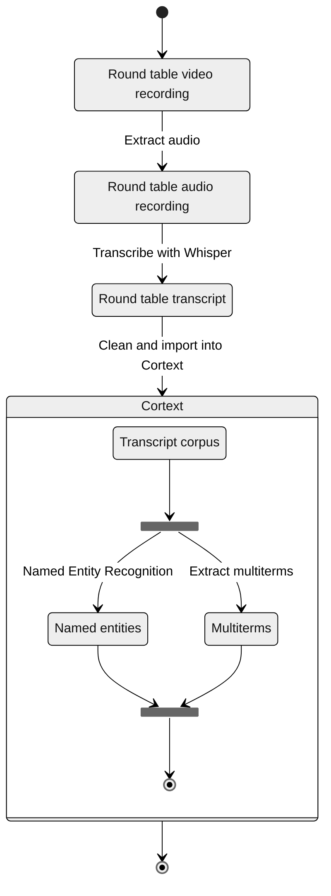

```js
import {
  downloadSVGButton,
  downloadTableButton,
  cropText,
} from "/components/utilities.js";
import { Graph, WordBubbles } from "/components/graph.js";
import {
  freq_words,
  group_freq_words,
  graph_config_round_table,
  entity_type_map,
  generateRoundTableEntitiesPlot,
  column_title_map,
  column_label_map,
  generateExtractedTermsPlot,
  extractedTermsHtmlTemplate,
  extractedTermsByGroupHtmlTemplate,
} from "./js-2025-analysis.js";
```

# VDBI JS 2025 Round Table Lexicometric Analysis <!-- omit in toc -->

## Diego Vinasco-Alvarez (PEPR VDBI; <diego.vinasco-alvarez@cnrs.fr>) <!-- omit in toc -->

## 1. Context

This report provides a lexicometric analysis of the round table discussions held
during the [2025 PEPR VDBI Journées Scientifiques](https://pepr-vdbi.fr/evenements/journees-scientifiques-annuelles-villes-durables-batiments-innovants-2025)
between November 3rd and 5th, 2025.

This report will be used to supplement a future publication regarding the round
table discussions. This publication will provide a more in-depth analysis of the
discussions and their context.

The report is structured as follows:

- [Section 2](#2-method) details the proposed methodology and steps for reproducibility
- [Section 3](#3-results) presents the results of the lexicometric
  analysis

<div class="tip">

A critique of the proposed methodology is provided in [this report](./js-2025-workshop-analysis-en).

</div>

## 2. Method

The diagram below illustrates the analysis process.

First, round table discussions were recorded live. Their audio was cut and extracted
with [Microsoft Clipchamp](https://clipchamp.com/en/).

Transcription was done using [Whisper](https://github.com/openai/whisper)'s
`large-v2` model. This transcript was manually verified and corrected by replacing
the most common misspelled proper nouns related to the PEPR VDBI, it's projects,
and the territorial collectives that participated in the round table (e.g. "Pleine
Commune" to "Plaine Commune" or "Antegreen" to "InteGREEN").

Next, the transcript was processed using the [Cortext](https://www.cortext.net/)
social science and humanities research infrastructure.
Cortext uses Natural Language Processing (NLP) and machine learning to extract keywords
and entities from a corpus. This analysis uses two main Cortext tasks:

1. **Named Entity Recognition (NER)** [[5.1]](#51-cortext-documentation-named-entity-recognition)
   to "identify and index persons, places, organizations, etc."
   The following metrics are provided for each extracted entity:
   - _frequency_: The number of times the entity appears in the discussions
   - _type_: The type of the entity (e.g. Person, Organization, Location).
2. **(Multi)Term extraction** [[5.2]](#52-cortext-documentation-multiterm-extraction)
   to identifiy terms used during the discussions. Including "not only simple terms
   but also multi-terms (called [n-grams](https://en.wikipedia.org/wiki/N-gram))."
   The following metrics are provided for each extracted term:
   - _C-value_: A measure of the frequency of a term
   - _G2_ (gf.idf): An alternative frequency measurement of a term "based on the
     assumption that interesting terms tend to be repeated within the same document."

The identified terms and entities were reviewed and corrected manually

- People identified as entities or terms were removed for privacy reasons
- Mistyped entities were reclassified (e.g., PEPR VDBI were retyped as
  organizations)
-

<div class="note">

The term '_corpus_' refers to a corpus of documents. In this case, each document
refers to a transcript of one of the three round table discussions.

</div>



<figcaption>Fig 1. Analysis Process</figcaption>

The following parameters were used to configure the Cortext tasks as of 19/12/2025.

| Task                    | Parameter                | Value       |
| :---------------------- | ------------------------ | ----------- |
| Terms extraction        | Textual Fields           | text        |
| Terms extraction        | Minimum Frequency        | 2           |
| Terms extraction        | language                 | fr          |
| Terms extraction        | Monogramms are forbidden | no          |
| Terms extraction        | grammatical criterion    | noun phrase |
| Named Entity Recognizer | Textual Fields           | text        |
| Named Entity Recognizer | language                 | fr          |

<div class="note">Unmentioned parameters use their default settings</div>

<div class="note">

Regarding the extracted multi-term entities, only the extracted noun phrases are
used in this analysis. Initial extaction of verbs and adjectives did not yield
interesting results.

</div>

## 3. Results

${Inputs.table([... await sql`select *, 'noun' from nouns`])}

<!-- $ -->

```sql id=extracted_entities
(
  select
    entity,
    sum(frequency) as frequency,
    'loc' as type
  from locations
  group by entity
  union
  select
    entity,
    sum(frequency) as frequency,
    'org' as type
  from organizations
  group by entity
  union
  select
    entity,
    sum(frequency) as frequency,
    'misc' as type
  from miscellaneous
  group by entity
)
order by "frequency" desc
limit 20
```

Looking at the top 6 most frequently used terms overall and by group, we can see
that **#question**", **#territoire**", **#acteurs**", **#projet**", and **#processus-de-co-construction**
are the most commonly used terms.

| Top 6 terms by frequency          | Top 6 terms by group frequency    |
| --------------------------------- | --------------------------------- |
| **#question**                     | **#territoire**                   |
| **#territoire**                   | #sujet                            |
| **#acteurs**                      | **#question**                     |
| #notion                           | **#acteurs**                      |
| #projet                           | #métropole                        |
| **#processus-de-co-construction** | **#processus-de-co-construction** |

${fig_2}<!-- $ -->

<figcaption>Fig 2. Top 15 extracted nouns by frequency</figcaption>

```js
const fig_2 = new WordBubbles(
  {
    nodes: freq_words([...(await sql`select * from nouns`)], {
      limit: 15,
      rFactor: 4,
    }),
  },
  graph_config_round_table,
).getSVG();
```

${fig_3}<!-- $ -->

<figcaption>Fig 3. Top 15 extracted nouns by round table frequency</figcaption>

```js
const fig_3 = new WordBubbles(
  {
    nodes: group_freq_words([...(await sql`select * from nouns`)], {
      limit: 15,
      rFactor: 4,
    }),
  },
  graph_config_round_table,
).getSVG();
```

Interestingly, group 3 evokes the term **#processus** and **#processus-de-co-construction**
more than group 2 despite both groups' questions being about processes (fig 5).
This seems to be due to the fact that group 2's presentation focused more on the
transposable elements of the process of documentation than _how_ to document it.

Between the extracted entities (figures 3-6) and the extracted terms, we can also
observe the following:

- There is little overlap between the extracted entities and terms
  - With the only exception being "PEPR", evoked by group 1
- There is no overlap between the extracted entities of each group presentation
- There is little overlap entity reuse within each group presentation (with the
  exception of the "PEPR" in group 1)

Looking at the extracted entities and terms that were only evoked by a singular
group we can see that keywords in the respective group questions are also evoked
during each presentation. Notably the keywords that are not evoked in the group
questions may give (somewhat vague) insight into how each group responded to their
question.

| Top 5 unique group 1 terms            | Top 5 unique Group 2 terms | Top 5 unique Group 3 terms    |
| ------------------------------------- | -------------------------- | ----------------------------- |
| #capitalisation-et-de-la-transmission | #projet                    | #processus-de-co-construction |
| #comité-des-parties-prenantes         | #sujet                     | #notion                       |
| #premier-groupe                       | #métropole                 | #volet                        |
| #PEPR                                 | #expertise-locale          | #évaluation                   |
|                                       | #villes-moyennes           | #apprendisage-réciproque      |

${resize((width) => generateRoundTableEntitiesPlot(extracted_entities, width))}

<!-- $ -->

${extractedTermsHtmlTemplate(
[...(await sql`select * from nouns`)],
{marginLeft: 120}
)}<!-- $ -->

## 4. Method review

Two aspects of the methodology are reviewed in this section:

1. A quantitative measure of the effectiveness of **Whisper** to automatically generate
   transcripts in a real-world setting
2. An informal review of the usefullness of **Cortext** and this **lexical analyses**
   to extract terms from the workshop transcripts compared to a manual analysis

### 4.1. Whisper error rate measurement

The Whisper transcription accuracy was measured using the
[Word Error Rate (WER) [5.3]](https://en.wikipedia.org/wiki/Word_error_rate)

```tex
WER=\frac{S+D+I}{N}=\frac{S+D+I}{S+D+C}
```

Where

- ${tex`S`} is the number of substitutions,
- ${tex`D`} is the number of deletions,
- ${tex`I`} is the number of insertions,
- ${tex`N`} is the number of words in the reference ${tex`(N=S+D+C)`},
- ${tex`C`} is the number of correct words

For this study words are separated by spaces (i.e., '_c'est_' is considered
a single word)

The following table shows the WER for each group presentation:

| Source text          | S   | D   | I   | N    | WER          |
| :------------------- | --- | --- | --- | :--- | :----------- |
| Group 1 presentation | 3   | 2   | 4   | 319  | 0.028213     |
| Group 2 presentation | 1   | 42  | 31  | 1000 | 0.074000     |
| Group 3 presentation | 29  | 204 | 88  | 907  | 0.353914     |
| **Total**            | 33  | 248 | 133 | 2226 | **0.185984** |

<div class="note">

It should be noted that a large majority of measured deletions are clustered
together. Surprisingly, Whisper's errors often materialized as several repetitive,
duplicate lines.

These are very easy to find and correct manually, which means that the WER score
may be a pessimistic measure of the actual effort required to correct the transcriptions.

Future experiments should consider measuring the WER after only removing the
repetitive lines to get a better estimate of the effort required to _quickly_ but
not completely correct the transcriptions.

</div>

<div class="tip">

A [git diff](https://git-scm.com/docs/git-diff) is used to help identify the WER
manually. Notably, existing tools with known limitations could be used in the future:

- [Understanding and Calculating Word Error Rate (WER) in Automatic Speech Recognition using python](https://medium.com/@ramadhanimassawe14/understanding-and-calculating-word-error-rate-wer-in-automatic-speech-recognition-using-python-661f18b518a5)
- [WER-in-python](https://github.com/zszyellow/WER-in-python/tree/master);
  hypothesis and/or reference may need data cleaning depending on use-case

</div>

### 4.2. Cortext vs manual analysis

A synthesis of the workshop was proposed by the NEO project, which is comparitavly
rich when compared to this lexical analysis. Many more conclusions and
observations are drawn with more detail and meaning in the manual synthesis. This
highlights the main limitation of Cortext in this application: _Cortext is intended_
_to analyse document corpuses at scale_.

In addition, the approach is limited by the quality of the transcriptions; much
of the recorded sessions were not included as the audio quality was insufficient
and inconsistent. Although manually reviewing the transcripts is always necessary
to some degree, even in a manual approach. Some manual corrections and methodology
adustment were also necessary for this analysis. For example, the detected location
entity `France` was initially identified as `de France`.

However, this methodology still has applications in the following settings, given
that the transcription quality is sufficient:

- When the number of transcriptions is too large for a manual analysis
- When the goal of the analysis is to get a general overview of the content or to
  supplement the conclusions of a manual analysis
- When a domain expert is not available to perform a manual analysis

<div class="note">

The author of this analysis is not as knowledgeable in the domain
of urban planning and development as the workshop participants or the author
of the manual analysis and could not have performed a manual analysis of the
same quality.

</div>

## 5. References and links

```bibtex
@software{cortext_manager_v2_bibtex,
  keywords = {natural language processing, social network analysis, geospatial analysis, descriptive statistics, scientometrics, biliometrics},
  author = {Breucker, Philippe and Cointet, Jean-Philippe and Hannud Abdo, Alexandre and Orsal, Guillaume and de Quatrebarbes, Constance and Duong, Tam-Kien and Martinez, Cristian and Ospina Delgado, Juan Pablo and Medina Zuluaga, Luis Daniel and Gómez Peña, Diego Fernando and Sánchez Castaño, Tatiana Andrea and Marques da Costa, Joenio and Laglil, Hajar and Villard, Lionel and Barbier, Marc},
  month = {10},
  title = {CorTexT Manager},
  url = {https://docs.cortext.net},
  year = {2016}
}
```

### 5.1. [Cortext documentation: Named Entity Recognition](https://docs.cortext.net/named-entity-recognizer/)

### 5.2. [Cortext documentation: (Multi)Term extraction](https://docs.cortext.net/lexical-extraction/)

### 5.3. [Word Error Rate](https://en.wikipedia.org/wiki/Word_error_rate)
