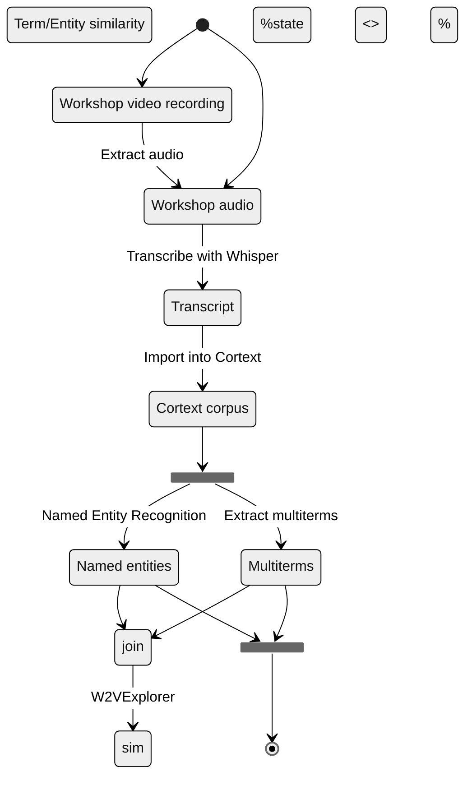

# VDBI JS 2025 Lexicometric Analysis <!-- omit in toc -->

## NEO/SoLocale Workshop <!-- omit in toc -->

Author: Diego Vinasco-Alvarez (<diego.vinasco-alvarez@cnrs.fr>) - PEPR VDBI

## 1. Context

This report provides a lexicometric analysis of the NEO/SoLocale workshop held
on November 5th, 2025 during the [2025 PEPR VDBI Journées Scientifiques](https://pepr-vdbi.fr/evenements/journees-scientifiques-annuelles-villes-durables-batiments-innovants-2025).

The purpose of this analysis is to automatically identify the most relevant keywords
and entities noted during the workshop. Additionally, this report identifies the
known limitations of the proposed methodology and when compared to a manual analysis.

The NEO/SoLocale workshop was composed largely of group discussions and activities.
This report will focus on a the final "World café" synthesis activity, where 3
groups of paricipants were asked to present the conclusions of their group work.
The activity theme is :

> "Comment garder la mémoire et retranscrire les démarches de collaboration et
> de co-création des outils de la connaissance en vue de la réplicabilité sur
> d’autres territoires ? Illustration à travers le cas d’usage Sol autour de la
> problématique plus spécifique des données."

To answer this, one or more questions were assigned to each group:

> 1. Comment capitaliser et transmettre les apprentissages à l’échelle
>    nationale ?
> 2. Comment documenter le processus ? Quels sont les éléments transposables
>    (ou non) ? Quelles spécificités propres au territoire ?
> 3. Comment évaluer et améliorer les processus (de coconstruction, d’apprentissage
>    réciproque) ?

Other activities of the workshop, including the question sections, will
unfortunately not be analyzed due to insufficient quality of the recorded workshop
audio.

The report is structured as follows:

- [Section 2](#2-method) details the proposed methodology and steps for reproducibility
- [Section 3](#3-lexical-analysis-results) presents the results of the lexicometric
  analysis
- [Section 4](#4-method-review) reviews the limitations of the proposed methodology

## 2. Method

The diagram below illustrates the analysis process.

First, a video of the workshop activity was recorded live. The recordings for the
workshop are not currently made publicly available for participant and animator
privacy. The audio was then extracted and cut with [Microsoft Clipchamp](https://clipchamp.com/en/)
to be transcribed.

Transcription was done using [Whisper](https://github.com/openai/whisper)'s
`large-v2` model. This transcript was manually verified and corrected. An evaluation
of the transcription quality is provided in [section 4.1](#41-whisper-error-rate-measurement).

Next, the transcript was processed using the [Cortext](https://www.cortext.net/)
social science and humanities research infrastructure.
Cortext uses Natural Language Processing (NLP) and machine learning to extract keywords
and entities from a corpus. This analysis uses two main Cortext tasks:

1. **Named Entity Recognition (NER)** [[5.1]](#51-cortext-documentation-named-entity-recognition)
   to "identify and index persons, places, organizations, etc."
   The following metrics are provided for each extracted entity:
   - _frequency_: The number of times the entity appears in the workshop
   - _type_: The type of the entity (e.g. Person, Organization, Location)
2. **(Multi)Term extraction** [[5.2]](#52-cortext-documentation-multiterm-extraction)
   to identifiy terms used during the workshop. Including "not only simple terms
   but also multi-terms (called [n-grams](https://en.wikipedia.org/wiki/N-gram))."
   The following metrics are provided for each extracted term:
   - _C-value_: A measure of the frequency of a term
   - _G2_ (gf.idf): An alternative frequency measurement of a term "based on the
   assumption that interesting terms tend to be repeated within the same document."
   <!-- - _Specificity_ (${tex`X^2`}): How specific a term is within the text -->
   - _Occurrences_: The number of group presentations where a term appears
   - _Cooccurrence_: The number of times the term cooccurs with other terms in the
   same group presentation
   <!-- 3. **W2V Explorer** [[5.3]](#53-cortext-documentation-w2v-explorer) to "[learn]
      the word embedding of every word... in a corpus and [visualize] the position
      of words in a reduced 2 dimensional space. Words are also clustered according
      to their proximity." -->

<div class="note">

The term '_corpus_' refers to a corpus of documents. In this case, each document
refers to a transcript of a group presentation of the workshop.

</div>

<div class="note">

Only the extracted noun terms are used in this analysis. Initial extaction of verbs
and adjectives did not yield interesting results.

</div>

<div class="note">

The term extraction step is run once on the entire corpus, and once for each
group presentation to extract term frequency by group statistics.

</div>



<figcaption>Fig 1. Analysis Process</figcaption>

The following parameters were used to configure the Cortext tasks as of 19/12/2025.

| Task                    | Parameter                | Value |
| :---------------------- | ------------------------ | ----- |
| Terms extraction        | Textual Fields           | text  |
| Terms extraction        | Minimum Frequency        | 2     |
| Terms extraction        | language                 | fr    |
| Terms extraction        | Monogramms are forbidden | no    |
| Named Entity Recognizer | Textual Fields           | text  |
| Named Entity Recognizer | language                 | fr    |

<div class="note">Unmentioned parameters use their default settings</div>

## 3. Lexical Analysis Results

```js
import {
  downloadSVGButton,
  downloadTableButton,
  cropText,
} from "/components/utilities.js";
import { Graph } from "/components/graph.js";
import {
  freq_words,
  group_freq_words,
  graph_config_workshop,
  entity_type_map,
  generateWorkshopEntitiesPlot,
  column_title_map,
  column_label_map,
  generateExtractedTermsPlot,
  extractedTermsHtmlTemplate,
  extractedTermsByGroupHtmlTemplate,
} from "./js-2025-analysis.js";
```

```sql id=nouns_by_group
select * from nouns_by_group
```

```sql id=nouns
select * from nouns
```

```sql id=entities
select * from entities
```

Each group presentation is numbered based on their respective question(s) as
follows:

- **Group 1:** "Comment capitaliser et transmettre les apprentissages à l’échelle
  nationale ?"
- **Group 2:** "Comment documenter le processus ? Quels sont les éléments transposables
  (ou non) ?"
- **Group 3:** "Comment évaluer et améliorer les processus
  (de coconstruction, d’apprentissage réciproque) ?"

Looking at the top 6 most frequently used terms overall and by group, we can see
that **#question**", **#territoire**", **#acteurs**", **#projet**", and **#processus-de-co-construction**
are the most commonly used terms.

| Top 6 terms by frequency          | Top 6 terms by group frequency    |
| --------------------------------- | --------------------------------- |
| **#question**                     | **#territoire**                   |
| **#territoire**                   | #sujet                            |
| **#acteurs**                      | **#question**                     |
| #notion                           | **#acteurs**                      |
| #projet                           | #métropole                        |
| **#processus-de-co-construction** | **#processus-de-co-construction** |

${new Graph({nodes: freq_words([...nouns])}, graph_config_workshop).getSVG()}

<!-- $ -->
<figcaption>Fig 2. Top 10 terms by frequency</figcaption>

${new Graph({nodes: group_freq_words([...nouns])}, graph_config_workshop).getSVG()}

<!-- $ -->
<figcaption>Fig 3. Top 10 terms by group frequency</figcaption>

Interestingly, group 3 evokes the term **#processus** and **#processus-de-co-construction**
more than group 2 despite both groups' questions being about processes (fig 5).
This seems to be due to the fact that group 2's presentation focused more on the
transposable elements of the process of documentation than _how_ to document it.

Between the extracted entities (figures 3-6) and the extracted terms, we can also
observe the following:

- There is little overlap between the extracted entities and terms
  - With the only exception being "PEPR", evoked by group 1
- There is no overlap between the extracted entities of each group presentation
- There is little overlap entity reuse within each group presentation (with the
  exception of the "PEPR" in group 1)

Looking at the extracted entities and terms that were only evoked by a singular
group we can see that keywords in the respective group questions are also evoked
during each presentation. Notably the keywords that are not evoked in the group
questions may give (somewhat vague) insight into how each group responded to their
question.

| Top 5 unique group 1 terms            | Top 5 unique Group 2 terms | Top 5 unique Group 3 terms    |
| ------------------------------------- | -------------------------- | ----------------------------- |
| #capitalisation-et-de-la-transmission | #projet                    | #processus-de-co-construction |
| #comité-des-parties-prenantes         | #sujet                     | #notion                       |
| #premier-groupe                       | #métropole                 | #volet                        |
| #PEPR                                 | #expertise-locale          | #évaluation                   |
|                                       | #villes-moyennes           | #apprendisage-réciproque      |

${resize((width) => generateWorkshopEntitiesPlot(entities, width))}<!-- $ -->

<!-- ${downloadSVGButton("#entities svg")} -->

${extractedTermsByGroupHtmlTemplate([...nouns_by_group])}<!-- $ -->

${extractedTermsHtmlTemplate([...nouns])}<!-- $ -->

## 4. Method review

Two aspects of the methodology are reviewed in this section:

1. A quantitative measure of the effectiveness of **Whisper** to automatically generate
   transcripts in a real-world setting
2. An informal review of the usefullness of **Cortext** and this **lexical analyses**
   to extract terms from the workshop transcripts compared to a manual analysis

### 4.1. Whisper error rate measurement

The Whisper transcription accuracy was measured using the
[Word Error Rate (WER) [5.3]](https://en.wikipedia.org/wiki/Word_error_rate)

```tex
WER=\frac{S+D+I}{N}=\frac{S+D+I}{S+D+C}
```

Where

- ${tex`S`} is the number of substitutions,
- ${tex`D`} is the number of deletions,
- ${tex`I`} is the number of insertions,
- ${tex`N`} is the number of words in the reference ${tex`(N=S+D+C)`},
- ${tex`C`} is the number of correct words

For this study words are separated by spaces (i.e., '_c'est_' is considered
a single word)

The following table shows the WER for each group presentation:

| Source text          | S   | D   | I   | N    | WER          |
| :------------------- | --- | --- | --- | :--- | :----------- |
| Group 1 presentation | 3   | 2   | 4   | 319  | 0.028213     |
| Group 2 presentation | 1   | 42  | 31  | 1000 | 0.074000     |
| Group 3 presentation | 29  | 204 | 88  | 907  | 0.353914     |
| **Total**            | 33  | 248 | 133 | 2226 | **0.185984** |

<div class="note">

It should be noted that a large majority of measured deletions are clustered
together. Surprisingly, Whisper's errors often materialized as several repetitive,
duplicate lines.

These are very easy to find and correct manually, which means that the WER score
may be a pessimistic measure of the actual effort required to correct the transcriptions.

Future experiments should consider measuring the WER after only removing the
repetitive lines to get a better estimate of the effort required to _quickly_ but
not completely correct the transcriptions.

</div>

<div class="tip">

A [git diff](https://git-scm.com/docs/git-diff) is used to help identify the WER
manually. Notably, existing tools with known limitations could be used in the future:

- [Understanding and Calculating Word Error Rate (WER) in Automatic Speech Recognition using python](https://medium.com/@ramadhanimassawe14/understanding-and-calculating-word-error-rate-wer-in-automatic-speech-recognition-using-python-661f18b518a5)
- [WER-in-python](https://github.com/zszyellow/WER-in-python/tree/master);
  hypothesis and/or reference may need data cleaning depending on use-case

</div>

### 4.2. Cortext vs manual analysis

A synthesis of the workshop was proposed by the NEO project, which is comparitavly
rich when compared to this lexical analysis. Many more conclusions and
observations are drawn with more detail and meaning in the manual synthesis. This
highlights the main limitation of Cortext in this application: _Cortext is intended_
_to analyse document corpuses at scale_.

In addition, the approach is limited by the quality of the transcriptions; much
of the recorded sessions were not included as the audio quality was insufficient
and inconsistent. Although manually reviewing the transcripts is always necessary
to some degree, even in a manual approach. Some manual corrections and methodology
adustment were also necessary for this analysis. For example, the detected location
entity `France` was initially identified as `de France`.

However, this methodology still has applications in the following settings, given
that the transcription quality is sufficient:

- When the number of transcriptions is too large for a manual analysis
- When the goal of the analysis is to get a general overview of the content or to
  supplement the conclusions of a manual analysis
- When a domain expert is not available to perform a manual analysis

<div class="note">

The author of this analysis is not as knowledgeable in the domain
of urban planning and development as the workshop participants or the author
of the manual analysis and could not have performed a manual analysis of the
same quality.

</div>

<div class="note">

Cortext NER doesn't have as many entity types or configurations for french. Analysing
terms and entities in english may yield more accurate and/or more detailed results.

</div>

## 5. References and links

```bibtex
@software{cortext_manager_v2_bibtex,
  keywords = {natural language processing, social network analysis, geospatial analysis, descriptive statistics, scientometrics, biliometrics},
  author = {Breucker, Philippe and Cointet, Jean-Philippe and Hannud Abdo, Alexandre and Orsal, Guillaume and de Quatrebarbes, Constance and Duong, Tam-Kien and Martinez, Cristian and Ospina Delgado, Juan Pablo and Medina Zuluaga, Luis Daniel and Gómez Peña, Diego Fernando and Sánchez Castaño, Tatiana Andrea and Marques da Costa, Joenio and Laglil, Hajar and Villard, Lionel and Barbier, Marc},
  month = {10},
  title = {CorTexT Manager},
  url = {https://docs.cortext.net},
  year = {2016}
}
```

### 5.1. [Cortext documentation: Named Entity Recognition](https://docs.cortext.net/named-entity-recognizer/)

### 5.2. [Cortext documentation: (Multi)Term extraction](https://docs.cortext.net/lexical-extraction/)

### 5.3. [Word Error Rate](https://en.wikipedia.org/wiki/Word_error_rate)
