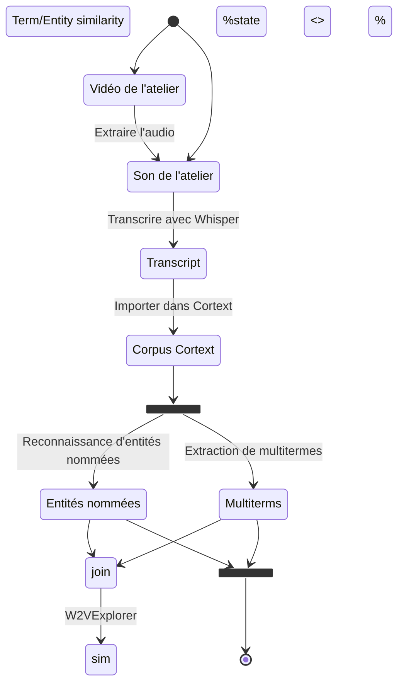

# VDBI JS 2025 Analyse lexicométrique - Atelier NEO/SoLocal <!-- omit in toc -->

## Diego Vinasco-Alvarez; PEPR VDBI; <diego.vinasco-alvarez@cnrs.fr> <!-- omit in toc -->

```js
import {
  downloadSVGButton,
  downloadTableButton,
  cropText,
} from '/components/utilities.js'
import { WordBubbles } from '/components/graph.js'
import * as page from './js-2025-analysis.js'
```

## 1. Contexte

Ce rapport présente une analyse lexicométrique de l'atelier NEO/SoLocal qui
s'est tenu le 5 novembre 2025 lors des
[Journées Scientifiques PEPR VDBI 2025](https://pepr-vdbi.fr/evenements/journees-scientifiques-annuelles-villes-durables-batiments-innovants-2025).

L'objectif de cette analyse est d'identifier automatiquement les mots-clés et les
entités les plus pertinents notés durant l'atelier. En outre, ce rapport identifie
les limites identifées de la méthodologie proposée et les compare à une analyse
manuelle.

L'atelier NEO/SoLocal était principalement composé de discussions et d'activités
de groupe. Ce rapport se concentrera sur l'activité de synthèse finale du
« _World café_ », dans laquelle trois groupes de participants ont présenté les
résultats de leur travail de groupe.

Le thème de l'activité est :

> « Comment garder la mémoire et retranscrire les démarches de collaboration et
> de co-création des outils de la connaissance en vue de la réplicabilité sur
> d’autres territoires ? Illustration à travers le cas d’usage Sol autour de la
> problématique plus spécifique des données. »

Pour répondre à cette question, une ou plusieurs questions ont été attribuées à
chaque groupe :

> 1. Comment capitaliser et transmettre les apprentissages à l’échelle
>    nationale ?
> 2. Comment documenter le processus ? Quels sont les éléments transposables
>    (ou non) ? Quelles spécificités propres au territoire ?
> 3. Comment évaluer et améliorer les processus (de coconstruction, d’apprentissage
>    réciproque) ?

Les autres activités de l'atelier, y compris les sections consacrées aux questions,
ne seront pas analysées en raison de la qualité insuffisante de
l'enregistrement audio de l'atelier.

Le rapport est structuré comme suit :

- La [section 2](#2-méthode) détaille la méthodologie proposée et les étapes pour
  la reproductibilité
- La [section 3](#3-résultats-de-lanalyse-lexicale) présente les résultats de l'analyse
  lexicométrique
- La [section 4](#4-revue-de-la-méthode) passe en revue les limites de la méthodologie
  proposée

## 2. Méthode

Le diagramme ci-dessous illustre le processus d'analyse.

Tout d'abord, une vidéo de l'activité de l'atelier a été enregistrée en direct.
Les enregistrements de l'atelier ne sont actuellement pas accessibles au public
afin de préserver la vie privée des participants et des animateurs. L'audio a ensuite
été extrait et coupé avec [Microsoft Clipchamp](https://clipchamp.com/) pour être
transcrit.

La transcription a été réalisée à l'aide du modèle « large-v2 » de [Whisper](https://github.com/openai/whisper).
Cette transcription a été vérifiée et corrigée manuellement. Une évaluation
de la qualité de la transcription est fournie dans la [section 4.1](#41-mesure-de-lexactitude-de-whisper).

Ensuite, la transcription a été traitée à l'aide de l'infrastructure de recherche
en sciences sociales et humaines [Cortext](https://www.cortext.net/). Cortext utilise
le traitement du langage naturel (TLN) et l'apprentissage automatique pour extraire
des mots-clés et des entités d'un corpus. Cette analyse utilise deux tâches principales
de Cortext :

1. **Reconnaissance d'entités nommées (NER)** [[5.1]](#51-cortext-documentation-named-entity-recognition)
   pour « identifier et indexer des personnes, places, organisations, etc. »
   Les mesures suivantes sont fournies pour chaque entité extraite :
   - _fréquence_ : nombre d'occurrences de l'entité dans l'atelier
   - _type_ : type de l'entité (par exemple, personne, organisation, lieu)
2. **Extraction (multi)terminologique** [[5.2]](#52-cortext-documentation-multiterm-extraction)
   pour identifier les termes utilisés pendant l'atelier. Y compris « simultanément
   des termes simples et des multitermes
   (appelés [n-grams](https://en.wikipedia.org/wiki/N-gram)). »
   Les mesures suivantes sont fournies pour chaque terme extrait :
   - _C-value_ : une mesure de la fréquence d'un terme
   - _G2_ (gf.idf) : une autre mesure de la fréquence d'un terme "based on the
     assumption that interesting terms tend to be repeated within the same document."
   - _Occurrences_ : le nombre de présentations de groupe dans lesquelles un terme
     apparaît.
   - _Cooccurrence_ : le nombre de fois où le terme cooccur avec d'autres termes
     dans la même présentation de groupe.

<div class="note">

Le terme « _corpus_ » désigne un ensemble de documents. Dans le cas présent, chaque
document correspond à la transcription d'une présentation de groupe réalisée dans
le cadre de l'atelier.

</div>

<div class="note">

Seuls les termes nominaux extraits sont utilisés dans cette analyse. L'extraction
initiale des verbes et des adjectifs n'a pas donné de résultats intéressants.

</div>

<div class="note">

L'étape d'extraction des termes est exécutée une fois sur l'ensemble du corpus,
puis une fois pour chaque présentation de groupe afin d'extraire la fréquence des
termes par statistiques de groupe.

</div>



<figcaption>Fig 1. Analysis Process</figcaption>

Les paramètres suivants ont été utilisés pour configurer les tâches Cortext au 19/12/2025.

| Task                    | Parameter                | Value       |
| :---------------------- | ------------------------ | ----------- |
| Terms extraction        | Textual Fields           | text        |
| Terms extraction        | Minimum Frequency        | 2           |
| Terms extraction        | language                 | fr          |
| Terms extraction        | grammatical criterion    | noun phrase |
| Terms extraction        | Monogramms are forbidden | no          |
| Named Entity Recognizer | Textual Fields           | text        |
| Named Entity Recognizer | language                 | fr          |

<div class="note">Les paramètres non mentionnés utilisent leurs paramètres par défaut.</div>

## 3. Résultats de l'analyse lexicale

```sql id=nouns_by_group
select * from nouns_by_group
```

```sql id=nouns
select * from nouns
```

```sql id=entities
select * from entities
```

Chaque présentation de groupe est numérotée en fonction de sa ou ses questions respectives,
comme suit :

- **Groupe 1 :** "Comment capitaliser et transmettre les apprentissages à l’échelle
  nationale ?"
- **Groupe 2 :** "Comment documenter le processus ? Quels sont les éléments transposables
  (ou non) ?"
- **Groupe 3 :** "Comment évaluer et améliorer les processus
  (de coconstruction, d’apprentissage réciproque) ?"

En examinant les 6 termes les plus fréquemment utilisés dans l'ensemble et par groupe,
nous pouvons constater que **#question**", **#territoire**", **#acteurs**", **#projet**",
et **#processus-de-co-construction** sont les termes les plus couramment utilisés.

| Top 6 terms par fréquence         | Top 6 terms par fréquence par groupe |
| --------------------------------- | ------------------------------------ |
| **#question**                     | **#territoire**                      |
| **#territoire**                   | #sujet                               |
| **#acteurs**                      | **#question**                        |
| #notion                           | **#acteurs**                         |
| #projet                           | #métropole                           |
| **#processus-de-co-construction** | **#processus-de-co-construction**    |

${fig_2}<!-- $ -->

<figcaption>Fig 2. Les 15 termes les plus fréquents</figcaption>

```js
const fig_2 = new WordBubbles(
  page.freq_words([...nouns], {
    rFactor: 7,
  }),
).getSVG()
```

${fig_3}<!-- $ -->

```js
const fig_3 = new WordBubbles(
  page.group_freq_words([...nouns], {
    rFactor: 13,
  }),
).getSVG()
```

<figcaption>Fig 3. Les 15 termes les plus fréquents par groupe</figcaption>

Il est intéressant de noter que le groupe 3 évoque davantage les termes **#processus**
et **#processus-de-co-construction** que le groupe 2, bien que les questions des
deux groupes portent sur les processus (fig. 5). Cela semble s'expliquer par le
fait que la présentation du groupe 2 était plus axée sur les éléments transposables
du processus de documentation que sur la manière de le documenter.

Entre les entités extraites (figures 3 à 6) et les termes extraits, nous pouvons
également observer ce qui suit :

- Il y a peu de chevauchement entre les entités et les termes extraits
  - La seule exception étant « PEPR », évoqué par le groupe 1
- Aucun chevauchement n'existe entre les entités extraites de chaque présentation
  de groupe
- Il y a peu de chevauchement dans la réutilisation des entités au sein de chaque
  présentation de groupe (à l'exception du « PEPR » dans le groupe 1)

En examinant les entités et les termes extraits qui n'ont été évoqués que par un
seul groupe, nous pouvons voir que les mots-clés des questions respectives du groupe
sont également évoqués lors de chaque présentation. Il convient de noter que les
mots-clés qui ne sont pas évoqués dans les questions du groupe peuvent donner un
aperçu (quelque peu vague) de la manière dont chaque groupe a répondu à sa question.

| Top 5 termes uniques du groupe 1      | Top 5 termes uniques du groupe 2 | Top 5 termes uniques du groupe 3 |
| ------------------------------------- | -------------------------------- | -------------------------------- |
| #capitalisation-et-de-la-transmission | #projet                          | #processus-de-co-construction    |
| #comité-des-parties-prenantes         | #sujet                           | #notion                          |
| #premier-groupe                       | #métropole                       | #volet                           |
| #PEPR                                 | #expertise-locale                | #évaluation                      |
|                                       | #villes-moyennes                 | #apprendisage-réciproque         |

${resize((width) => page.generateWorkshopEntitiesPlot(entities, width))}<!-- $ -->

<!-- ${downloadSVGButton("#entities svg")} -->

${page.extractedTermsByGroupHtmlTemplate([...nouns_by_group])}<!-- $ -->

${page.extractedTermsHtmlTemplate([...nouns])}<!-- $ -->

## 4. Revue de la méthode

Deux aspects de la méthodologie sont examinés dans cette section :

1. Une mesure quantitative de l'efficacité de **Whisper** pour générer automatiquement
   des transcriptions dans un contexte réel
2. Un examen informel de l'utilité de **Cortext** et de cette **analyse lexicale**
   pour extraire des termes des transcriptions de l'atelier par rapport à une analyse
   manuelle

### 4.1. Mesure de l'exactitude de Whisper

L'exactitude de la transcription de Whisper a été mesurée avec le
[Word Error Rate (WER) [5.3]](https://en.wikipedia.org/wiki/Word_error_rate)

```tex
WER=\frac{S+D+I}{N}=\frac{S+D+I}{S+D+C}
```

Où

- ${tex`S`} est le nombre de substitutions,
- ${tex`D`} est le nombre de délétions,
- ${tex`I`} est le nombre d'insertions,
- ${tex`N`} est le nombre de mots dans la référence ${tex`(N=S+D+C)`},
- ${tex`C`} est le nombre de mots corrects

Pour cette étude, les mots sont séparés par des espaces (i.e., '_c'est_' est considéré
comme un seul mot).

Le tableau suivant indique le taux d'erreur de reconnaissance (WER) pour chaque
présentation de groupe :

| Source text           | S   | D   | I   | N    | WER          |
| :-------------------- | --- | --- | --- | :--- | :----------- |
| Presentation groupe 1 | 3   | 2   | 4   | 319  | 0.028213     |
| Presentation groupe 2 | 1   | 42  | 31  | 1000 | 0.074000     |
| Presentation groupe 3 | 29  | 204 | 88  | 907  | 0.353914     |
| **Total**             | 33  | 248 | 133 | 2226 | **0.185984** |

<div class="note">

Il convient de noter que la grande majorité des suppressions mesurées sont regroupées.
Étonnamment, les erreurs de Whisper se sont souvent matérialisées sous la forme
de plusieurs lignes répétitives et dupliquées.

Celles-ci sont très faciles à trouver et à corriger manuellement, ce qui signifie
que le score WER peut être une mesure pessimiste de l'effort réel nécessaire pour
corriger les transcriptions.

Les expériences futures devraient envisager de mesurer le WER après avoir supprimé
uniquement les lignes répétitives afin d'obtenir une meilleure estimation de l'effort
nécessaire pour corriger rapidement, mais pas complètement, les transcriptions.

</div>

<div class="tip">

Un [git diff](https://git-scm.com/docs/git-diff) est utilisé pour aider à identifier
manuellement le WER. Il convient de noter que des outils existants présentant des
limites identifiées pourraient être utilisés à l'avenir :

- [Comprendre et calculer le taux d'erreur sur les mots (WER) dans la reconnaissance vocale automatique à l'aide de Python](https://medium.com/@ramadhanimassawe14/understanding-and-calculating-word-error-rate-wer-in-automatic-speech-recognition-using-python-661f18b518a5)
- [WER-in-python](https://github.com/zszyellow/WER-in-python/tree/master) ;
  l'hypothèse et/ou la référence peuvent nécessiter un nettoyage des données en
  fonction du cas d'utilisation.

</div>

### 4.2. Cortext vs analyse manuelle

Une synthèse de l'atelier a été proposée par le projet NEO, qui est relativement
riche par rapport à cette analyse lexicale. De nombreuses autres conclusions et
observations sont tirées avec plus de détails et de sens dans la synthèse manuelle.
Cela met en évidence la principale limite de Cortext dans cette application :
_Cortext est destiné à analyser des corpus de documents à grande échelle_.

De plus, l'approche est limitée par la qualité des transcriptions ; une grande partie
des sessions enregistrées n'ont pas été incluses car la qualité audio était insuffisante
et incohérente. Cependant, la révision manuelle des transcriptions est toujours
nécessaire dans une certaine mesure, même dans une approche manuelle. Certaines
corrections manuelles et ajustements méthodologiques ont également été nécessaires
pour cette analyse. Par exemple, l'entité de localisation détectée « _France_ »
a été initialement identifiée comme « _de France_ ».

<div class="tip">

Gardez à l'esprit que Cortext NER dispose beaucoup plus de types d'entités et de
configurations pour l'anglais que le français.

</div>

Cependant, cette méthodologie trouve encore des applications dans les cas suivants,
à condition que la qualité de la transcription soit suffisante :

- Lorsque le nombre de transcriptions est trop important pour une analyse manuelle
- Lorsque l'objectif de l'analyse est d'obtenir une vue d'ensemble du contenu ou
  de compléter les conclusions d'une analyse manuelle
- Lorsqu'aucun expert du domaine n'est disponible pour effectuer une analyse manuelle

<div class="note">

L'auteur de cette analyse n'est pas aussi compétent dans le domaine de l'urbanisme
et du développement urbain que les participants à l'atelier ou l'auteur de l'analyse
manuelle et n'aurait pas pu réaliser une analyse manuelle de la même qualité.

</div>

<div class="note">

Cortext NER ne dispose pas d'autant de types d'entités ou de configurations pour
le français. L'analyse des termes et des entités en anglais peut donner des résultats
plus précis et/ou plus détaillés.

</div>

Plusieurs améliorations ont été apportées à la méthodologie utilisée pour les analyses
prospectives à l'aide de Cortext.

Tout d'abord, cette analyse n'a extrait que des _groupes nominaux_ comme termes,
mais d'autres parties du discours pourraient être extraites à des fins d'identification
de mots-clés, telles que les _verbes_ et les _adjectifs_ à l'aide de Cortext.
Bien que les groupes nominaux n-grammes identifiés puissent contenir des adjectifs
(par exemple, « jeu-sérieux »), peu d'entre eux ont été identifiés dans cette analyse.
Une extraction initiale des verbes et des adjectifs a été effectuée, mais ceux-ci
ont été exclus des résultats. En effet, seuls les monogrammes peuvent être extraits
pour les verbes et les adjectifs à l'aide de Cortext et les termes obtenus nécessitent
un traitement plus complexe des données afin d'améliorer leur utilité (par exemple,
définition et suppression des mots vides indésirables, lemmatisation, etc.).

<div class="note">

Cortext ne fournit pas de fonction de lemmatisation à la place du stemming, mais
il s'agit d'une tâche de NLP bien connue qui peut être effectuée sur des textes
français à l'aide de bibliothèques telles que Stanza [[5.4]](#54-stanza)

</div>

Deuxièmement, les entités et les termes identifiés pourraient être combinés en une
seule liste de termes plus complète afin de permettre une analyse plus complète
des mots-clés. Troisièmement, les occurrences des termes et les résultats de cooccurrence
ont été calculés par discussion en table ronde par défaut, ce qui n'a pas donné
de résultats intéressants avec si peu de documents (seulement 3) dans le corpus.
L'extraction de termes par occurrences (cooccurrences) de phrases pourrait être
plus pertinente.

## 5. Références et liens

```bibtex
@software{cortext_manager_v2_bibtex,
  keywords = {natural language processing, social network analysis, geospatial analysis,
    descriptive statistics, scientometrics, biliometrics},
  author = {Breucker, Philippe and Cointet, Jean-Philippe and Hannud Abdo, Alexandre
    and Orsal, Guillaume and de Quatrebarbes, Constance and Duong, Tam-Kien and
    Martinez, Cristian and Ospina Delgado, Juan Pablo and Medina Zuluaga, Luis Daniel
    and Gómez Peña, Diego Fernando and Sánchez Castaño, Tatiana Andrea and Marques
    da Costa, Joenio and Laglil, Hajar and Villard, Lionel and Barbier, Marc},
  month = {10},
  title = {CorTexT Manager},
  url = {https://docs.cortext.net},
  year = {2016}
}
```

### 5.1. [Cortext documentation: Named Entity Recognition](https://docs.cortext.net/named-entity-recognizer/)

### 5.2. [Cortext documentation: (Multi)Term extraction](https://docs.cortext.net/lexical-extraction/)

### 5.3. [Word Error Rate](https://en.wikipedia.org/wiki/Word_error_rate)

### 5.4. [Stanza](https://stanfordnlp.github.io/stanza/)

```bibtex
@InProceedings{manning-EtAl:2014:P14-5,
  author    = {Manning, Christopher D. and  Surdeanu, Mihai  and  Bauer, John  and
    Finkel, Jenny  and  Bethard, Steven J. and  McClosky, David},
  title     = {The {Stanford} {CoreNLP} Natural Language Processing Toolkit},
  booktitle = {Association for Computational Linguistics (ACL) System Demonstrations},
  year      = {2014},
  pages     = {55--60},
  url       = {http://www.aclweb.org/anthology/P/P14/P14-5010}
}
```
