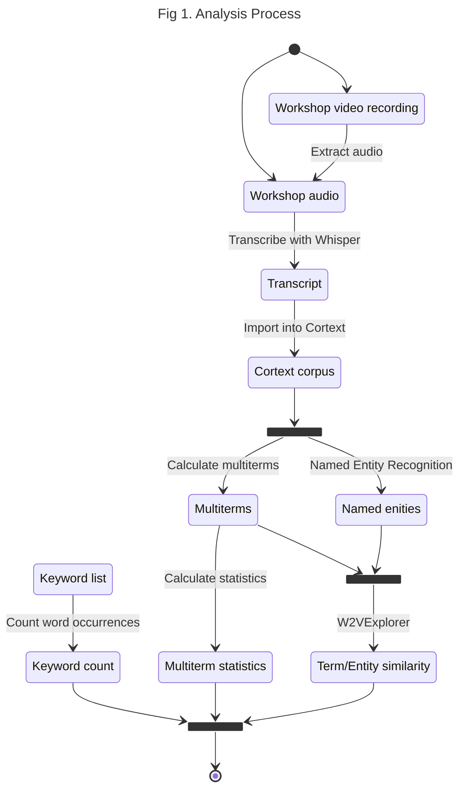

# VDBI JS 2025 Lexicometric Analysis <!-- omit in toc -->

## NEO/SoLocale Workshop <!-- omit in toc -->

## 1. Context

This report provides a lexicometric analysis of the NEO/SoLocale workshop held
on November 5th, 2025 during the [2025 PEPR VDBI Journées Scientifiques](https://pepr-vdbi.fr/evenements/journees-scientifiques-annuelles-villes-durables-batiments-innovants-2025).

The purpose of this analysis is to automatically identify the most relevant keywords
and entities noted during the workshop. Additionally, this report identifies the
known limitations of the proposed methodology and when compared to a manual analysis.

The NEO/SoLocale workshop was composed largely of group discussions and activities.
This report will focus on a the final synthesis activity, where 3 groups of
paricipants were asked to present the conclusions of their group work.
Other activities of the workshop, including the question sections, will
unfortunately not be analyzed due to insufficient quality of the recorded workshop
audio.

The report is structured as follows:

- [Section 2](#2-method) details the proposed methodology and steps for reproducibility
- [Section 3](#3-analysis-results) presents the results of the lexicometric analysis
- [Section 4](#4-method-review) reviews the limitations of the proposed methodology

## 2. Method

The diagram below illustrates the analysis process.

First, a video of the workshop activity was recorded live. The recordings for the
workshop are not currently made publicly available for participant and animator
privacy. The audio was then extracted and cut with [Microsoft Clipchamp](https://clipchamp.com/en/)
to be transcribed.

Transcription was done using [Whisper](https://github.com/openai/whisper)'s
`large-v2` model. This transcript was manually verified and corrected. An evaluation
of the transcription quality is provided in [section 4.1](#41-whisper-error-rate-measurement).

Next, the transcript was processed using the [Cortext](https://www.cortext.net/)
social science and humanities research infrastructure.
Cortext uses Natural Language Processing (NLP) and machine learning to extract keywords
and entities from a corpus. This analysis uses three main Cortext tasks:

1. **[Named Entity Recognition (NER)](https://docs.cortext.net/named-entity-recognizer/)**
   to "identify and index persons, places, organizations, etc."
2. **[(Multi)Term extraction](https://docs.cortext.net/lexical-extraction/)** to
   identifiy "terms pertaining to a given [document] corpus... [Including] not
   only simple terms but also multi-terms (called [n-grams](https://en.wikipedia.org/wiki/N-gram))."
3. **[W2V Explorer](https://docs.cortext.net/w2v-explorer/)** to "[learn] the
   word embedding of every word... in a corpus and [visualize] the position of
   words in a reduced 2 dimensional space. Words are also clustered according to
   their proximity."

<div class="note">

Cortext NER doesn't have as many entity types or configurations for french.

</div>



The following parameters were used to configure the Cortext tasks as of 19/12/2025.

<div class="note">

Unmentioned parameters use their default settings

</div>

| Task                    | Parameter                | Value         |
| :---------------------- | ------------------------ | ------------- |
| Terms extraction        | Textual Fields           | text          |
| Terms extraction        | Minimum Frequency        | 2             |
| Terms extraction        | language                 | fr            |
| Terms extraction        | Monogramms are forbidden | no            |
| Terms extraction        | grammatical criterion    | all${tex`^*`} |
| Named Entity Recognizer | Textual Fields           | text          |
| Named Entity Recognizer | language                 | fr            |
| W2vexplorer             | Field                    | text          |

${tex`^*`} Rerun task once with each available value<!-- $ -->

The following metrics are priovided for each extracted entity:

- `frequency`: The number of times the entity appears in the corpus
- `type`: The type of the entity (e.g. Person, Organization, Location)

The following metrics are priovided for each extracted term:

- `C-value`: A measure of the frequency of a term
- `Gf.idf (G2)`: An alternative frequency measurement of a term
- `chi2`: The specificity of a term
- `Occurrences`: The number of times a term appears in the corpus
- `Cooccurrences`: The number of times a term appears in the corpus
- `Part of speech (POS)`: The part of speech of a term (e.g. Noun, Verb, Adjective)

Both sets of metrics are separated by their occurrence in each group's discussion.

## 3. Analysis Results

```js
import { downloadSVGButton } from "/components/utilities.js"
```

```js
// for debugging
// display("entities")
// display(Inputs.table(entities))
// display("extracted_terms")
// display(Inputs.table(extracted_terms))
```

```js
// Load Cortext export
const files = await FileAttachment(
  "/data/private/VDBI_JS_2025_atelier_NEO_extracted_terms.zip",
).zip()

const extracted_terms = files.file("extracted-terms.tsv").tsv({ typed: true })
const entities = files.file("entities.tsv").tsv({ typed: true })
```

### 3.1. Extracted Entities

<div id="entities" class="card">
  <h2>Extracted Entities</h2>
  ${resize((width) =>
    generateEntitiesPlot(entities, width)
  )}<!-- $ -->
  ${downloadSVGButton("#entities svg")}

</div>

```js
const generateEntitiesPlot = (data, width) =>
  Plot.auto(data, {
    x: (d) => Number(d.frequency),
    y: "entity",
    fx: "group",
    color: "type",
    mark: "bar",
  }).plot({
    width: width,
    y: { label: "Entity", grid: true },
    x: { label: "Frequency" },
    fx: { label: "Group" },
    marginLeft: 150,
    color: { legend: true },
  })
```

### 3.2. Extracted Nouns

<div class="grid grid-cols-1">
  <div id="c-value-noun-plot" class="card">
    <h2>C-values</h2>
    ${resize((width) => generateExtractedTermsPlot(
      extracted_terms,
      width,
      "C-value",
      "noun",
      180,
    ))}<!-- $ -->
    ${downloadSVGButton("#c-value-noun-plot svg")}

  </div>
  <div id="gfidf-noun-plot" class="card">
    <h2>Gfidfs</h2>
    ${resize((width) => generateExtractedTermsPlot(
      extracted_terms,
      width,
      "Gfidf",
      "noun",
      180,
    ))}<!-- $ -->
    ${downloadSVGButton("#gfidf-noun-plot svg")}

  </div>
  <div id="specificity-noun-plot" class="card">
    <h2>Specificity</h2>
    ${resize((width) => generateExtractedTermsPlot(
      extracted_terms,
      width,
      "Specificity chi2",
      "noun",
      180,
    ))}<!-- $ -->
    ${downloadSVGButton("#specificity-noun-plot svg")}

  </div>
  <div id="occurrences-noun-plot" class="card">
    <h2>Occurrences</h2>
    ${resize((width) => generateExtractedTermsPlot(
      extracted_terms,
      width,
      "Occurrences",
      "noun",
      180,
    ))}<!-- $ -->
    ${downloadSVGButton("#occurrences-noun-plot svg")}

  </div>
  <div id="cooccurrences-noun-plot" class="card">
    <h2>Co-occurrences</h2>
    ${resize((width) => generateExtractedTermsPlot(
      extracted_terms,
      width,
      "Cooccurrences",
      "noun",
      180,
    ))}<!-- $ -->
    ${downloadSVGButton("#cooccurrences-noun-plot svg")}

  </div>
</div>

### 3.3. Extracted Verbs

<div class="grid grid-cols-2">
  <div id="c-value-verb-plot" class="card">
    <h2>C-values</h2>
    ${resize((width) => generateExtractedTermsPlot(
      extracted_terms,
      width,
      "C-value",
      "verb",
      100,
    ))}<!-- $ -->
    ${downloadSVGButton("#c-value-verb-plot svg")}

  </div>
  <div id="gfidf-verb-plot" class="card">
    <h2>Gfidfs</h2>
    ${resize((width) => generateExtractedTermsPlot(
      extracted_terms,
      width,
      "Gfidf",
      "verb",
      100,
    ))}<!-- $ -->
    ${downloadSVGButton("#gfidf-verb-plot svg")}

  </div>
  <div id="specificity-noun-plot" class="card">
    <h2>Specificity</h2>
    ${resize((width) => generateExtractedTermsPlot(
      extracted_terms,
      width,
      "Specificity chi2",
      "verb",
      100,
    ))}<!-- $ -->
    ${downloadSVGButton("#specificity-noun-plot svg")}

  </div>
  <div id="occurrences-verb-plot" class="card">
    <h2>Occurrences</h2>
    ${resize((width) => generateExtractedTermsPlot(
      extracted_terms,
      width,
      "Occurrences",
      "verb",
      100,
    ))}<!-- $ -->
    ${downloadSVGButton("#occurrences-verb-plot svg")}

  </div>
  <div id="cooccurrences-verb-plot" class="card">
    <h2>Co-occurrences</h2>
    ${resize((width) => generateExtractedTermsPlot(
      extracted_terms,
      width,
      "Cooccurrences",
      "verb",
      100,
    ))}<!-- $ -->
    ${downloadSVGButton("#cooccurrences-verb-plot svg")}

  </div>
</div>

### 3.4. Extracted Adjectives

<div class="grid grid-cols-4">
  <div id="c-value-adj-plot" class="card">
    <h2>C-values</h2>
    ${resize((width) => generateExtractedTermsPlot(
      extracted_terms,
      width,
      "C-value",
      "adj",
      60,
    ))}<!-- $ -->
    ${downloadSVGButton("#c-value-adj-plot svg")}

  </div>
  <div id="gfidf-adj-plot" class="card">
    <h2>Gfidfs</h2>
    ${resize((width) => generateExtractedTermsPlot(
      extracted_terms,
      width,
      "Gfidf",
      "adj",
      60,
    ))}<!-- $ -->
    ${downloadSVGButton("#gfidf-adj-plot svg")}

  </div>
  <div id="specificity-noun-plot" class="card">
    <h2>Specificity</h2>
    ${resize((width) => generateExtractedTermsPlot(
      extracted_terms,
      width,
      "Specificity chi2",
      "adj",
      60,
    ))}<!-- $ -->
    ${downloadSVGButton("#specificity-noun-plot svg")}

  </div>
  <div id="occurrences-adj-plot" class="card">
    <h2>Occurrences</h2>
    ${resize((width) => generateExtractedTermsPlot(
      extracted_terms,
      width,
      "Occurrences",
      "adj",
      60,
    ))}<!-- $ -->
    ${downloadSVGButton("#occurrences-adj-plot svg")}

  </div>
  <div id="cooccurrences-adj-plot" class="card">
    <h2>Co-occurrences</h2>
    ${resize((width) => generateExtractedTermsPlot(
      extracted_terms,
      width,
      "Cooccurrences",
      "adj",
      60,
    ))}<!-- $ -->
    ${downloadSVGButton("#cooccurrences-adj-plot svg")}

  </div>
</div>

```js
const generateExtractedTermsPlot = (data, width, y_column, term, marginLeft) =>
  Plot.auto(
    data.filter((d) => d.pos === term),
    {
      x: (d) => Number(d[y_column]),
      y: "Main form",
      fx: "group",
      color: "#3558A2",
      mark: "bar",
    },
  ).plot({
    x: {
      label: y_column,
      ticks:
        d3.max(data.filter((d) => d.pos === term).map((d) => d[y_column])) === 1
          ? 1
          : undefined,
    },
    fx: { label: "Group" },
    width: width,
    grid: true,
    marginLeft: marginLeft,
    marginRight: 50,
  })
```

## 4. Method review

### 4.1. Whisper error rate measurement

The Whisper transcription accuracy was measured using the [Word Error Rate (WER)](https://en.wikipedia.org/wiki/Word_error_rate)

```tex
WER=\frac{S+D+I}{N}=\frac{S+D+I}{S+D+C}
```

Where

- $S$ is the number of substitutions,
- $D$ is the number of deletions,
- $I$ is the number of insertions,
- $N$ is the number of words in the reference (N=S+D+C),
- $C$ is the number of correct words

For this study words are separated by spaces (i.e., '_c'est_' is considered
a single word)

The following table shows the WER for each group presentation:

| Source text          | S   | D   | I   | N    | WER          |
| :------------------- | --- | --- | --- | :--- | :----------- |
| Group 1 presentation | 3   | 2   | 4   | 319  | 0.028213     |
| Group 2 presentation | 1   | 42  | 31  | 1000 | 0.074000     |
| Group 3 presentation | 29  | 204 | 88  | 907  | 0.353914     |
| **Total**            | 33  | 248 | 133 | 2226 | **0.185984** |

<div class="note">

It should be noted that a large majority of measured deletions are clustered
together. Surprisingly, Whisper's errors often materialize as several
repetitive, duplicate lines. These are easy to find and correct manually.

</div>

<div class="tip">

A [git diff](https://git-scm.com/docs/git-diff) is used to help identify the WER
manually. Notably, existing tools with known limitations could be used in the future:

- [Understanding and Calculating Word Error Rate (WER) in Automatic Speech Recognition using python](https://medium.com/@ramadhanimassawe14/understanding-and-calculating-word-error-rate-wer-in-automatic-speech-recognition-using-python-661f18b518a5)
- [WER-in-python](https://github.com/zszyellow/WER-in-python/tree/master);
  hypothesis and/or reference may need data cleaning depending on use-case

</div>
