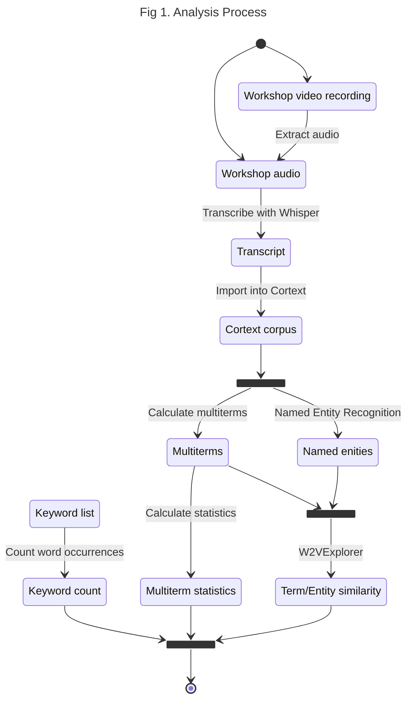

# VDBI JS 2025 Lexicometric Analysis <!-- omit in toc -->

## NEO/SoLocale Workshop <!-- omit in toc -->

## 1. Context

This report provides a lexicometric analysis of the NEO/SoLocale workshop held
on November 5th, 2025 during the [2025 PEPR VDBI Journées Scientifiques](https://pepr-vdbi.fr/evenements/journees-scientifiques-annuelles-villes-durables-batiments-innovants-2025).

The purpose of this analysis is to automatically identify the most relevant keywords
and entities noted during the workshop. Additionally, this report identifies the
known limitations of the proposed methodology and when compared to a manual analysis.

The NEO/SoLocale workshop was composed largely of group discussions and activities.
This report will focus on a the final synthesis activity, where 3 groups of
paricipants were asked to present the conclusions of their group work.
Other activities of the workshop, including the question sections, will
unfortunately not be analyzed due to insufficient quality of the recorded workshop
audio.

The report is structured as follows:

- [Section 2](#2-method) details the proposed methodology and steps for reproducibility
- [Section 3](#3-lexical-analysis-results) presents the results of the lexicometric
  analysis
- [Section 4](#4-method-review) reviews the limitations of the proposed methodology

## 2. Method

The diagram below illustrates the analysis process.

First, a video of the workshop activity was recorded live. The recordings for the
workshop are not currently made publicly available for participant and animator
privacy. The audio was then extracted and cut with [Microsoft Clipchamp](https://clipchamp.com/en/)
to be transcribed.

Transcription was done using [Whisper](https://github.com/openai/whisper)'s
`large-v2` model. This transcript was manually verified and corrected. An evaluation
of the transcription quality is provided in [section 4.1](#41-whisper-error-rate-measurement).

Next, the transcript was processed using the [Cortext](https://www.cortext.net/)
social science and humanities research infrastructure.
Cortext uses Natural Language Processing (NLP) and machine learning to extract keywords
and entities from a corpus. This analysis uses three main Cortext tasks:

1. **Named Entity Recognition (NER)** [[5.1]](#51-cortext-documentation-named-entity-recognition)
   to "identify and index persons, places, organizations, etc."
   The following metrics are provided for each extracted entity:
   - `frequency`: The number of times the entity appears in the workshop
   - `type`: The type of the entity (e.g. Person, Organization, Location)
2. **(Multi)Term extraction** [[5.2]](#52-cortext-documentation-multiterm-extraction)
   to identifiy terms used during the workshop. Including "not only simple terms
   but also multi-terms (called [n-grams](https://en.wikipedia.org/wiki/N-gram))."
   The following metrics are provided for each extracted term:
   - `C-value`: A measure of the frequency of a term
   - `Cooccurrence`: The number of times the term cooccurs with other terms
   - `Part of speech (POS)`: The part of speech of a term (e.g. Noun, Verb, Adjective)
3. **W2V Explorer** [[5.3]](#53-cortext-documentation-w2v-explorer) to "[learn]
   the word embedding of every word... in a corpus and [visualize] the position
   of words in a reduced 2 dimensional space. Words are also clustered according
   to their proximity."

<div class="note">

The following extracted terms have been filtered out (as they are too common):
_'être', 'est', 'étais', 'était', 'sont', 'avait', 'faire', 'fait', 'va'_

</div>

<div class="note">
  Cortext NER doesn't have as many entity types or configurations for french.
</div>

<div class="note">
  While Cortext NER doesn't have as many entity types or configurations for french.
</div>



The following parameters were used to configure the Cortext tasks as of 19/12/2025.

| Task                    | Parameter                | Value         |
| :---------------------- | ------------------------ | ------------- |
| Terms extraction        | Textual Fields           | text          |
| Terms extraction        | Minimum Frequency        | 2             |
| Terms extraction        | language                 | fr            |
| Terms extraction        | Monogramms are forbidden | no            |
| Terms extraction        | grammatical criterion    | all${tex`^*`} |
| Named Entity Recognizer | Textual Fields           | text          |
| Named Entity Recognizer | language                 | fr            |
| W2vexplorer             | Field                    | text          |

${tex`^*`} Rerun task once with each available value<!-- $ -->

<div class="note">Unmentioned parameters use their default settings</div>

## 3. Lexical Analysis Results

```js
import { downloadSVGButton } from "/components/utilities.js"
```

```sql id=extracted_terms
select
  *
from extracted_terms
where
  "Main form" != 'être' and
  "Main form" != 'est' and
  "Main form" != 'étais' and
  "Main form" != 'était' and
  "Main form" != 'sont' and
  "Main form" != 'avait' and
  "Main form" != 'faire' and
  "Main form" != 'fait' and
  "Main form" != 'va'
```

```sql id=entities
select * from entities
```

```js
// for debugging
// display("entities")
// display(Inputs.table(entities))
console.debug("extracted_terms", extracted_terms)
console.debug("entities", entities)
```

Between the extracted entities and terms, we can observe the following:

- There is little overlap between the extracted entities and terms
  - With the only exception being "PEPR", evoked in group 1
- There is no overlap between the extracted entities of each group discussion
- There is little overlap entity reuse within each group discussion (with the
  exception of the "PEPR" in group 1)

### 3.1. Extracted Entities

<div id="entities">
  ${resize((width) =>
    generateEntitiesPlot(entities, width)
  )}<!-- $ -->
  ${downloadSVGButton("#entities svg")}

</div>

```js
const entity_type_map = new Map([
  ["loc", "Location"],
  ["misc", "Miscellaneous"],
  ["org", "Organization"],
])

const generateEntitiesPlot = (data, width) =>
  Plot.auto(data, {
    x: (d) => Number(d.frequency),
    y: "entity",
    fx: "group",
    color: (d) => entity_type_map.get(d.type),
    mark: "bar",
  }).plot({
    width: width,
    y: { label: "Entity", grid: true },
    x: { label: "Frequency" },
    fx: { label: "Group" },
    marginLeft: 150,
    color: { legend: true },
  })
```

### 3.2. Extracted Terms

<div>${extractedTermsPosHtmlTemplate([...extracted_terms])}</div>

```js
const pos_header_map = new Map([
  ["noun", "Nouns"],
  ["verb", "Verbs"],
  ["adj", "Adjectives"],
])

const column_label_map = new Map([
  ["n", "Occurrences"],
  ["C-value", "C-value"],
  ["Gfidf", "gf.idf"],
  // ["Specificity chi2", "Specificity"],
  // ["Occurrences", "Occurrences"],
  ["Cooccurrences", "Co-occurrences"],
])

const generateExtractedTermsPlot = (data, title, x_column, x_column_label) =>
  resize((width) =>
    Plot.plot({
      x: {
        label: x_column_label,
        ticks: d3.max(data.map((d) => d[x_column])) === 1 ? 1 : undefined,
        // axis: "both",
        nice: true,
      },
      fx: { label: "Group" },
      color: { legend: true },
      symbol: { legend: true },
      title: title,
      width: width,
      marginLeft: 180,
      grid: true,
      marks: [
        Plot.frame(),
        Plot.barX(data, {
          x: (d) => Number(d[x_column]),
          y: "Main form",
          fx: "group",
          fill: (d) => pos_header_map.get(d.pos),
          sort: { y: "-x" },
        }),
      ],
    }),
  )

const extractedTermsPosHtmlTemplate = (data) =>
  html`${column_label_map
    .entries()
    .map(
      ([column, column_label]) =>
        html`<div id="terms-${column}-plot">
          ${generateExtractedTermsPlot(
            data,
            `Extracted terms by ${column_label}`,
            column,
            column_label,
          )}
          ${downloadSVGButton(`#terms-${column}-plot svg`)}
        </div>`,
    )}`
```

## 4. Method review

### 4.1. Whisper error rate measurement

The Whisper transcription accuracy was measured using the [Word Error Rate (WER)](https://en.wikipedia.org/wiki/Word_error_rate)

```tex
WER=\frac{S+D+I}{N}=\frac{S+D+I}{S+D+C}
```

Where

- $S$ is the number of substitutions,
- $D$ is the number of deletions,
- $I$ is the number of insertions,
- $N$ is the number of words in the reference (N=S+D+C),
- $C$ is the number of correct words

For this study words are separated by spaces (i.e., '_c'est_' is considered
a single word)

The following table shows the WER for each group presentation:

| Source text          | S   | D   | I   | N    | WER          |
| :------------------- | --- | --- | --- | :--- | :----------- |
| Group 1 presentation | 3   | 2   | 4   | 319  | 0.028213     |
| Group 2 presentation | 1   | 42  | 31  | 1000 | 0.074000     |
| Group 3 presentation | 29  | 204 | 88  | 907  | 0.353914     |
| **Total**            | 33  | 248 | 133 | 2226 | **0.185984** |

<div class="note">

It should be noted that a large majority of measured deletions are clustered
together. Surprisingly, Whisper's errors often materialize as several
repetitive, duplicate lines. These are easy to find and correct manually.

</div>

<div class="tip">

A [git diff](https://git-scm.com/docs/git-diff) is used to help identify the WER
manually. Notably, existing tools with known limitations could be used in the future:

- [Understanding and Calculating Word Error Rate (WER) in Automatic Speech Recognition using python](https://medium.com/@ramadhanimassawe14/understanding-and-calculating-word-error-rate-wer-in-automatic-speech-recognition-using-python-661f18b518a5)
- [WER-in-python](https://github.com/zszyellow/WER-in-python/tree/master);
  hypothesis and/or reference may need data cleaning depending on use-case

</div>

## 5. References

For more information, see the Cortext documentation for details on the methods
used, the parameters and the metrics provided, and scientific references.

### 5.1. [Cortext documentation: Named Entity Recognition](https://docs.cortext.net/named-entity-recognizer/)

### 5.2. [Cortext documentation: (Multi)Term extraction](https://docs.cortext.net/lexical-extraction/)

### 5.3. [Cortext documentation: W2V Explorer](https://docs.cortext.net/w2v-explorer/)
