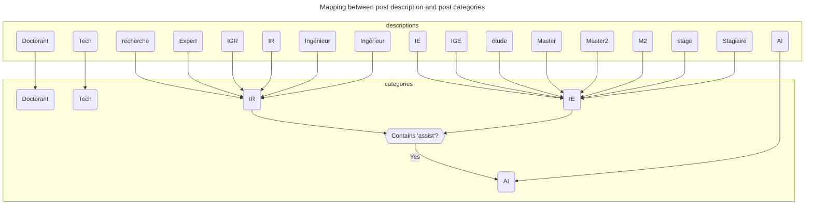

```js
const debug = false;
```

# Phase 1 Proposed Post Financing

Aggregated financing data by project for proposed personnel contract with requested financial assistance for non-civil servant roles. 

<div class="warning" label="Data visualization notice">
  Data visualizations are unverified and errors may exist. Regard these data visualizations as estimations and not a "ground truth". Note the following:
  <ul>
    <li>Civil servant positions are assumed to be CDIs.</li>
    <li>The employers of non-civil servant positions are assumed to be their partner institution.</li>
    <li>Some projects have listed the type of contract as the employer.</li>
    <li>Some post descriptions may be laboratory identifiers.</li>
    <li>Some post descriptions are missing.</li>
    <li>Some post descriptions are an aggregation of multiple posts with the same characteristics.</li>
  </ul>
</div>

Also the following mapping is made between post descriptions and post categories, i.e., if a description contains one of the following tokens, it will be categorized as follows:


```js
import {
  resolveProjectFinancingEntities,
} from "./components/financing.js";
import {
  sparkbar,
  countEntities,
  cropText,
} from "./components/utilities.js";
import {
  donutChart
} from "./components/pie-chart.js";
```

```js
const category_color_map = new Map([
  ['IR', d3.schemeCategory10[0]],
  ['Doctorant', d3.schemeCategory10[1]],
  ['IE', d3.schemeCategory10[2]],
  ['I', d3.schemeCategory10[3]],
  ['Tech', d3.schemeCategory10[4]],
])

function default_personnel_table_config(data, width) {
  return {
    rows: 30,
    width: {
      // description: 200,
      total_cost: 250,
    },
    maxWidth: width,
    columns: [
      // "project",
      "description",
      "type_contract",
      "type_post",
      "employer",
      "months",
      "cost",
      "assistance",
      "support",
      "total_cost",
    ],
    header: {
      "description": "Post description",
      "type_contract": "Contract type",
      "type_post": "Contract category",
      "employer": "Employer",
      "months": "Contract length (months)",
      "cost": "Unitary cost",
      "assistance": "Financial assistance requested",
      "support": "Support cost",
      "total_cost": "Total cost",
    },
    align: {
      total_cost: "left",
    },
    format: {
      cost: sparkbar(
        htl,
        d3.max(data, (d) => d.cost)
      ),
      assistance: sparkbar(
        htl,
        d3.max(data, (d) => d.assistance)
      ),
      support: sparkbar(
        htl,
        d3.max(data, (d) => d.support)
      ),
      total_cost: sparkbar(
        htl,
        d3.max(data, (d) => d.total_cost)
      ),
    }
  };
}

const default_partner_table_config = {
  header: {
    "complete_name": "Complete name",
    "name": "Name",
    "type": "Type",
    "siret": "SIRET",
  },
};

function default_x_plot_options(label, data, width, height) {
  return {
    width: width,
    height: height,
    marginTop: 50,
    marginLeft: 100,
    y: {
      label: label,
      tickRotate: 10,
      tickFormat: (d) => cropText(d, 25),
    },
    x: {
      grid: true,
      axis: "top",
      label: "Occurences",
    },
    color: {
      type: "linear",
      scheme: "Blues"
    },
    marks: [
      Plot.barX(data, {
        y: (d) => d[0],
        x: (d) => d[1],
        fill: (d) => d[1],
        stroke: "black",
        strokeOpacity: 0.1,
        // sort: {y: "y"},
        sort: {y: "-x"},
        tip: {
          format: {
            fill: false,
          },
          lineWidth: 25,
          textOverflow: "ellipsis-end"
        }
      }),
      Plot.barX(
        data, 
        Plot.pointerY({
          x: (d) => d[1],
          y: (d) => d[0],
          fill: "white",
          opacity: 0.5,
        }),
      ),
    ],
  }; 
};

function default_employer_plot_options(
    data,
    width,
    height = 500,
  ) {
  const max = d3.max(data.map((e) => e[1]));
  return {
    width: width,
    height: height,
    marginTop: 50,
    marginBottom: 75,
    x: {
      label: "Employer",
      tickRotate: 20,
      tickFormat: (d) => cropText(d, 25),
    },
    y: {
      label: "Occurences",
      grid: true,
    },
    color: {
      type: "linear",
      scheme: "Blues"
    },
    marks: [
      Plot.barY(data, {
        y: (d) => d[1],
        x: (d) => d[2],
        fill: (d) => d[1],
        stroke: "black",
        strokeOpacity: 0.5,
        // sort: {x: "-y"},
        sort: {x: "x"},
        channels: {Siret: (d) => d[0]},
        tip: {
          format: {
            fill: false,
          },
          lineWidth: 25,
          textOverflow: "ellipsis-end"
        }
      }),
      Plot.barY(
        data, 
        Plot.pointerX({
          x: (d) => d[2],
          y: (d) => d[1],
          fill: "white",
          opacity: 0.5,
        }),
      ),
    ],
  }; 
};

function default_pie_options(width, left_margin = 110) {
  return {
    width: width - left_margin,
    height: 500,
    keyMap: (d) => d[0],
    valueMap: (d) => d[1],
    colorMap: (d) => d[0],
    color: d3
      .scaleOrdinal(d3.schemeCategory10)
      .domain(category_color_map.keys())
      .range(category_color_map.values())
      .unknown("grey"),
    legendLeftMargin: left_margin,
  }
}
```

## All Financed Projects

```js
const all_data = {
  personnel: d3.merge([
    inteGREEN_data.personnel,
    VILLEGARDEN_data.personnel,
    NEO_data.personnel,
    RESILIENCE_data.personnel,
    TRACES_data.personnel,
    URBHEALTH_data.personnel,
    VFpp_data.personnel,
    WHAOU_data.personnel,
  ]),
  partners: d3.groups(
    d3.merge([
      inteGREEN_data.partners,
      VILLEGARDEN_data.partners,
      NEO_data.partners,
      RESILIENCE_data.partners,
      TRACES_data.partners,
      URBHEALTH_data.partners,
      VFpp_data.partners,
      WHAOU_data.partners,
    ]),
    (d) => d.siret
  ).map((D) => D[1][0]),
}

// const all_description_count = d3.rollups(
//   all_data.personnel,
//   (D) => D.length,
//   (d) => d.description,
// ).filter((d) => d[0]);

// const all_type_contract_count = d3.rollups(
//   all_data.personnel,
//   (D) => D.length,
//   (d) => d.type_contract,
// ).filter((d) => d[0]);

const all_type_post_count = d3.rollups(
  all_data.personnel,
  (D) => D.length,
  (d) => d.type_post,
).filter((d) => d[0]);

// const all_employer_count_by_name = d3.rollups(
//   all_data.personnel,
//   (D) => D.length,
//   (d) => d.employer.toLocaleUpperCase(),
// ).filter((d) => d[0]);

const all_employer_count_by_siret = d3.rollups(
  all_data.personnel,
  (D) => [D.length, D[0].employer.toLocaleUpperCase()],
  (d) => d.employer_id,
)
  .filter((d) => d[0])
  .map((d) => d3.merge([[d[0]], d[1]]));

const all_employer_count_by_siret_by_name = d3.rollups(
  all_employer_count_by_siret,
  (D) => d3.sum(D, (d) => d[1]),
  (d) => d[2],
)

if (debug) {
    display("all_data");
    display(all_data);
    // display("all_description_count");
    // display(all_description_count);
    // display("all_type_contract_count");
    // display(all_type_contract_count);
    display("all_type_post_count");
    display(all_type_post_count);
    display("all_employer_count_by_siret");
    display(all_employer_count_by_siret);
    display("all_employer_count_by_siret_by_name");
    display(all_employer_count_by_siret_by_name);
    display("all_employer_count_by_siret");
    display(all_employer_count_by_siret);
}
```

<div class="grid grid-cols-2">
  <div class="card">
    <h2>All proposed posts by category</h2>
    <div style="overflow: auto;">
      ${
        resize((width) => donutChart(
          all_type_post_count,
          default_pie_options(width)
        ))//$
      }
    </div>
  </div>
  <div class="card">
    <h2>All proposed posts by category</h2>
    <div style="overflow: auto;">
      ${
        resize((width) => donutChart(
          [...all_type_post_count.filter((d) => d[0] != "other/unknown")],
          default_pie_options(width)
        ))//$
      }
    </div>
  </div>
  <div class="card grid-colspan-2">
  <h2>Proposed posts by employer</h2>
    <div>
      ${
        resize((width) => Plot.plot(
          {
            width: width,
            height: 500,
            marginTop: 50,
            marginBottom: 75,
            x: {
              label: "Employer",
              tickRotate: 20,
              tickFormat: (d) => cropText(d, 25),
            },
            y: {
              label: "Occurences",
              grid: true,
            },
            color: {
              type: "linear",
              scheme: "Blues"
            },
            marks: [
              Plot.barY(all_employer_count_by_siret_by_name, {
                y: (d) => d[1],
                x: (d) => d[0],
                fill: (d) => d[1],
                stroke: "black",
                strokeOpacity: 0.5,
                // sort: {x: "-y"},
                sort: {x: "x"},
                tip: {
                  format: {
                    fill: false,
                  },
                  lineWidth: 25,
                  textOverflow: "ellipsis-end"
                }
              }),
              Plot.barY(
                all_employer_count_by_siret_by_name, 
                Plot.pointerX({
                  x: (d) => d[0],
                  y: (d) => d[1],
                  fill: "white",
                  opacity: 0.5,
                }),
              ),
            ],
          }
        ))//$
      }
    </div>
  </div>
  <div class="card grid-colspan-2">
  <h2>Proposed posts by employer (by distinct SIRET)</h2>
    <div>
      ${
        resize((width) => Plot.plot(
          {
            width: width,
            height: 500,
            marginTop: 50,
            marginBottom: 75,
            x: {
              label: "Employer",
              tickRotate: 20,
              tickFormat: (d) => cropText(d, 25),
            },
            y: {
              label: "Occurences",
              grid: true,
            },
            color: {
              type: "linear",
              scheme: "Blues"
            },
            marks: [
              Plot.barY(all_employer_count_by_siret, {
                y: (d) => d[1],
                x: (d) => d[2],
                fill: (d) => d[1],
                stroke: "black",
                strokeOpacity: 0.5,
                // sort: {x: "-y"},
                sort: {x: "x"},
                channels: {
                  Siret: (d) => d[0],
                  Occurences: (d) => d[1],
                  Employer: (d) => d[2],
                },
                tip: {
                  format: {
                    fill: false,
                  },
                  lineWidth: 25,
                  textOverflow: "ellipsis-end"
                }
              }),
              Plot.barY(
                all_employer_count_by_siret, 
                Plot.pointerX({
                  x: (d) => d[2],
                  y: (d) => d[1],
                  fill: "white",
                  opacity: 0.5,
                }),
              ),
              Plot.tip(
                [`CNRS SIRETs:
18,008,901,300,155,
18,008,901,307,812,
18,008,901,306,657,
18,008,901,300,668,
18,008,901,300,635`
                ],
                {
                  x: () => "CNRS" ,
                  y: 26,
                  dy: 3,
                  anchor: "left"
                },
              ),
              Plot.tip(
                [`CEREMA SIRETs:
13,001,831,000,222,
13,001,831,000,180,
13,001,831,000,016`
                ],
                {
                  x: () => "CEREMA" ,
                  y: 10,
                  dy: 3,
                  anchor: "bottom-right"
                },
              ),
              Plot.tip(
                [`INRAE SIRETs:
18,007,003,901,803,
18,007,003,902,678`
                ],
                {
                  x: () => "INRAE" ,
                  y: 7,
                  dy: 3,
                  anchor: "bottom-right"
                },
              ),
              Plot.tip(
                [`INSERM SIRETs:
18,003,604,802,391,
18,003,604,802,409`
                ],
                {
                  x: () => "INSERM" ,
                  y: 8,
                  dy: 3,
                  anchor: "bottom"
                },
              ),
              Plot.tip(
                [`INSTITUT AGRO SIRETs:
13,002,622,000,021,
13,002,622,200,021`
                ],
                {
                  x: () => "L'INSTITUT AGRO" ,
                  y: 10,
                  dy: 3,
                  anchor: "bottom-left"
                },
              ),
            ],
          }
        ))//$
      }
    </div>
  </div>
</div>
<div class="grid">
  <!-- <div class="card">
    <h2></h2>
    <span class="big">${financed_project_count.toLocaleString("en-US")}</span>
  </div> -->
  <div class="card grid-rowspan-2">
    <h2>Identified project personnel</h2>
    <div>
      ${
        resize((width) => Inputs.table(
          all_data.personnel,
          {
            ...default_personnel_table_config(all_data.personnel, width),
            ...{
              columns: [
                "project",
                "description",
                "type_contract",
                "type_post",
                "employer",
                "months",
                "cost",
                "assistance",
                "support",
                "total_cost",
              ],
            },
          }
        ))//$
      }
    </div>
  </div>
  <div class="card">
    <h2>Identified project partners</h2>
    <div>
      ${
        resize((width) => Inputs.table(
          all_data.partners,
          default_partner_table_config
        ))//$
      }
    </div>
  </div>
</div>

## inteGREEN

```js
const inteGREEN_workbook = FileAttachment(
  "./data/private/inteGREEN_France2030_aap_pepr_vdbi_2023_AnnexeFinanciere.xlsx"
).xlsx();
```

```js
const inteGREEN_data = resolveProjectFinancingEntities(inteGREEN_workbook, 'inteGREEN');

const inteGREEN_type_post_count = d3.rollups(
  inteGREEN_data.personnel,
  (D) => D.length,
  (d) => d.type_post,
).filter((d) => d[0]);

const inteGREEN_employer_count = d3.rollups(
  inteGREEN_data.personnel,
  (D) => [D.length, D[0].employer.toLocaleUpperCase()],
  (d) => d.employer_id,
)
  .filter((d) => d[0])
  .map((d) => d3.merge([[d[0]], d[1]]));

if (debug) {
  display(inteGREEN_data);
}
```

<div class="grid grid-cols-2">
  <div class="card">
    <h2>All proposed posts by category</h2>
    <div style="overflow: auto;">
      ${
        resize((width) => donutChart(
          inteGREEN_type_post_count,
          default_pie_options(width)
        ))//$
      }
    </div>
  </div>
  <div class="card">
    <h2>All proposed posts by category</h2>
    <div style="overflow: auto;">
      ${
        resize((width) => donutChart(
          [...inteGREEN_type_post_count.filter((d) => d[0] != "other/unknown")],
          default_pie_options(width)
        ))//$
      }
    </div>
  </div>
<div class="card grid-colspan-1">
  <h2>Proposed posts by employer</h2>
    <div>
      ${
        resize((width) => Plot.plot(
          default_employer_plot_options(inteGREEN_employer_count, width)
        ))//$
      }
    </div>
  </div>
</div>
<div class="grid grid-cols-2">
  <!-- <div class="card">
    <h2></h2>
    <span class="big">${financed_project_count.toLocaleString("en-US")}</span>
  </div> -->
  <div class="card grid-colspan-2 grid-rowspan-2">
    <h2>Identified project personnel</h2>
    <div>
      ${
        resize((width) => Inputs.table(
          inteGREEN_data.personnel,
          default_personnel_table_config(inteGREEN_data.personnel, width)
        ))//$
      }
    </div>
  </div>
  <div class="card grid-colspan-2">
    <h2>Identified project partners</h2>
    <div>
      ${
        resize((width) => Inputs.table(
          inteGREEN_data.partners,
          {
            ...default_partner_table_config,
            ...{
              width: width,
            }
          }
        ))//$
      }
    </div>
  </div>
</div>

## VILLEGARDEN

```js
const VILLEGARDEN_workbook = FileAttachment(
  "./data/private/France2030_aap_pepr_vdbi_2023_AnnexeFinanciere_VILLEGARDEN_07_02_2024.xlsx"
).xlsx();
```

```js
const VILLEGARDEN_data = resolveProjectFinancingEntities(VILLEGARDEN_workbook, 'VILLEGARDEN');

const VILLEGARDEN_type_post_count = d3.rollups(
  VILLEGARDEN_data.personnel,
  (D) => D.length,
  (d) => d.type_post,
).filter((d) => d[0]);

const VILLEGARDEN_employer_count = d3.rollups(
  VILLEGARDEN_data.personnel,
  (D) => [D.length, D[0].employer.toLocaleUpperCase()],
  (d) => d.employer_id,
)
  .filter((d) => d[0])
  .map((d) => d3.merge([[d[0]], d[1]]));

if (debug) {
  display(VILLEGARDEN_data);
}
```

<div class="grid grid-cols-2">
  <div class="card">
    <h2>All proposed posts by category</h2>
    <div style="overflow: auto;">
      ${
        resize((width) => donutChart(
          VILLEGARDEN_type_post_count,
          default_pie_options(width)
        ))//$
      }
    </div>
  </div>
  <div class="card">
    <h2>All proposed posts by category</h2>
    <div style="overflow: auto;">
      ${
        resize((width) => donutChart(
          [...VILLEGARDEN_type_post_count.filter((d) => d[0] != "other/unknown")],
          default_pie_options(width)
        ))//$
      }
    </div>
  </div>
<div class="card grid-colspan-1">
  <h2>Proposed posts by employer</h2>
    <div>
      ${
        resize((width) => Plot.plot(
          default_employer_plot_options(VILLEGARDEN_employer_count, width)
        ))//$
      }
    </div>
  </div>
</div>
<div class="grid grid-cols-2">
  <!-- <div class="card">
    <h2></h2>
    <span class="big">${financed_project_count.toLocaleString("en-US")}</span>
  </div> -->
  <div class="card grid-colspan-2 grid-rowspan-2">
    <h2>Identified project personnel</h2>
    <div>
      ${
        resize((width) => Inputs.table(
          VILLEGARDEN_data.personnel,
          default_personnel_table_config(VILLEGARDEN_data.personnel, width)
        ))//$
      }
    </div>
  </div>
  <div class="card grid-colspan-2">
    <h2>Identified project partners</h2>
    <div>
      ${
        resize((width) => Inputs.table(
          VILLEGARDEN_data.partners,
          {
            ...default_partner_table_config,
            ...{
              width: width,
            }
          }
        ))//$
      }
    </div>
  </div>
</div>

## NEO

```js
const NEO_workbook = FileAttachment(
  "./data/private/NEO_AnnexeFinanciere_totale_finale.xlsx"
).xlsx();
```

```js
const NEO_data = resolveProjectFinancingEntities(NEO_workbook, 'NEO');

const NEO_type_post_count = d3.rollups(
  NEO_data.personnel,
  (D) => D.length,
  (d) => d.type_post,
).filter((d) => d[0]);

const NEO_employer_count = d3.rollups(
  NEO_data.personnel,
  (D) => [D.length, D[0].employer.toLocaleUpperCase()],
  (d) => d.employer_id,
)
  .filter((d) => d[0])
  .map((d) => d3.merge([[d[0]], d[1]]));

if (debug) {
  display(NEO_data);
}
```

<div class="grid grid-cols-2">
  <div class="card">
    <h2>All proposed posts by category</h2>
    <div style="overflow: auto;">
      ${
        resize((width) => donutChart(
          NEO_type_post_count,
          default_pie_options(width)
        ))//$
      }
    </div>
  </div>
  <div class="card">
    <h2>All proposed posts by category</h2>
    <div style="overflow: auto;">
      ${
        resize((width) => donutChart(
          [...NEO_type_post_count.filter((d) => d[0] != "other/unknown")],
          default_pie_options(width)
        ))//$
      }
    </div>
  </div>
<div class="card grid-colspan-1">
  <h2>Proposed posts by employer</h2>
    <div>
      ${
        resize((width) => Plot.plot(
          default_employer_plot_options(NEO_employer_count, width)
        ))//$
      }
    </div>
  </div>
</div>
<div class="grid grid-cols-2">
  <!-- <div class="card">
    <h2></h2>
    <span class="big">${financed_project_count.toLocaleString("en-US")}</span>
  </div> -->
  <div class="card grid-colspan-2 grid-rowspan-2">
    <h2>Identified project personnel</h2>
    <div>
      ${
        resize((width) => Inputs.table(
          NEO_data.personnel,
          default_personnel_table_config(NEO_data.personnel, width)
        ))//$
      }
    </div>
  </div>
  <div class="card grid-colspan-2">
    <h2>Identified project partners</h2>
    <div>
      ${
        resize((width) => Inputs.table(
          NEO_data.partners,
          {
            ...default_partner_table_config,
            ...{
              width: width,
            }
          }
        ))//$
      }
    </div>
  </div>
</div>

## RESILIENCE

```js
const RESILIENCE_workbook = FileAttachment(
  "./data/private/PEPR_RESILIENCE_07022024.xlsx"
).xlsx();
```

```js
const RESILIENCE_data = resolveProjectFinancingEntities(RESILIENCE_workbook, 'RESILIENCE');

const RESILIENCE_type_post_count = d3.rollups(
  RESILIENCE_data.personnel,
  (D) => D.length,
  (d) => d.type_post,
).filter((d) => d[0]);

const RESILIENCE_employer_count = d3.rollups(
  RESILIENCE_data.personnel,
  (D) => [D.length, D[0].employer.toLocaleUpperCase()],
  (d) => d.employer_id,
)
  .filter((d) => d[0])
  .map((d) => d3.merge([[d[0]], d[1]]));

if (debug) {
  display(RESILIENCE_data);
}
```

<div class="grid grid-cols-2">
  <div class="card">
    <h2>All proposed posts by category</h2>
    <div style="overflow: auto;">
      ${
        resize((width) => donutChart(
          RESILIENCE_type_post_count,
          default_pie_options(width)
        ))//$
      }
    </div>
  </div>
  <div class="card">
    <h2>All proposed posts by category</h2>
    <div style="overflow: auto;">
      ${
        resize((width) => donutChart(
          [...RESILIENCE_type_post_count.filter((d) => d[0] != "other/unknown")],
          default_pie_options(width)
        ))//$
      }
    </div>
  </div>
<div class="card grid-colspan-1">
  <h2>Proposed posts by employer</h2>
    <div>
      ${
        resize((width) => Plot.plot(
          default_employer_plot_options(RESILIENCE_employer_count, width)
        ))//$
      }
    </div>
  </div>
</div>
<div class="grid grid-cols-2">
  <!-- <div class="card">
    <h2></h2>
    <span class="big">${financed_project_count.toLocaleString("en-US")}</span>
  </div> -->
  <div class="card grid-colspan-2 grid-rowspan-2">
    <h2>Identified project personnel</h2>
    <div>
      ${
        resize((width) => Inputs.table(
          RESILIENCE_data.personnel,
          default_personnel_table_config(RESILIENCE_data.personnel, width)
        ))//$
      }
    </div>
  </div>
  <div class="card grid-colspan-2">
    <h2>Identified project partners</h2>
    <div>
      ${
        resize((width) => Inputs.table(
          RESILIENCE_data.partners,
          {
            ...default_partner_table_config,
            ...{
              width: width,
            }
          }
        ))//$
      }
    </div>
  </div>
</div>

## TRACES

```js
const TRACES_workbook = FileAttachment(
  "./data/private/France2030_aap_pepr_vdbi_2023_AnnexeFinanciere_TRACES.xlsx"
).xlsx();
```

```js
const TRACES_data = resolveProjectFinancingEntities(TRACES_workbook, 'TRACES');

const TRACES_type_post_count = d3.rollups(
  TRACES_data.personnel,
  (D) => D.length,
  (d) => d.type_post,
).filter((d) => d[0]);

const TRACES_employer_count = d3.rollups(
  TRACES_data.personnel,
  (D) => [D.length, D[0].employer.toLocaleUpperCase()],
  (d) => d.employer_id,
)
  .filter((d) => d[0])
  .map((d) => d3.merge([[d[0]], d[1]]));

if (debug) {
  display(TRACES_data);
}
```

<div class="grid grid-cols-2">
  <div class="card">
    <h2>All proposed posts by category</h2>
    <div style="overflow: auto;">
      ${
        resize((width) => donutChart(
          TRACES_type_post_count,
          default_pie_options(width)
        ))//$
      }
    </div>
  </div>
  <div class="card">
    <h2>All proposed posts by category</h2>
    <div style="overflow: auto;">
      ${
        resize((width) => donutChart(
          [...TRACES_type_post_count.filter((d) => d[0] != "other/unknown")],
          default_pie_options(width)
        ))//$
      }
    </div>
  </div>
<div class="card grid-colspan-1">
  <h2>Proposed posts by employer</h2>
    <div>
      ${
        resize((width) => Plot.plot(
          default_employer_plot_options(TRACES_employer_count, width)
        ))//$
      }
    </div>
  </div>
</div>
<div class="grid grid-cols-2">
  <!-- <div class="card">
    <h2></h2>
    <span class="big">${financed_project_count.toLocaleString("en-US")}</span>
  </div> -->
  <div class="card grid-colspan-2 grid-rowspan-2">
    <h2>Identified project personnel</h2>
    <div>
      ${
        resize((width) => Inputs.table(
          TRACES_data.personnel,
          default_personnel_table_config(TRACES_data.personnel, width)
        ))//$
      }
    </div>
  </div>
  <div class="card grid-colspan-2">
    <h2>Identified project partners</h2>
    <div>
      ${
        resize((width) => Inputs.table(
          TRACES_data.partners,
          {
            ...default_partner_table_config,
            ...{
              width: width,
            }
          }
        ))//$
      }
    </div>
  </div>
</div>

## URBHEALTH

```js
const URBHEALTH_workbook = FileAttachment(
  "./data/private/France2030_aap_pepr_vdbi_2023_AnnexeFinanciere_URBHEALTH_2024_02_05.xlsx"
).xlsx();
```

```js
const URBHEALTH_data = resolveProjectFinancingEntities(URBHEALTH_workbook, 'URBHEALTH');

const URBHEALTH_type_post_count = d3.rollups(
  URBHEALTH_data.personnel,
  (D) => D.length,
  (d) => d.type_post,
).filter((d) => d[0]);

const URBHEALTH_employer_count = d3.rollups(
  URBHEALTH_data.personnel,
  (D) => [D.length, D[0].employer.toLocaleUpperCase()],
  (d) => d.employer_id,
)
  .filter((d) => d[0])
  .map((d) => d3.merge([[d[0]], d[1]]));

if (debug) {
  display(URBHEALTH_data);
}
```

<div class="grid grid-cols-2">
  <div class="card">
    <h2>All proposed posts by category</h2>
    <div style="overflow: auto;">
      ${
        resize((width) => donutChart(
          URBHEALTH_type_post_count,
          default_pie_options(width)
        ))//$
      }
    </div>
  </div>
  <div class="card">
    <h2>All proposed posts by category</h2>
    <div style="overflow: auto;">
      ${
        resize((width) => donutChart(
          [...URBHEALTH_type_post_count.filter((d) => d[0] != "other/unknown")],
          default_pie_options(width)
        ))//$
      }
    </div>
  </div>
<div class="card grid-colspan-1">
  <h2>Proposed posts by employer</h2>
    <div>
      ${
        resize((width) => Plot.plot(
          default_employer_plot_options(URBHEALTH_employer_count, width)
        ))//$
      }
    </div>
  </div>
</div>
<div class="grid grid-cols-2">
  <!-- <div class="card">
    <h2></h2>
    <span class="big">${financed_project_count.toLocaleString("en-US")}</span>
  </div> -->
  <div class="card grid-colspan-2 grid-rowspan-2">
    <h2>Identified project personnel</h2>
    <div>
      ${
        resize((width) => Inputs.table(
          URBHEALTH_data.personnel,
          default_personnel_table_config(URBHEALTH_data.personnel, width)
        ))//$
      }
    </div>
  </div>
  <div class="card grid-colspan-2">
    <h2>Identified project partners</h2>
    <div>
      ${
        resize((width) => Inputs.table(
          URBHEALTH_data.partners,
          {
            ...default_partner_table_config,
            ...{
              width: width,
            }
          }
        ))//$
      }
    </div>
  </div>
</div>

## VF++

```js
const VFpp_workbook = FileAttachment(
  "./data/private/VF2PLUS_France2030_aap_pepr_vdbi_2023_AnnexeFinanciere_global.xlsx"
).xlsx();
```

```js
const VFpp_data = resolveProjectFinancingEntities(VFpp_workbook, 'VF++');

const VFpp_type_post_count = d3.rollups(
  VFpp_data.personnel,
  (D) => D.length,
  (d) => d.type_post,
).filter((d) => d[0]);

const VFpp_employer_count = d3.rollups(
  VFpp_data.personnel,
  (D) => [D.length, D[0].employer.toLocaleUpperCase()],
  (d) => d.employer_id,
)
  .filter((d) => d[0])
  .map((d) => d3.merge([[d[0]], d[1]]));

if (debug) {
  display(VFpp_data);
}
```

<div class="grid grid-cols-2">
  <div class="card">
    <h2>All proposed posts by category</h2>
    <div style="overflow: auto;">
      ${
        resize((width) => donutChart(
          VFpp_type_post_count,
          default_pie_options(width)
        ))//$
      }
    </div>
  </div>
  <div class="card">
    <h2>All proposed posts by category</h2>
    <div style="overflow: auto;">
      ${
        resize((width) => donutChart(
          [...VFpp_type_post_count.filter((d) => d[0] != "other/unknown")],
          default_pie_options(width)
        ))//$
      }
    </div>
  </div>
<div class="card grid-colspan-1">
  <h2>Proposed posts by employer</h2>
    <div>
      ${
        resize((width) => Plot.plot(
          default_employer_plot_options(VFpp_employer_count, width)
        ))//$
      }
    </div>
  </div>
</div>
<div class="grid grid-cols-2">
  <!-- <div class="card">
    <h2></h2>
    <span class="big">${financed_project_count.toLocaleString("en-US")}</span>
  </div> -->
  <div class="card grid-colspan-2 grid-rowspan-2">
    <h2>Identified project personnel</h2>
    <div>
      ${
        resize((width) => Inputs.table(
          VFpp_data.personnel,
          default_personnel_table_config(VFpp_data.personnel, width)
        ))//$
      }
    </div>
  </div>
  <div class="card grid-colspan-2">
    <h2>Identified project partners</h2>
    <div>
      ${
        resize((width) => Inputs.table(
          VFpp_data.partners,
          {
            ...default_partner_table_config,
            ...{
              width: width,
            }
          }
        ))//$
      }
    </div>
  </div>
</div>

## WHAOU

```js
const WHAOU_workbook = FileAttachment(
  "./data/private/WHAOU_PEPR_VDBI_AnnexeFinanciere.xlsx"
).xlsx();
```

```js
const WHAOU_data = resolveProjectFinancingEntities(WHAOU_workbook, 'WHAOU');

const WHAOU_type_post_count = d3.rollups(
  WHAOU_data.personnel,
  (D) => D.length,
  (d) => d.type_post,
).filter((d) => d[0]);

const WHAOU_employer_count = d3.rollups(
  WHAOU_data.personnel,
  (D) => [D.length, D[0].employer.toLocaleUpperCase()],
  (d) => d.employer_id,
)
  .filter((d) => d[0])
  .map((d) => d3.merge([[d[0]], d[1]]));

if (debug) {
  display(WHAOU_data);
}
```

<div class="grid grid-cols-2">
  <div class="card">
    <h2>All proposed posts by category</h2>
    <div style="overflow: auto;">
      ${
        resize((width) => donutChart(
          WHAOU_type_post_count,
          default_pie_options(width)
        ))//$
      }
    </div>
  </div>
  <div class="card">
    <h2>All proposed posts by category</h2>
    <div style="overflow: auto;">
      ${
        resize((width) => donutChart(
          [...WHAOU_type_post_count.filter((d) => d[0] != "other/unknown")],
          default_pie_options(width)
        ))//$
      }
    </div>
  </div>
<div class="card grid-colspan-1">
  <h2>Proposed posts by employer</h2>
    <div>
      ${
        resize((width) => Plot.plot(
          default_employer_plot_options(WHAOU_employer_count, width)
        ))//$
      }
    </div>
  </div>
</div>
<div class="grid grid-cols-2">
  <!-- <div class="card">
    <h2></h2>
    <span class="big">${financed_project_count.toLocaleString("en-US")}</span>
  </div> -->
  <div class="card grid-colspan-2 grid-rowspan-2">
    <h2>Identified project personnel</h2>
    <div>
      ${
        resize((width) => Inputs.table(
          WHAOU_data.personnel,
          default_personnel_table_config(WHAOU_data.personnel, width)
        ))//$
      }
    </div>
  </div>
  <div class="card grid-colspan-2">
    <h2>Identified project partners</h2>
    <div>
      ${
        resize((width) => Inputs.table(
          WHAOU_data.partners,
          {
            ...default_partner_table_config,
            ...{
              width: width,
            }
          }
        ))//$
      }
    </div>
  </div>
</div>
