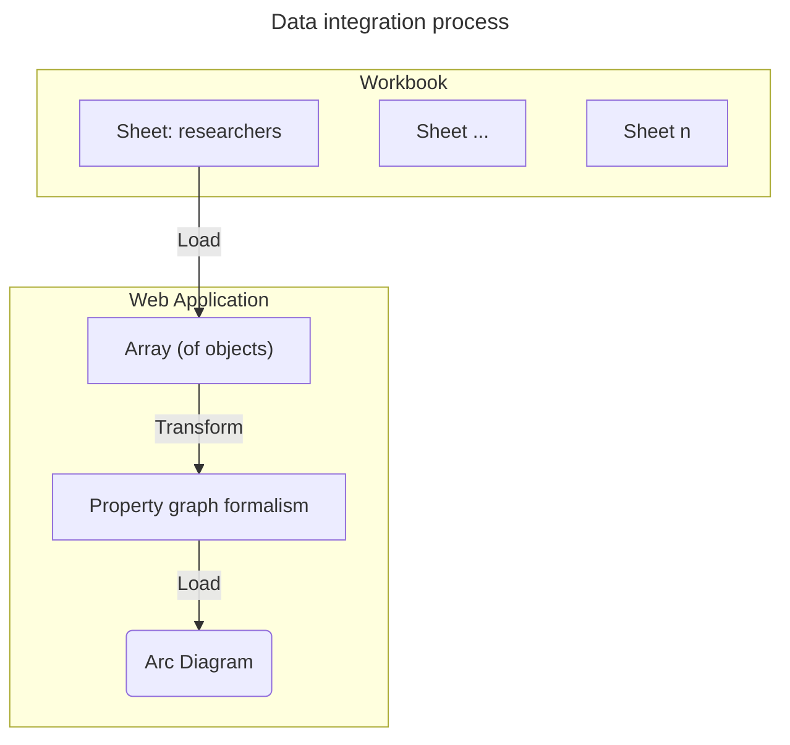

# Visualize Workbook data using Graphs

Visualize the researcher sheet from the phase 2 Excel document using [arc diagrams](https://observablehq.com/@d3/arc-diagram).

## Data integration

Take a tabluar data structure and transform the table into a graph formalism.
To do this, we need to set up a component to transform the data.



```js
import {
  countEntities,
  cropText
} from "./components/utilities.js";
import {
  extractPhase2Workbook,
} from "./components/phase2-dashboard.js";
import {
  arcDiagramVertical,
  mapTableToPropertyGraphLinks,
  sortNodes
} from "./components/graph.js";

const workbook = FileAttachment(
  "./data/250120 PEPR_VBDI_analyse modifiée JYT_financed_redacted.xlsx"
).xlsx();
```

### Input data

Using the transformation proposed in the imported components we can extract the tabular workbook data and resolve known entities.
For this experiment we will use the researcher table.

<div class="tip">
  Large datasets can be hard to visualize with arc diagrams which tend to list nodes linearly in a single dimension.
</div>

To reduce the amount of information displayed we apply a filter to retain only researchers from the `VF++` project.

```js echo
const anonymize = false;
const anonymizeDict = new Map();
const researcher_data = extractPhase2Workbook(workbook, false)
  .researchers.filter((d) => d.project.includes("VF++"));
```

```js
display(researcher_data);
```

## Transformation to Property Graph

Map the elements of an array of objects (a table) to a graph with the following rules:
- Each object (row) is treated as a node with the properties (columns) of the object
- A link is created between nodes that share the same primitive property values
- A link is created between nodes with Array properties that share the same elements
- A link is **NOT** created between nodes with properties that are JS `Object`s *(for now)*
- Links contain:
  - a `source` property
  - a `target` property
  - a `label` property denoting the property key
  - a `value` property denoting the property value

<div class="warning">Duplicate rows are treated as duplicate nodes</div>
<div class="tip">
  Generating links can be quite costly.
  A whitelist can be passed to the <code class="language-js">mapTableToPropertyGraphLinks()</code> function to ignore unnecessary properties.
</div>

The properties are selected for generating links:
- `fullname`
- `position`

To reduce the size of the visualized data we filter on researcher positions as well for this test.
```js echo
const researcher_links = mapTableToPropertyGraphLinks(researcher_data, {
    id_key: "fullname",
    columns: [
      "fullname",
      "position",
    ]
  }
).filter((d) => d.label == "position");
```

```js
display(researcher_links);
```

## Arc Diagram 

An arc diagram is generated from an adaptation of the canonical [arc diagram example](https://observablehq.com/@d3/arc-diagram).
A legend is added as well to distinguish arc values.

```js echo
display(
  arcDiagramVertical(
    {
      nodes: researcher_data,
      links: researcher_links
    }, {
      width: 600,
      marginLeft: 150,
      marginRight: 200,
      keyMap: (d) => d.fullname,
      valueMap: (d) => d.position
    }
  )
);
```

## Sortable Arc Diagram 

The order of nodes can be sorted on an arc diagram.
Currently 4 sort modalities are proposed:
1. `input`: No sort
2. `by name`: alphabetically, based on node id
3. `by property`: based on a node property
4. `by degree`: based on the degree of arcs per node

The node sort order is produced by `sortNodes()`
```js echo
const arc_sort_map = sortNodes(
  {
    nodes: researcher_data,
    links: researcher_links
  },
  {
    keyMap: (d) => d.fullname,
    valueMap: (d) => d.position
  }
);
```

```js
display(arc_sort_map);
```

```js echo
const sort_select_input = Inputs.select(
  arc_sort_map,
  {
    label: "Sort",
    sort: true,
    unique: true,
  }
);

const sortable_arc_diagram = arcDiagramVertical(
  {
    nodes: researcher_data,
    links: researcher_links
  }, {
    width: 700,
    marginLeft: 230,
    marginRight: 200,
    keyMap: (d) => d.fullname,
    valueMap: (d) => d.position,
  }
);

// This doesn't work with Observable.Generator (or at least we don't understand how)
// without regenerating the svg and missing the update() function.
sort_select_input.addEventListener("input", () => sortable_arc_diagram.update(sort_select_input.value));
sortable_arc_diagram.update(sort_select_input.value);
```

```js
display(sort_select_input);
display(sortable_arc_diagram);
```
