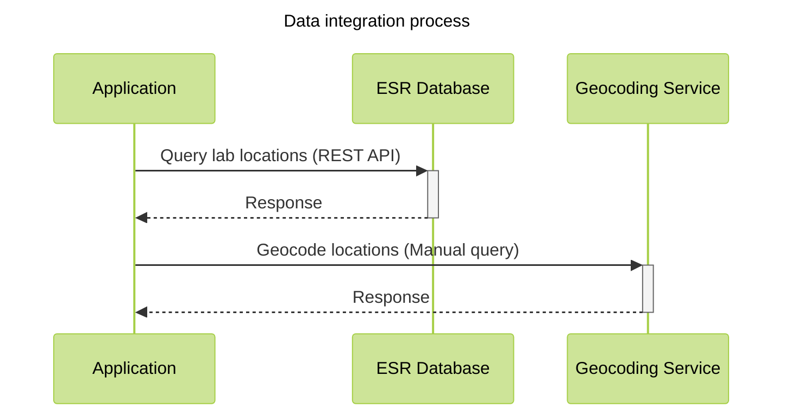

# Import and visualize Geospatial ESR Open Data

Import and visualize data from the [ESR Open Data](data.enseignementsup-recherche.gouv.fr) using their [API](https://data.enseignementsup-recherche.gouv.fr/api/explore/v2.1/console)
Also test the Observable Frameworks data loader library.

## Data integration



Interesting datasets:
- `fr-esr-structures-recherche-publiques-actives` (tests will be effectuated on this dataset)
- `fr-esr-ecoles_doctorales_annuaire`
- `fr-esr-atlas_regional-effectifs-d-etudiants-inscrits-detail_etablissements`
- `fr-esr-referentiel-geographique`

French geocoding service:
- [Géocoder un fichier CSV](https://adresse.data.gouv.fr/csv)

<div class="caution">Since 2025 the proposed <a href="https://adresse.data.gouv.fr/csv">french geocoding service</a> has changed API! The resulting output fields use the following structure (as of 22/01/2025):
  <ul>
    <li>latitude</li>
    <li>longitude</li>
    <li>result_score</li>
    <li>result_score_next</li>
    <li>result_label</li>
    <li>result_type</li>
    <li>result_id</li>
    <li>result_housenumber</li>
    <li>result_name</li>
    <li>result_street</li>
    <li>result_postcode</li>
    <li>result_city</li>
    <li>result_context</li>
    <li>result_citycode</li>
    <li>result_oldcitycode</li>
    <li>result_oldcity</li>
    <li>result_district</li>
    <li>result_status</li>
  </ul>
</div>

# Visualization results

```js
// const research_structures_json = FileAttachment("./data/fr-esr-structures-recherche-publiques-actives.json").json();
// const research_structures_csv = FileAttachment("./data/fr-esr-structures-recherche-publiques-actives.csv").csv();
```

```js
// display("research_structures json and csv");
// display(research_structures_json);
// display(research_structures_csv);
// display(research_structures_ttl);
```

```js echo
const geocoded_research_structures = FileAttachment("./data/fr-esr-structures-recherche-publiques-actives.geocoded.csv").csv();
const world = FileAttachment("./data/world.json").json();
```

```js echo
const geocoded_research_structures_by_city = d3.groups(geocoded_research_structures, d => d.commune);
const land = topojson.feature(world, world.objects.land);
const borders = topojson.mesh(world, world.objects.countries, (a, b) => a !== b);
```

```js
display("geocoded_research_structures");
display(geocoded_research_structures);
display("geocoded_research_structures_by_city");
display(geocoded_research_structures_by_city);
display("world");
display(world);
display("land");
display(land);
display("borders");
display(borders);
```


```js
// globe inputs
const globe_lat_input = Inputs.range([-180, 180], {step: 1, value: 0});
const globe_lon_input = Inputs.range([-180, 180], {step: 1, value: 30});
const globe_lat = Generators.input(globe_lat_input);
const globe_lon = Generators.input(globe_lon_input);

// france inputs
const france_lat_input = Inputs.range([-180, 180], {step: 1, value: 2});
const france_lon_input = Inputs.range([-180, 180], {step: 1, value: 47});
const france_zoom_input = Inputs.range([0, 100], {step: 1, value: 5});
const france_lat = Generators.input(france_lat_input);
const france_lon = Generators.input(france_lon_input);
const france_zoom = Generators.input(france_zoom_input);
```

## Globe view
<!-- 
<div>Latitude: ${globe_lat_input}</div>
<div>Longitude: ${globe_lon_input}</div> -->
<div>${globe_plot}</div>

```js echo
const dots = Plot.dot(
  geocoded_research_structures,
  {
    x: "longitude",
    y: "latitude",
    r: 1,
    stroke: "#f43f5e",
    channels: {
      name: {
        value: "libelle",
        label: "Laboratory"
      },
      address: {
        value: "adresse",
        label: "Address"
      },
      city: {
        value: "commune",
        label: "City"
      },
      code_postal: {
        value: "code_postal",
        label: "Postal code"
      },
    },
    tip: {
      format: {
        name: true,
        address: true,
        city: true,
        code_postal: true,
      }
    }
  },
);

// modified from https://observablehq.com/framework/loaders
const globe_plot = Plot.plot({
  height: 400,
  width: 800,
  projection: {
    type: "equal-earth",
    // rotate: [-globe_lat, -globe_lon],
  },
  marks: [
    Plot.graticule(),
    Plot.sphere(),
    Plot.geo(land, {stroke: "var(--theme-foreground-faint)"}),
    Plot.geo(borders, {stroke: "var(--theme-foreground-faint)"}),
    dots
  ]
});
```

## France view

<div>Latitude: ${france_lat_input}</div>
<div>Longitude: ${france_lon_input}</div>
<div>Zoom: ${france_zoom_input}</div>
<div>${france_plot}</div>

```js echo
const france_circle_domain = d3.geoCircle().center([france_lat, france_lon]).radius(france_zoom)();

const france_plot = Plot.plot({
  height: 800,
  width: 800,
  projection: {
    type: "azimuthal-equidistant",
    domain: france_circle_domain
  },
  marks: [
    Plot.graticule(),
    Plot.sphere(),
    Plot.geo(land, {stroke: "var(--theme-foreground-faint)"}),
    Plot.geo(borders, {stroke: "var(--theme-foreground-faint)"}),
    dots
  ]
});
```

## France view grouped by city

<div>${france_city_plot}</div>

```js echo
const france_city_circle_domain = d3.geoCircle().center([2, 47]).radius(5)();

const france_city_plot = Plot.plot({
  height: 800,
  width: 800,
  projection: {
    type: "azimuthal-equidistant",
    domain: france_city_circle_domain
  },
  marks: [
    Plot.graticule(),
    Plot.sphere(),
    Plot.geo(land, {stroke: "var(--theme-foreground-faint)"}),
    Plot.geo(borders, {stroke: "var(--theme-foreground-faint)"}),
    Plot.dot(
      geocoded_research_structures_by_city,
      {
        x: d => d[1][0].longitude,
        y: d => d[1][0].latitude,
        r: d => d[1].length,
        stroke: "#f43f5e",
        channels: {
          city: {
            value: d => d[1][0].commune,
            label: "City"
          },
          longitude: d => d[1][0].longitude,
          latitude: d => d[1][0].latitude,
          count: d => d[1].length,
        },
        tip: {
          format: {
            city: true,
            longitude: true,
            latitude: true,
            count: true,
            x: false,
            y: false
          }
        }
      }
    )
  ]
});
```
