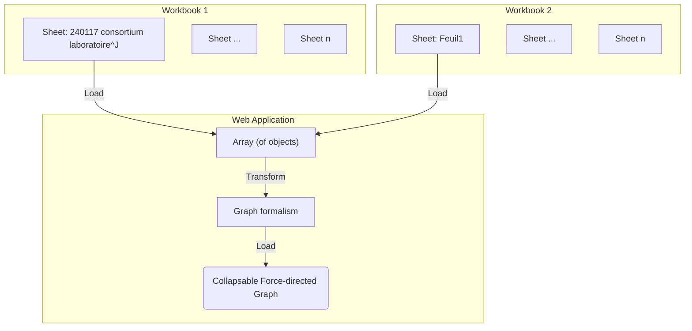

# Visualize Workbook data using Graphs

Visualize the first sheet from the phase 1 Excel document using graphs.

## Data integration process

Take the data imported from the [initial-import-test](./initial-import-test) and transform the table into a graph formalism.
To do this, we need to set up a component to transform the data.

**Input:**

- Workbook 1: "240117 consortium laboratoire, établissement CNRS-SHS_Stat"
- Workbook 2: "240108_consortium, contenus des propositions CNRS-SHS_GGE_JYT_ANRT"



```js echo
import {
  getProductSheet,
  resolveProjectEntities,
  projectColorMap,
} from "./components/240108-proposals-keywords.js";
import {
  mapProjectsToRDFGraph,
  filterLinks,
  forceGraph,
} from "./components/graph.js";

const workbook1 = FileAttachment(
  "./data/240117 consortium laboratoire, établissement CNRS-SHS_Stat.xlsx"
).xlsx();
const workbook2 = FileAttachment(
  "./data/240108_consortium, contenus des propositions CNRS-SHS_GGE_JYT_ANRT.xlsx"
).xlsx();
```

**Input data:**

Using the transformation proposed in the imported components we can extract the tabular workbook data and resolve known entities.
This transformation produces the following hierarchy: `root -> Project Acronym -> Project attribute (keywords, titles, etc.) -> ...`

```js echo
const anonymize = false;
const anonymizeDict = new Map();
const productData = resolveProjectEntities(
  getProductSheet(workbook2),
  anonymize,
  anonymizeDict
);
display(productData);
```

# Visualization results

Once integrated the following information is desired for visualization:

- lab names
- ERC disciplines
- show missing information
- show graphs over charts
  - theme → projet (in other workbook ANRT)
  - col I : produit (ou resultats) de la recherche (primaire) → J : secondaire → H : Quelles actions pour quelles solutions → A : acronyme
- Root node: PEPR VDBI

## Force Directed Graph - all project data

**Sheet mapped to graph:**

... We can also map the data to a graph hierarchy

```js echo
const productGraph = mapProjectsToRDFGraph(productData, projectColorMap);
```

```js
display(productGraph);
```

```js echo
const productForceGraph = forceGraph(productGraph, {
  width: 1400,
  height: 1400,
  valueMap: (d) => d.color,
  r: 3,
  fontSize: 8,
});
```

```js
display(productForceGraph);
```

## Force Directed Graph - projects and keywords

**Filtered graph nodes and links:**

```js
const filter_input = Inputs.select(
  Object.keys(productData[0]).slice(1)
);
const filter_value = Generators.input(filter_input);
```

```js echo
const filteredProductGraph = filterLinks(
  productGraph,
  (d) => d.label == filter_value
);
```

```js
display(filteredProductGraph);
```

```js echo
const filteredProductForceGraph = forceGraph(filteredProductGraph, {
  width: 1400,
  height: 1400,
  valueMap: (d) => d.color,
  r: 2,
  fontSize: 8,
  typeList: projectColorMap,
});
```

<div>${filter_input}</div>
<div>${filteredProductForceGraph}</div>
