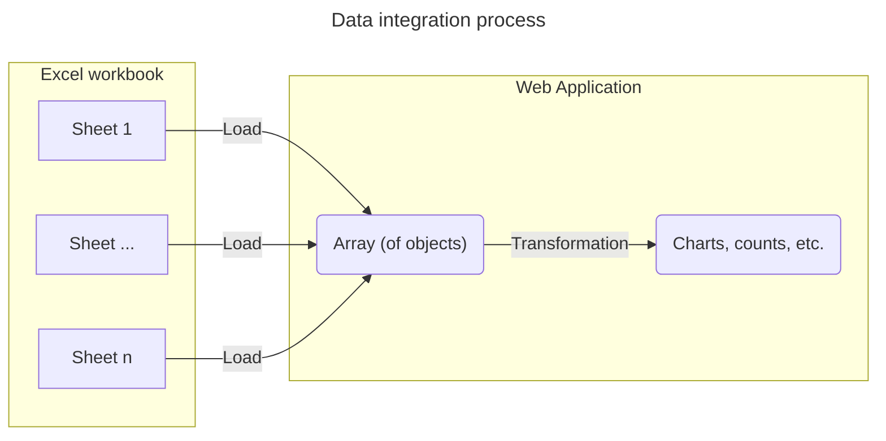

# Import 240117 consortium laboratoire^J

Visualize the first sheet from the phase 1 Excel document as a graph.

## Integration process

Take the data imported from the [initial-import-test](./initial-import-test) and transform the table into a plot.
To do this, we need to set up a component to transform the data.



# Visualization results

- idea: calculate # of reserachers by etablissement
  - plot sorted graph with data divided by # of reserchers
  - look up a source

Once integrated the following data visualizations are tested using components.

```js
import {
  getPhase1Sheet,
  getVillesSheet,
  getLabSheet,
  resolvePhase1Entities,
  resolveLaboEntities,
} from "./components/240117-proposals-labs-establishments.js";
import {
  getProductSheet,
  resolveProjectEntities,
} from "./components/240108-proposals-keywords.js";
import { mapProjectsToRDFGraph } from "./components/graph.js";
import { mapCounts, mergeCounts } from "./components/utilities.js";
```

```js
const workbook1 = FileAttachment(
  "./data/240108_consortium, contenus des propositions CNRS-SHS_GGE_JYT_ANRT.xlsx"
).xlsx();
const workbook2 = FileAttachment(
  "./data/240117 consortium laboratoire, établissement CNRS-SHS_Stat.xlsx"
).xlsx();
```

```js
const anonymize = false;
const acronymousDict = new Map();
const projects_product = resolveProjectEntities(
  getProductSheet(workbook1),
  anonymize,
  acronymousDict
);
const projects_phase_1 = resolvePhase1Entities(
  getPhase1Sheet(workbook2),
  anonymize,  
  acronymousDict
);
```

Projects from product workbook:

```js echo
display(projects_product);
```

Projects from laboratory workbook:

```js echo
display(projects_phase_1);
```

## Simple XBar plot - count keywords

Map-group-reduce-sort the keywords of each project to an array and count the occurences of each word

```js echo
function countEntities(data, mapFunction) {
  // flatten (map to array then merge) entities
  const entity_list = d3.merge(
    d3.map(
      data,
      (d) => mapFunction(d)
    )
  );
  // group by entity then reduce to a count with d3.rollup()
  const entityCounts = d3.rollup(
    entity_list,
    (D) => D.length,
    (d) => d
  );
  // map entityCounts to a [{x: entity, y: count}] data structure
  const formatted_entity_counts = d3.map(
    entityCounts.entries(),
    ([key, value], i) => {
      return {
        entity: key,
        count: value,
      };
    }
  );
  // sort by entity and return
  return d3.sort(formatted_entity_counts, (d) => d.entity);
}

const sorted_keyword_counts = countEntities(
  projects_product,
  (project) => project.motClefs
);
display(sorted_keyword_counts);
```

Plot the occurrences to a simple bar chart with the following features:

- horizontal bars
- coloring by count number
- longer keyword (y) axis labels are truncated
- hover over bar to see full keyword

```js echo
display(
  Plot.plot({
    height: sorted_keyword_counts.length * 15, // assure adequate horizontal space for each line
    marginLeft: 150,
    color: {
      scheme: "Spectral",
    },
    x: {
      grid: true,
      axis: "both",
      anchor: "top",
    },
    y: {
      tickFormat: (d) => (d.length > 25 ? d.slice(0, 23).concat("...") : d), // cut off long tick labels
      fontSize: 20,
    },
    marks: [
      Plot.barX(sorted_keyword_counts, {
        x: "count",
        y: "entity",
        title: "entity",
        fill: d3.map(sorted_keyword_counts, (d) => d.count + 2), // shift up the color values to be more visible
      }),
    ],
  })
);
```

## Sorted Grouped XBar plot - count project universities and partners

<!--
Map table to graph first
```js echo
const phase_1_graph = mapProjectsToRDFGraph(projects_phase_1);
display(phase_1_graph);
``` -->

A count of establishment owners (or a count of projects per establishment owner)

```js echo
const sorted_establishment_owner_counts = countEntities(
  projects_phase_1,
  (project) => project.etablissements.slice(0, 1)
);
display(sorted_establishment_owner_counts);
```

A count of establishment partners (or a count of projects per establishment partner)

```js echo
const sorted_establishment_partner_counts = countEntities(
  projects_phase_1,
  (project) => project.etablissements.slice(1)
);
display(sorted_establishment_partner_counts);
```

<!-- A count of partners per establishment (using the graph).
Note that this "query" could work (should be) better with node types (either as attributes of a node or in the graph).

```js echo
// establishment count by project
const establishment_counts = d3.rollup(d3.filter(phase_1_graph.links, (link) => link.label == "etablissements"), (D) => D.length, (link) => link.target);
display(establishment_counts);
``` -->

Combine counts to one array and calculate count totals

```js echo
const establishment_counts = mapCounts(
  [sorted_establishment_owner_counts, sorted_establishment_partner_counts],
  ["owner", "partner"]
);

const total_establishment_counts = d3.sort(
  d3
    .rollup(
      establishment_counts,
      (D) => {
        let count = 0;
        D.forEach((d) => {
          count = count + d.count;
        });
        return {
          entity: D[0].entity,
          count: count,
          type: "total",
        };
      },
      (d) => d.entity
    )
    .values(),
  (d) => d.entity
);
```

Merge counts into one dataset

```js echo
const sorted_establishment_counts = d3.sort(
  establishment_counts.concat(total_establishment_counts),
  (d) => d.count,
  (d) => d.entity
);
display(sorted_establishment_counts);
```

... and plot data

```js
display(
  Plot.plot({
    height: sorted_establishment_counts.length * 20, // assure adequate horizontal space for each line
    width: 1000,
    marginLeft: 60,
    marginRight: 150,
    color: {
      scheme: "Plasma",
    },
    x: {
      grid: true,
      axis: "both",
      anchor: "top",
    },
    fy: {
      tickFormat: (d) => (d.length > 25 ? d.slice(0, 23).concat("...") : d), // cut off long tick labels
    },
    marks: [
      Plot.barX(sorted_establishment_counts, {
        x: "count",
        y: "type",
        fy: "entity",
        title: "entity",
        fill: "count",
        sort: { fy: "-x" },
      }),
    ],
  })
);
```

## Sorted YBar plot - count project cities

Get lab cities (from workbook for now)

```js echo
const city_data = getVillesSheet(workbook2).map((d) => {
  return {
    etablissement: [d["Etablissements"]],
    lieu: [d["Lieu"]],
  };
});
display(city_data);
```

A count of project cities

```js echo
const city_count = countEntities(
  city_data,
  (establishment) => establishment.lieu
);
display(city_count);
```

Plot data

```js
display(
  Plot.plot({
    width: 1000,
    height: 600,
    marginBottom: 60,
    color: {
      scheme: "Turbo",
    },
    x: {
      tickRotate: 30,
    },
    y: {
      grid: true,
    },
    marks: [
      Plot.barY(city_count, {
        x: "entity",
        y: "count",
        fill: "count",
        sort: { x: "y" },
      }),
    ],
  })
);
```

## Sorted YLine plot - count project laboratories (project owners and partners)

<!--
Get lab data (from workbook for now)

```js echo
const lab_data = resolveLaboEntities(getLabSheet(workbook2));
display(lab_data);
```
-->

A count of lab project owners

```js echo
const lab_owner_count = countEntities(projects_phase_1, (project) =>
  project.laboratoires.slice(0, 1)
);
display(lab_owner_count);
```

A count of lab project partners

```js echo
const lab_partner_count = countEntities(projects_phase_1, (project) =>
  project.laboratoires.slice(1)
);
display(lab_partner_count);
```

Combine counts to one array and calculate count totals

```js echo
const lab_counts = mapCounts(
  [lab_owner_count, lab_partner_count],
  ["owner", "partner"]
);

const total_lab_counts = d3.sort(
  d3
    .rollup(
      lab_counts,
      (D) => {
        let count = 0;
        D.forEach((d) => {
          count = count + d.count;
        });
        return {
          entity: D[0].entity,
          count: count,
          type: "total",
        };
      },
      (d) => d.entity
    )
    .values(),
  (d) => d.entity
);
```

Group counts together

```js echo
// const sorted_lab_counts = d3.sort(
//   lab_counts.concat(total_lab_counts),
//   (d) => d.entity
//   // (d) => d.count,
// );

const sorted_lab_counts = [];

d3.sort(
  mergeCounts(
    [lab_owner_count, lab_partner_count, total_lab_counts],
    ["owner_count", "partner_count", "total_count"]
  ).values(),
  (d) => d.entity
).forEach((d) => {
  sorted_lab_counts.push({
    entity: d.entity,
    count: d.owner_count,
    type: "owner",
  });
  sorted_lab_counts.push({
    entity: d.entity,
    count: d.partner_count,
    type: "partner",
  });
  sorted_lab_counts.push({
    entity: d.entity,
    count: d.total_count,
    type: "total",
  });
});
display(sorted_lab_counts);
```

... and plot data

```js
display(
  Plot.plot({
    height: sorted_lab_counts.length * 7, // assure adequate horizontal space for each line
    width: 1000,
    marginLeft: 150,
    color: {
      legend: true,
    },
    x: {
      grid: true,
      axis: "both",
    },
    y: {
      grid: true,
      tickFormat: (d) => (d.length > 25 ? d.slice(0, 23).concat("...") : d), // cut off long tick labels
      ticks: 10,
    },
    marks: [
      Plot.lineY(sorted_lab_counts, {
        x: "count",
        y: "entity",
        z: "type",
        title: "entity",
        stroke: "type",
        marker: true,
      }),
    ],
  })
);
```
