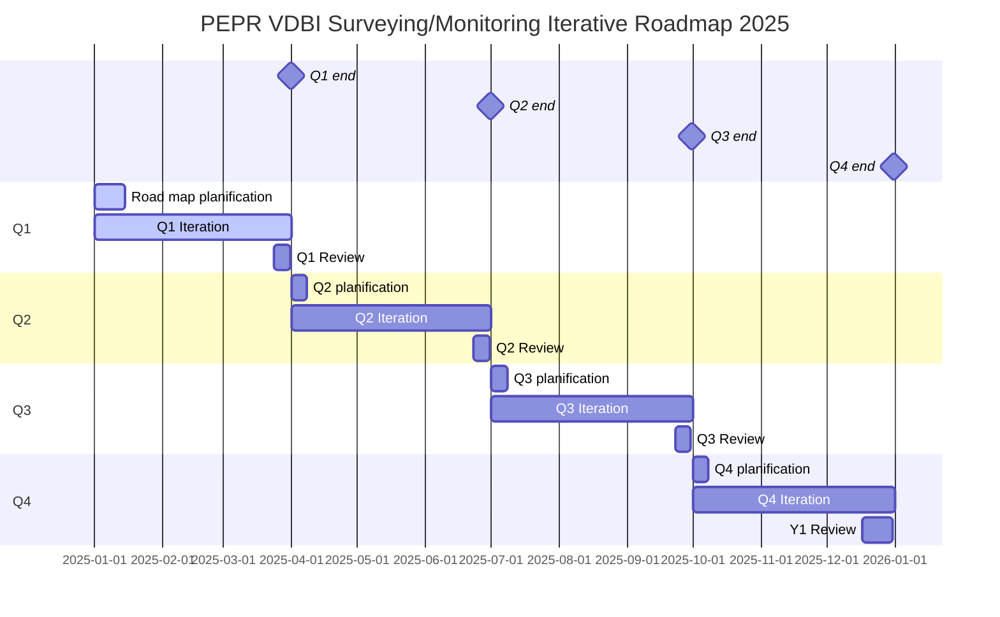

# PEPR VDBI Documentation <!-- omit in toc -->

## Table of contents <!-- omit in toc -->
- [Org Chart](#org-chart)
- [Reports/Meeting notes](#reportsmeeting-notes)
- [Data Integraion](#data-integraion)
- [Data Visualization](#data-visualization)
- [Project Schedule](#project-schedule)
- [Project Goals](#project-goals)
- [Project Tasks](#project-tasks)

### External links
- [VDBI feulle de route](https://pepr-vdbi.fr/feuille-de-route-scientifique-et-technique)

## Org Chart

> [!NOTE]
> References to the following individuals may use the following aliases in project documentation for brevity:
> - DMI: Dominique Mignot
> - GGE: Gilles Gesquière
> - ARU: Anne Raus
> - DVA: Diego Vinasco-Alvarez
> - EMO: Emannuelle Moench
> - GGR: Gabriel Gros
> - JSAR: Joud Sarkis
> - JYT: Jean-Yves Toussaint

## [Reports/Meeting notes](./meeting_notes/)

## Data Integraion
Also refered to in the documentation as data mining and data extraction
- [GPT-based unstructured data integration documentation](../data-integration/README.md) 
- [Classical data integration](../data-visualization/docs/index.md)

## [Data Visualization](../data-visualization/README.md)

## Project Schedule

> [!TIP] Milestones
> See project [milestone](https://github.com/VCityTeam/PEPR-VDBI/milestones) descriptions for more information about specific quarterly/yearly goals.

## Project Goals

| Goal | Title                            | Description                                                                                                                                                                                                                                                          |
| ---- | -------------------------------- | -------------------------------------------------------------------------------------------------------------------------------------------------------------------------------------------------------------------------------------------------------------------- |
| G1   | Project monitoring data viz tool | Proposal and implementation of a dashboard-based project monitoring tool based on the call for projects document corpus and open data sources to monitor the VDBI community and its development over the course of the program.                                      |
| G2   | Data mining and analysis tool    | Proposal and implementation of an automated AI (GPT-based) data mining and analysis tool to identify characteristics of the VDBI research community in document corpus. Verification of method using the "ground truth" (manually processed document corpus) corpus. |
| G3   | Bibliometry tool                 | Proposal and implementation of bibliometric trajectory tracking tools on VDBI.                                                                                                                                                                                       |
| G4   | ASLR tool                        | Proposal and implementation of tools to facilitate automatic SLRs.                                                                                                                                                                                                   |
| G5   | Tracking tool                    | Proposal and implementation of a tool for identifying existing trends and impact in/of the VDBI (and other) research communities alongside PEPR partners (in connection with the editorial manager).                                                                 |
| G6   | Forecasting tool                 | Proposal and implementation of a tool for identifying and projecting future trends in the VDBI (and other) research communities.                                                                                                                                     |
| G7   | Promote achievements             | Promote achievements and results in the form of scientific publications, reports and oral presentations                                                                                                                                                              |

> [!TIP] Issues
> [Issues](https://github.com/VCityTeam/PEPR-VDBI/issues) are labeled by goal for simplifying searching.
> 
> For example, use the `label:G1` filter to search for all issues related to G1.

## Project Tasks

| Task | Description                                                                                                                                                                                   |
| ---- | --------------------------------------------------------------------------------------------------------------------------------------------------------------------------------------------- |
| T1   | Design and manage a document monitoring system for research purposes                                                                                                                          |
| T2   | Propose an approach adapted to the subject of study                                                                                                                                           |
| T3   | Implement methods or protocols for data or corpus collection, ensure analysis and interpret results. Study new monitoring methods (e.g. Systematic Literature Reviews)                        |
| T4   | Lead studies linked to the management of data from research projects and provide quantitative elements to demonstrate the trajectory of the VDBI project                                      |
| T5   | Formalize methods for producing or analyzing data or corpora in conjunction with the SIVDBI Operational Center of the PEPR VDBI                                                               |
| T6   | Analyze external requests and assess their relevance and possible synergies with scientific orientations                                                                                      |
| T7   | Promote achievements and results in the form of scientific publications, reports and oral presentations, coordinating with editorial activities (other recruitment underway in the PEPR VDBI) |
| T8   | Contribute to the organization of scientific events                                                                                                                                           |
| T9   | Contribute to the development of highly innovative techniques and methods                                                                                                                     |
| T10  | Design and implement a bibliometric scientific and methodological monitoring/surveying tool                                                                                                   |
| T11  | Experiment with new techniques, methods and forms of monitoring/surveying                                                                                                                     |
| T12  | Maturation of tools for larger-scale, production-ready data integration, visualisation, analysis, and forecasting.                                                                            |
