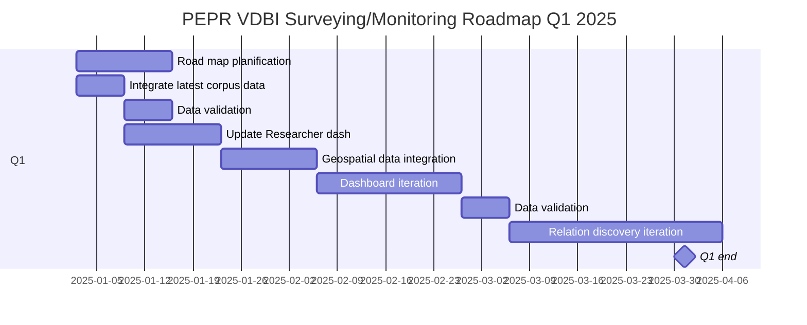
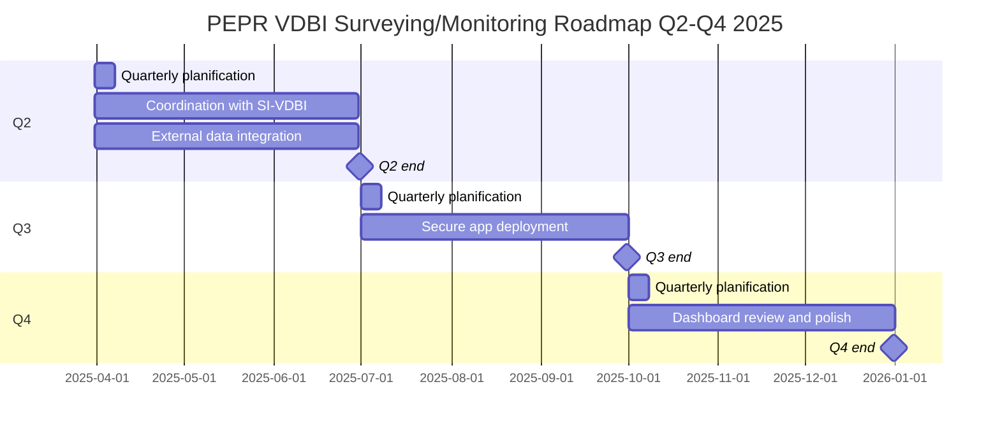

# PEPR VDBI Documentation

### - [Feulle de route](https://pepr-vdbi.fr/feuille-de-route-scientifique-et-technique)

### Org Chart

> [!NOTE]
> References to the following individuals may use the following aliases in project documentation for brevity:
> - DMI: Dominique Mignot
> - GGE: Gilles Gesquière
> - ARU: Anne Raus
> - DVA: Diego Vinasco-Alvarez
> - EMO: Emannuelle Moench
> - GGR: Gabriel Gros
> - JSAR: Joud Sarkis
> - JYT: Jean-Yves Toussaint

## Reports/Meeting notes
- [Day 1 Report 2/1/2025](./meeting_notes/02-01-2025_DVA.md)
- [CoDir Meeting 6/1/2025](./meeting_notes/06-01-2025_vdbi.md)
- [CO Meeting 6/1/2025](./meeting_notes/06-01-2025_co.md)
- [Point DVA GGE 6/1/2025](./meeting_notes/06-01-2025_point.md)
- [Point DVA EMO 10/1/2025](./meeting_notes/10-01-2025_DVA_EMO.md)
- [CoDir Meeting 13/1/2025](./meeting_notes/13-01-2025_codir.md)

## Project Goals

| Goal | Description                                                                                                                                                                                                    |
| ---- | -------------------------------------------------------------------------------------------------------------------------------------------------------------------------------------------------------------- |
| G1   | Proposal and implementation of a project monitoring tool based on the call for projects document corpus and open data sources to monitor the VDBI community and its development over the course of the program |
| G2   | Proposal and implementation of an automated AI (GPT-based) data mining and analysis tool to identify characteristics of the VDBI research community in document corpus                                         |
| G3   | Proposal and implementation of tools to facilitate automatic SLRs                                                                                                                                              |
| G4   | Proposal and implementation of bibliometric trajectory tracking tools on VDBI                                                                                                                                  |
| G5   | Proposal and implementation of a tool for identifying and projecting future trends in the VDBI (and other) research communities                                                                                |
| G6   | Research and monitoring of the program's impact alongside PEPR partners (other than research laboratories) in connection with the editorial side                                                               |
| G7   | Promote achievements and results in the form of scientific publications, reports and oral presentations                                                                                                        |

## Proposed Project Schedule

### 5-year Road map
| Year | Description                                                                                                                                                                                |
| ---- | ------------------------------------------------------------------------------------------------------------------------------------------------------------------------------------------ |
| Y1   | G1: Implementation of dashboard-based application to monitor the VDBI community and its development over the course of the program.                                                        |
| Y2   | G2: Implementation of an automatic data extraction and analysis method of the ground truth (manually processed document corpus). Verification of method using the "ground truth" corpus.   |
| Y3   | <li>G3: Implementation of a tool to facilitate automated SLRs (systematic literature review).</li><li>G4: Implementation of bibliometric trajectory tracking tools on VDBI community.</li> |
| Y4   | G5: Implementation of a tool for identifying and forcasting trends of the VDBI community (and other scientific research communities).                                                      |
| Y5   | Maturation of tools for larger-scale, production-ready data integration, visualisation, analysis, and forecasting.                                                                         |

## Project Tasks

| Task | Description                                                                                                                                                                                   |
| ---- | --------------------------------------------------------------------------------------------------------------------------------------------------------------------------------------------- |
| T1   | Design and manage a document monitoring system for research purposes                                                                                                                          |
| T2   | Propose an approach adapted to the subject of study                                                                                                                                           |
| T3   | Implement methods or protocols for data or corpus collection, ensure analysis and interpret results. Study new monitoring methods (e.g. Systematic Literature Reviews)                        |
| T4   | Lead studies linked to the management of data from research projects and provide quantitative elements to demonstrate the trajectory of the VDBI project                                      |
| T5   | Formalize methods for producing or analyzing data or corpora in conjunction with the SIVDBI Operational Center of the PEPR VDBI                                                               |
| T6   | Analyze external requests and assess their relevance and possible synergies with scientific orientations                                                                                      |
| T7   | Promote achievements and results in the form of scientific publications, reports and oral presentations, coordinating with editorial activities (other recruitment underway in the PEPR VDBI) |
| T8   | Contribute to the organization of scientific events                                                                                                                                           |
| T9   | Contribute to the development of highly innovative techniques and methods                                                                                                                     |
| T10  | Design and implement a bibliometric scientific and methodological monitoring/surveying tool                                                                                                                |
| T11  | Experiment with new techniques, methods and forms of monitoring/surveying                                                                                                                     |
| T12  | Maturation of tools for larger-scale, production-ready data integration, visualisation, analysis, and forecasting.                                                                            |
