# PEPR VDBI Documentation

### - [Feulle de route](https://pepr-vdbi.fr/feuille-de-route-scientifique-et-technique)

### Org Chart

> [!NOTE]
> References to the following individuals may use the following aliases in project documentation for brevity:
> - GGE: Gilles Gesquière
> - DVA: Diego Vinasco-Alvarez
> - JYT: Jean-Yves Toussaint
> - EMO: Emannuelle Moench
> - ARU: Anne Raus
> - GGR: Gabriel Gros
> - JSAR: Joud Sarkis

## Reports/Meeting notes
- [Day 1 Report 2/1/2025](./meeting_notes/02-01-2025_DVA.md)
- [Meeting CoDir 6/1/2025](./meeting_notes/06-01-2025_vdbi.md)
- [Meeting CO 6/1/2025](./meeting_notes/06-01-2025_co.md)
- [Point DVA GGE 6/1/2025](./meeting_notes/06-01-2025_point.md)
