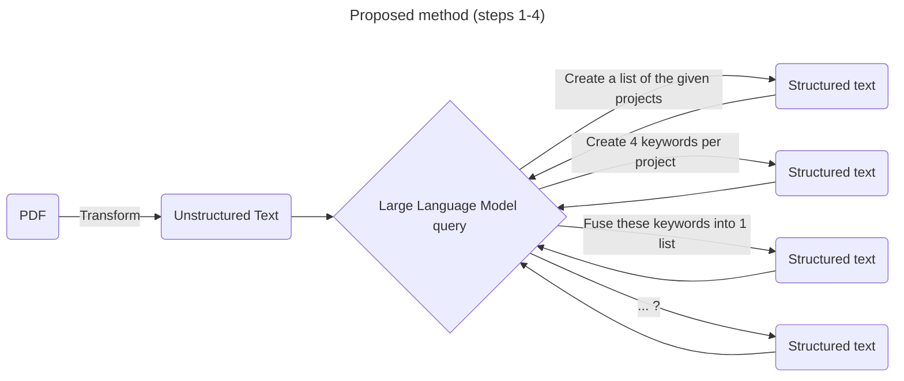

```mermaid
---
title: Proposed method (steps 1-4)
---
flowchart LR
    A(PDF) -->|Transform| B(Unstructured Text)
    B --> C{Large Language Model query}
    C -->|"Create a list of the given projects"| X(Structured text)
    C -->|"Create 4 keywords per project"| Y(Structured text)
    C -->|"Fuse these keywords into 1 list"| Z(Structured text)
    C -->|... ?| AA(Structured text)
    X --> C
    Y --> C
    Z --> C
    AA --> C
```
Inspired from [GGE perplexity tests](../../data-integration/proposed_ai_tests.md)
