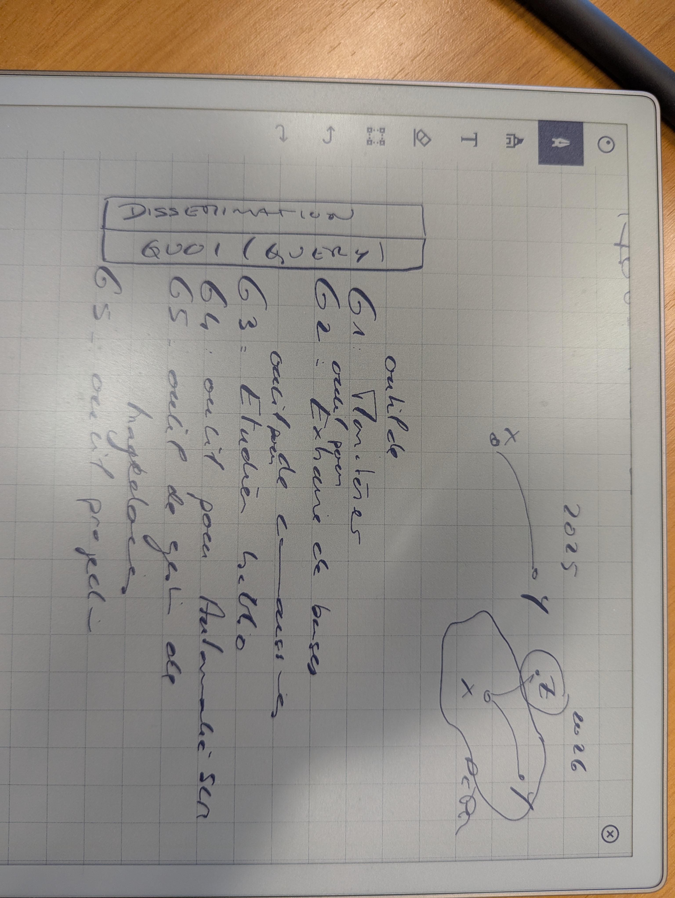

## Questions 
- what is the role/relationship of the "Banque des Territoires" with the PEPR VDBI?
- what are the ANR indicators for?
- what meetings should I attend?
  - CO workshops?
  - Kickoffs?
  - GGE :
    - attend CoDir
    - watch out to not take on tasks from project managment  
- what is a work package (WP)
  - a group of a project's management, deliverables, and due dates

## Data management plan discussion
- GGE:
  - simplify DMP of SIVDBI
  - add what is needed concerning editorialization and monitoring
- CNIL:
  - a declarer des données

## Road map discussion
- goals need short and sweet title
  - noted in GGE notes
  - new g3 bibliomety
  - reorganize as iterative/waterfall design approach
    - do everything by Y1 end but in beta/alpha
- GGE : projection is based on diff that can be applied on tool s like biliotools

### GGE goal notes 

## todos/take-aways
- [ ] revisit road map
